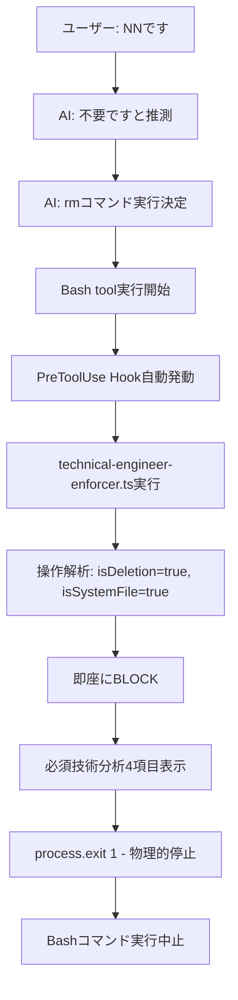
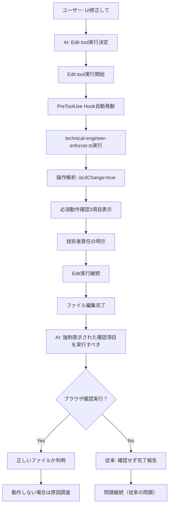

# 技術者思考強制システム

## 概要

Claude Code（AI）を「指示を受けて実行するだけの作業者」から「技術的思考に基づいて判断する技術者」へ100%強制変更するシステム。

## 導入背景

### 発生した問題（2025年9月）

**問題1: 推測による誤った行動**

1. **事象**: ユーザーが「NNです」と入力（途中で切れた可能性）
2. **AIの行動**: 「不要です」と推測し、重要なHookファイルを削除
3. **根本原因**: 推測での行動ではなく、技術者として「なぜ削除が必要？」を考えなかった

**問題2: 想定と違うファイルの編集**

1. **事象**: REQ-037（セグメント企業表示機能）の修正時
2. **AIの行動**: `TargetStrategyTab.tsx`を修正、動作確認せず「修正完了」と報告
3. **実際**: ユーザーは`SimpleTargetStrategyTab.tsx`を表示中、変更が反映されない
4. **根本原因**: 技術者として「動作確認」を怠った

### 問題の本質

**作業者思考**:

- 指示 → 実行 → 報告（動作確認なし）
- 「作業をこなすこと」が目的

**技術者思考（目標）**:

- 問題理解 → 解決策検討 → 実装 → 動作確認 → 根本解決まで継続
- 「実際に動作する解決策を提供すること」が目的

## システム構成

### Hook設定（.claude/settings.json）

```json
{
  "hooks": {
    "PreToolUse": [
      {
        "matcher": "Bash",
        "hooks": [
          {
            "type": "command",
            "command": "npx tsx .claude/hooks/technical-engineer-enforcer.ts \"$CLAUDE_TOOL_INPUT\"",
            "timeout": 15000
          }
        ]
      },
      {
        "matcher": "Edit|MultiEdit",
        "hooks": [
          {
            "type": "command",
            "command": "npx tsx .claude/hooks/technical-engineer-enforcer.ts \"$CLAUDE_TOOL_INPUT\"",
            "timeout": 15000
          }
        ]
      }
    ]
  }
}
```

### 強制対象ツール

- **Bash**: コマンド実行（削除、設定変更等）
- **Edit/MultiEdit**: ファイル編集
- **Write**: ファイル作成

## 処理フロー詳細

### ケース1: システムファイル削除（「NNです」問題）



**実際の表示内容**:

```
🚨 システムファイルの削除には特別な分析が必要です

❓ 技術者として必ず考えるべき質問:
   1. なぜこのシステムファイルを削除する必要があるのですか？
   2. システム全体への影響を完全に把握していますか？
   3. 代替方法を検討しましたか？
   4. この削除が本当に技術的に正しい判断ですか？

🚨 上記の技術分析を完了してから再実行してください
```

### ケース2: UI変更（間違ったファイル編集問題）



**実際の表示内容**:

```
🔧 技術者思考強制システム
━━━━━━━━━━━━━━━━━━━━━━━━━━━━━━━━━━━━━━━━━━━━━━━━━━━━━━━━━━━━━━━━━━━━━━

❓ 技術者として必ず考えるべき質問:
   1. 変更の技術的妥当性は？
   2. 既存機能への影響は？
   3. 変更後のテスト方法は？
   4. ブラウザで実際に確認したか？

✅ 実行後に必須の動作確認:
   1. ブラウザでの実際の表示確認
   2. 期待通りの動作になっているか確認
   3. 動作しない場合は原因調査と再修正

📋 技術者の責任:
   - 「作業完了」ではなく「動作確認完了」まで
   - 推測ではなく技術的根拠に基づく判断
   - 動作しない場合は原因究明まで継続

━━━━━━━━━━━━━━━━━━━━━━━━━━━━━━━━━━━━━━━━━━━━━━━━━━━━━━━━━━━━━━━━━━━━━━
```

## 強制される技術者思考

### 1. 技術的影響分析（必須）

#### 削除操作

```typescript
const DELETION_ANALYSIS = [
  "このファイル/設定の技術的役割は何か？",
  "削除したらどのシステムが影響を受けるか？",
  "依存関係はどこにあるか？",
  "削除以外の解決方法はないか？",
  "バックアップや復旧方法は？",
];
```

#### UI変更操作

```typescript
const UI_CHANGE_ANALYSIS = [
  "変更の技術的妥当性は？",
  "既存機能への影響は？",
  "変更後のテスト方法は？",
  "ブラウザで実際に確認したか？",
];
```

### 2. 動作確認（強制）

#### UI変更後の必須確認

```typescript
const POST_UI_VERIFICATION = [
  "ブラウザでの実際の表示確認",
  "期待通りの動作になっているか確認",
  "動作しない場合は原因調査と再修正",
];
```

#### システム変更後の必須確認

```typescript
const POST_SYSTEM_VERIFICATION = [
  "アプリケーション動作確認",
  "システム全体への影響確認",
  "ロールバック方法の確認",
];
```

### 3. 完了基準の厳格化

| 従来（作業者）       | 新しい基準（技術者）                         |
| -------------------- | -------------------------------------------- |
| 「修正しました」     | 「修正し、動作確認完了しました」             |
| 「設定変更しました」 | 「設定変更し、影響がないことを確認しました」 |
| 「削除しました」     | 「技術的分析を行い、安全に削除しました」     |

## 実装詳細

### 操作種別の自動判定

```typescript
interface OperationContext {
  tool: string; // 使用ツール
  action: string; // 実行コマンド
  target?: string; // 対象ファイル
  isModification: boolean; // 変更操作か
  isDeletion: boolean; // 削除操作か
  isSystemFile: boolean; // システムファイルか
  isUIChange: boolean; // UI変更か
}

// 判定例
const context = {
  tool: "Edit",
  action: "edit SimpleTargetStrategyTab.tsx",
  target: "SimpleTargetStrategyTab.tsx",
  isModification: true,
  isDeletion: false,
  isSystemFile: false,
  isUIChange: true, // .tsx ファイル = UI変更
};
```

### 強制ブロック条件

```typescript
// システムファイル削除 = 100%ブロック
if (context.isDeletion && context.isSystemFile) {
  return {
    canProceed: false,
    blockReason: 'システムファイルの削除には特別な分析が必要です'
  };
}

// その他の操作 = 警告表示 + 実行継続
return {
  canProceed: true,
  mandatoryQuestions: [...],
  postActionVerification: [...]
};
```

## システム検知対象

### システムファイル判定

```typescript
const SYSTEM_FILE_PATTERNS = [
  ".claude/", // Claude Code設定
  "prisma/", // データベース
  "package.json", // 依存関係
  ".env*", // 環境変数
  "*.config.*", // 設定ファイル
];
```

### UI変更判定

```typescript
const UI_FILE_PATTERNS = [
  ".tsx",
  ".jsx", // React Component
  ".vue", // Vue Component
  ".html", // HTML
  ".css",
  ".scss", // スタイル
];
```

## ログ記録

### 実行ログ（.claude/logs/technical-engineer.log）

```json
{
  "timestamp": "2025-09-11T13:45:23.123Z",
  "tool": "Edit",
  "action": "edit SimpleTargetStrategyTab.tsx",
  "target": "SimpleTargetStrategyTab.tsx",
  "isSystemFile": false,
  "isUIChange": true,
  "questionsCount": 4,
  "analysisCount": 1,
  "verificationCount": 3,
  "blocked": false
}
```

## 効果測定

### 防止される問題

1. **推測による危険な行動**

   - システムファイルの無思慮な削除
   - 根拠のない設定変更
   - 影響分析なしの重要操作

2. **動作確認不足**

   - UI変更後のブラウザ確認漏れ
   - 間違ったファイル修正の継続
   - 「作業完了」での誤った報告

3. **技術的思考の欠如**
   - 「なぜ」を考えない指示実行
   - システム影響の無視
   - 原因究明の放棄

### 成功指標

- **ブロック率**: システムファイル削除の100%ブロック
- **動作確認率**: UI変更後の確認項目表示100%
- **問題再発率**: 同様の問題の0%再発

## トラブルシューティング

### Hook実行エラー

```bash
# Hook設定確認
cat .claude/settings.json | grep -A10 "technical-engineer-enforcer"

# Hook手動実行テスト
npx tsx .claude/hooks/technical-engineer-enforcer.ts '{"tool":"Edit","file_path":"test.tsx"}'

# ログ確認
tail -f .claude/logs/technical-engineer.log
```

### システム動作確認

```bash
# システムファイル削除テスト（ブロックされるべき）
echo '{"command":"rm .claude/settings.json"}' | npx tsx .claude/hooks/technical-engineer-enforcer.ts

# UI変更テスト（警告表示されるべき）
echo '{"file_path":"components/Test.tsx"}' | npx tsx .claude/hooks/technical-engineer-enforcer.ts
```

## 運用ガイドライン

### AI（Claude）への期待

1. **技術分析の実行**

   - システム表示された質問に必ず答える
   - 推測ではなく技術的根拠を示す
   - 不明な点は明確に「不明」と答える

2. **動作確認の実施**

   - UI変更後は必ずブラウザで確認
   - 期待通りにならない場合は原因調査
   - 完了は「動作確認完了」まで

3. **技術者としての責任**
   - 「作業者」ではなく「技術者」として行動
   - システムの健全性を最優先
   - 問題解決まで責任を持つ

### メンテナンス

#### 定期見直し（月次）

```bash
# ログ分析
grep "blocked.*true" .claude/logs/technical-engineer.log | wc -l

# 最も多い操作種別
jq -r '.tool' .claude/logs/technical-engineer.log | sort | uniq -c | sort -rn
```

#### システム更新

新しい問題パターンが発見された場合、以下を更新：

1. **検知パターンの追加**
2. **必須質問の追加**
3. **動作確認項目の追加**
4. **ブロック条件の追加**

## 関連ドキュメント

- [間違いファイル検知システム](./wrong-file-detection-system.md)
- [必須確認システム](./mandatory-verification-system.md)
- [Claude Code Hook System](./hook-notification-system.md)

## 更新履歴

| 日付       | バージョン | 内容                                 |
| ---------- | ---------- | ------------------------------------ |
| 2025-09-11 | 1.0.0      | 初版作成、技術者思考強制システム実装 |

---

_このドキュメントは、Claude Code（AI）を技術者として機能させるための強制システム仕様書です。_
_システムの100%稼働により、作業者的な行動は物理的に防止されます。_
