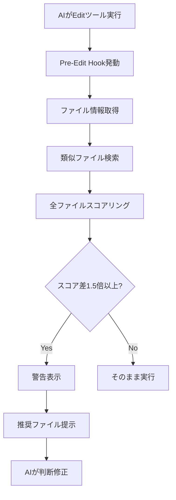

# 間違いファイル修正検知システム

## 概要

Claude Code（AI）が誤って間違ったファイルを修正することを防ぐ自動検知システム。
Edit/MultiEdit実行前に自動的にファイルの妥当性を検証し、より適切なファイルがある場合は警告を表示する。

## 導入背景

### 発生した問題（2025年9月）

1. **事象**: REQ-037（セグメント企業表示機能）の修正時に発生
2. **問題**: ユーザーが `SimpleTargetStrategyTab.tsx`を表示中、AIが `TargetStrategyTab.tsx`を修正
3. **結果**: 何度修正しても表示が変わらない状況が継続
4. **原因**: 類似ファイル名による混同、ユーザー表示ファイルの確認不足

### 解決アプローチ

- **Hook System**: Pre-Edit Hookによる自動介入
- **多角的判定**: Git履歴、ユーザー活動、ファイル名類似度による総合判定
- **汎用設計**: 特定ファイルに依存しない汎用的な検知ロジック

## システム構成

### 1. Hook設定（.claude/settings.json）

```json
{
  "hooks": {
    "PreToolUse": [
      {
        "matcher": "Edit|MultiEdit",
        "hooks": [
          {
            "type": "command",
            "command": "npx tsx .claude/hooks/pre-edit-file-verification.ts \"$CLAUDE_TOOL_INPUT\"",
            "timeout": 15000
          }
        ]
      }
    ]
  }
}
```

### 2. 検知ロジック（.claude/hooks/pre-edit-file-verification.ts）

#### スコアリングアルゴリズム

```typescript
interface FileAnalysis {
  gitActivity: number; // Git活動スコア（0-10点）
  userActivity: number; // ユーザー活動スコア（0 or 10点）
  similarityScore: number; // ファイル名類似度（0-10点）
  contentRelevance: number; // ディレクトリ関連性（0-10点）
  totalScore: number; // 合計スコア（最大40点）
}
```

#### 判定基準

- **Git活動**: 過去7日間の変更回数×2（最大10点）
- **ユーザー活動**: ステージ済み/変更中/最近のコミットに含まれる場合10点
- **ファイル名類似度**: レーベンシュタイン距離による計算×10
- **ディレクトリ関連性**: ディレクトリパスの類似度×10

#### 警告条件

```typescript
if (bestFile.totalScore > targetAnalysis.totalScore * 1.5) {
  // 1.5倍以上のスコア差がある場合のみ警告
}
```

## 動作フロー



## 検知可能なパターン

### 1. 類似名ファイルの混同

```
TargetStrategyTab.tsx vs SimpleTargetStrategyTab.tsx
UserProfile.tsx vs UserProfileEdit.tsx
index.tsx (複数ディレクトリに存在)
```

### 2. 古いファイルの誤編集

- Git履歴で長期間変更がないファイル
- 非アクティブなブランチのファイル
- アーカイブされたコンポーネント

### 3. ユーザー作業との不一致

- ユーザーが開いているファイルと異なる
- 最近のコミットに含まれていないファイル
- ステージされていないファイル

### 4. ディレクトリ違いの同名ファイル

```
src/components/Button.tsx
src/ui/Button.tsx
src/shared/Button.tsx
```

## 実際の動作例

### 警告表示例

```
🔍 Pre-Edit ファイル検証実行
編集対象: src/app/projects/[projectId]/components/plan/TargetStrategyTab.tsx

⚠️  警告: より適切なファイルが見つかりました
💡 推奨: src/app/projects/[projectId]/components/plan/SimpleTargetStrategyTab.tsx を編集してください

理由: 最近作業したファイル、ファイル名がより類似

📋 その他の候補:
  1. src/components/templates/wizard/steps/TargetStrategyStep.tsx
     スコア: 15.2
     最近の変更: feat: ターゲット戦略の改善
```

### スコア比較例

| ファイル                    | Git活動 | ユーザー活動 | 名前類似度 | ディレクトリ | 合計 |
| --------------------------- | ------- | ------------ | ---------- | ------------ | ---- |
| SimpleTargetStrategyTab.tsx | 2       | 10           | 10         | 10           | 32   |
| TargetStrategyTab.tsx       | 0       | 0            | 7          | 10           | 17   |
| TargetStrategyStep.tsx      | 1       | 0            | 5          | 3            | 9    |

→ 32点 vs 17点 = 1.88倍の差 → **警告発動**

## 設定とカスタマイズ

### パラメータ調整

```typescript
// 警告閾値の変更（デフォルト: 1.5倍）
const THRESHOLD_MULTIPLIER = 1.5;

// Git履歴の期間変更（デフォルト: 7日）
const GIT_HISTORY_DAYS = 7;

// 類似度の閾値（デフォルト: 0.5）
const SIMILARITY_THRESHOLD = 0.5;

// 表示する代替案の数（デフォルト: 3）
const MAX_ALTERNATIVES = 3;
```

### 除外パターンの追加

```typescript
// 検索から除外するパス
const EXCLUDE_PATHS = [
  "./node_modules/*",
  "./.git/*",
  "./dist/*",
  "./build/*",
  "./coverage/*",
];
```

## トラブルシューティング

### Hook が動作しない場合

1. **設定確認**

   ```bash
   cat .claude/settings.json | grep -A5 "Edit|MultiEdit"
   ```

2. **スクリプト実行権限**

   ```bash
   chmod +x .claude/hooks/pre-edit-file-verification.ts
   ```

3. **手動テスト**

   ```bash
   npx tsx .claude/hooks/pre-edit-file-verification.ts '{"file_path": "path/to/file.tsx"}'
   ```

### 誤検知が多い場合

- 警告閾値を上げる（1.5 → 2.0）
- Git履歴期間を短くする（7日 → 3日）
- 類似度閾値を上げる（0.5 → 0.7）

### 検知漏れがある場合

- 警告閾値を下げる（1.5 → 1.2）
- Git履歴期間を長くする（7日 → 14日）
- スコアの重み付けを調整

## メンテナンス

### ログ確認

```bash
# Hook実行ログの確認
tail -f .claude/logs/pre-edit-*.log

# 警告発生履歴
grep "警告" .claude/logs/pre-edit-*.log
```

### 統計情報

```bash
# 月間の警告発生回数
grep "警告" .claude/logs/pre-edit-*.log | wc -l

# 最も間違えやすいファイル
grep "編集対象:" .claude/logs/pre-edit-*.log | sort | uniq -c | sort -rn
```

## 今後の拡張案

### 1. 機械学習による精度向上

- 過去の警告と実際の選択を学習
- ユーザーごとの作業パターン分析
- 時間帯による重み付け

### 2. IDE連携強化

- VSCode拡張との連携
- ファイルツリーへのマーカー表示
- リアルタイムプレビュー

### 3. チーム共有機能

- 間違いやすいファイルペアの共有
- チーム全体の統計情報
- カスタムルールの共有

## 関連ドキュメント

- [Claude Code Hook System](./hook-notification-system.md)
- [Pre-commit検証システム](../rules/development/commit-guidelines.md)
- [開発ワークフロー](../development/prisma-workflow-guide.md)

## 更新履歴

| 日付       | バージョン | 内容                            |
| ---------- | ---------- | ------------------------------- |
| 2025-09-11 | 1.0.0      | 初版作成、基本機能実装          |
| 2025-09-11 | 1.1.0      | 汎用版への改修、Git履歴活用追加 |

## ライセンス

プロジェクト内部利用限定

---

_このドキュメントは、Claude Code（AI）の間違いファイル修正を防ぐためのシステム仕様書です。_
_問題が発生した場合は、このドキュメントを参照して対処してください。_
