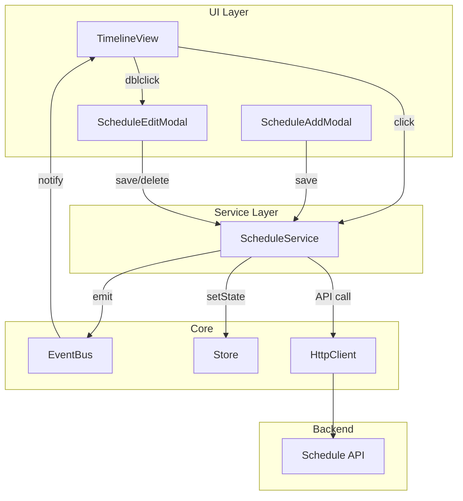
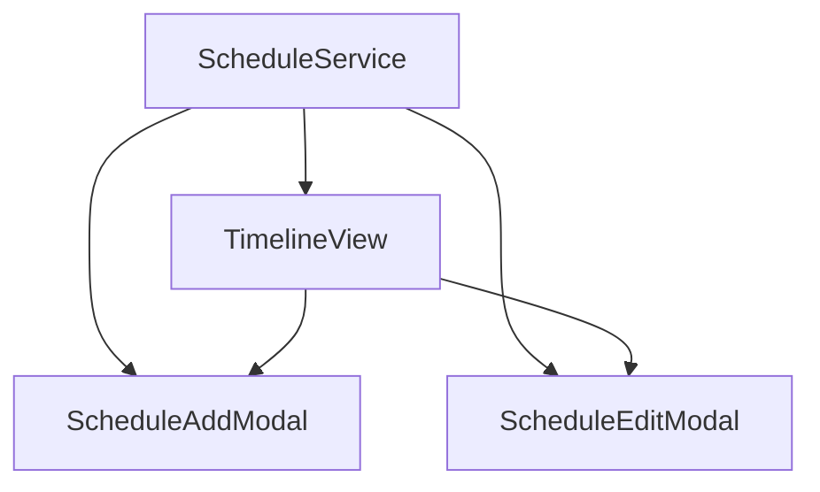

# 技術設計書: schedule-ui-crud

## 概要

スケジュールイベントのCRUD操作をUIから可能にする。既存のタスク管理UIパターンに従い、EventBus/Store経由でリアクティブに更新する。

## アーキテクチャ

### コンポーネント構成



### イベントフロー

```
ユーザー操作
    ↓
TimelineView (クリック検知)
    ↓
ScheduleService (API呼び出し)
    ↓
HttpClient → Backend API
    ↓
ScheduleService (Store更新 + EventBus発火)
    ↓
TimelineView (再レンダリング)
```

## コンポーネント設計

### 1. ScheduleService 拡張

**ファイル**: `public/modules/domain/schedule/schedule-service.js`

```javascript
export class ScheduleService {
    // 既存
    async loadSchedule() { ... }
    getTimeline() { ... }

    // 新規追加
    async addEvent(eventData) {
        const date = this._getTodayDate();
        const event = await this.httpClient.post(`/api/schedule/${date}/events`, eventData);
        await this._refreshAndNotify();
        return event;
    }

    async updateEvent(eventId, updates) {
        const date = this._getTodayDate();
        const event = await this.httpClient.put(`/api/schedule/${date}/events/${eventId}`, updates);
        await this._refreshAndNotify();
        return event;
    }

    async deleteEvent(eventId) {
        const date = this._getTodayDate();
        await this.httpClient.delete(`/api/schedule/${date}/events/${eventId}`);
        await this._refreshAndNotify();
    }

    async toggleEventComplete(eventId) {
        const events = this.getTimeline();
        const event = events.find(e => e.id === eventId);
        if (event) {
            await this.updateEvent(eventId, { completed: !event.completed });
        }
    }

    _getTodayDate() {
        return new Date().toLocaleDateString('sv-SE', { timeZone: 'Asia/Tokyo' });
    }

    async _refreshAndNotify() {
        await this.loadSchedule();
        await this.eventBus.emit(EVENTS.SCHEDULE_UPDATED, this.getTimeline());
    }
}
```

### 2. TimelineView 拡張

**ファイル**: `public/modules/ui/views/timeline-view.js`

```javascript
// 追加する機能
_formatTimelineHTML(events, currentTime) {
    // 既存のHTML生成
    let html = '<div class="timeline">';

    // 追加ボタン
    html += '<button class="timeline-add-btn" title="予定を追加">+</button>';

    // イベントにdata属性とクリックハンドラ用クラス追加
    sortedEvents.forEach((event) => {
        const completedClass = event.completed ? ' is-completed' : '';
        html += `
            <div class="timeline-item is-event${completedClass}"
                 data-event-id="${event.id}"
                 data-event-completed="${event.completed}">
                ...
            </div>
        `;
    });

    html += '</div>';
    return html;
}

_attachEventHandlers() {
    // 追加ボタン
    this.container.addEventListener('click', (e) => {
        if (e.target.classList.contains('timeline-add-btn')) {
            this._onAddClick();
        }
    });

    // イベントクリック（完了トグル）
    this.container.addEventListener('click', (e) => {
        const item = e.target.closest('.timeline-item[data-event-id]');
        if (item && !e.target.classList.contains('timeline-add-btn')) {
            this._onEventClick(item.dataset.eventId);
        }
    });

    // ダブルクリック（編集）
    this.container.addEventListener('dblclick', (e) => {
        const item = e.target.closest('.timeline-item[data-event-id]');
        if (item) {
            this._onEventDblClick(item.dataset.eventId);
        }
    });
}
```

### 3. ScheduleAddModal

**ファイル**: `public/modules/ui/modals/schedule-add-modal.js`

```javascript
export class ScheduleAddModal {
    constructor({ scheduleService }) {
        this.scheduleService = scheduleService;
        this.modalElement = null;
    }

    mount() {
        this.modalElement = document.getElementById('add-schedule-modal');
        this._attachEventHandlers();
    }

    open() {
        this._clearForm();
        this.modalElement.classList.add('active');
        document.getElementById('add-schedule-start').focus();
    }

    close() {
        this.modalElement.classList.remove('active');
    }

    async save() {
        const start = document.getElementById('add-schedule-start').value;
        const end = document.getElementById('add-schedule-end').value;
        const title = document.getElementById('add-schedule-title').value.trim();

        if (!start || !title) {
            this._showError('開始時間とタイトルは必須です');
            return;
        }

        await this.scheduleService.addEvent({
            start,
            end: end || null,
            title,
            source: 'manual'
        });

        this.close();
    }
}
```

### 4. ScheduleEditModal

**ファイル**: `public/modules/ui/modals/schedule-edit-modal.js`

```javascript
export class ScheduleEditModal {
    constructor({ scheduleService }) {
        this.scheduleService = scheduleService;
        this.currentEventId = null;
    }

    open(eventId) {
        this.currentEventId = eventId;
        const event = this._findEvent(eventId);
        if (!event) return;

        this._populateForm(event);
        this.modalElement.classList.add('active');
    }

    async save() {
        const updates = {
            start: document.getElementById('edit-schedule-start').value,
            end: document.getElementById('edit-schedule-end').value || null,
            title: document.getElementById('edit-schedule-title').value.trim()
        };

        await this.scheduleService.updateEvent(this.currentEventId, updates);
        this.close();
    }

    async delete() {
        if (confirm('この予定を削除しますか？')) {
            await this.scheduleService.deleteEvent(this.currentEventId);
            this.close();
        }
    }
}
```

## HTML追加（index.html）

```html
<!-- スケジュール追加モーダル -->
<div id="add-schedule-modal" class="modal">
    <div class="modal-content">
        <div class="modal-header">
            <h3>予定を追加</h3>
            <button class="close-modal-btn">&times;</button>
        </div>
        <div class="modal-body">
            <div class="form-group">
                <label for="add-schedule-start">開始時間 *</label>
                <input type="time" id="add-schedule-start" required>
            </div>
            <div class="form-group">
                <label for="add-schedule-end">終了時間</label>
                <input type="time" id="add-schedule-end">
            </div>
            <div class="form-group">
                <label for="add-schedule-title">タイトル *</label>
                <input type="text" id="add-schedule-title" required>
            </div>
            <div id="add-schedule-error" class="error-message" style="display: none;"></div>
        </div>
        <div class="modal-footer">
            <button class="btn btn-secondary close-modal-btn">キャンセル</button>
            <button id="save-add-schedule-btn" class="btn btn-primary">追加</button>
        </div>
    </div>
</div>

<!-- スケジュール編集モーダル -->
<div id="edit-schedule-modal" class="modal">
    <div class="modal-content">
        <div class="modal-header">
            <h3>予定を編集</h3>
            <button class="close-modal-btn">&times;</button>
        </div>
        <div class="modal-body">
            <div class="form-group">
                <label for="edit-schedule-start">開始時間 *</label>
                <input type="time" id="edit-schedule-start" required>
            </div>
            <div class="form-group">
                <label for="edit-schedule-end">終了時間</label>
                <input type="time" id="edit-schedule-end">
            </div>
            <div class="form-group">
                <label for="edit-schedule-title">タイトル *</label>
                <input type="text" id="edit-schedule-title" required>
            </div>
            <div id="edit-schedule-error" class="error-message" style="display: none;"></div>
        </div>
        <div class="modal-footer">
            <button id="delete-schedule-btn" class="btn btn-danger">削除</button>
            <button class="btn btn-secondary close-modal-btn">キャンセル</button>
            <button id="save-edit-schedule-btn" class="btn btn-primary">保存</button>
        </div>
    </div>
</div>
```

## CSS追加

```css
/* 完了済みイベント */
.timeline-item.is-completed .timeline-content {
    text-decoration: line-through;
    opacity: 0.6;
}

/* 追加ボタン */
.timeline-add-btn {
    position: absolute;
    top: 8px;
    right: 8px;
    width: 24px;
    height: 24px;
    border-radius: 50%;
    border: none;
    background: var(--primary-color);
    color: white;
    cursor: pointer;
    font-size: 16px;
    line-height: 1;
}

.timeline-add-btn:hover {
    background: var(--primary-hover);
}

/* クリック可能なイベント */
.timeline-item[data-event-id] {
    cursor: pointer;
}

.timeline-item[data-event-id]:hover {
    background: var(--hover-bg);
}
```

## 依存関係



## テスト戦略

### ユニットテスト
- ScheduleService.addEvent()
- ScheduleService.updateEvent()
- ScheduleService.deleteEvent()
- ScheduleService.toggleEventComplete()

### 統合テスト
- モーダル開閉
- フォーム送信
- API呼び出し確認

### E2E（手動）
- 追加ボタンクリック → モーダル → 保存 → 表示確認
- イベントクリック → 完了トグル
- ダブルクリック → 編集 → 保存
- 削除確認
