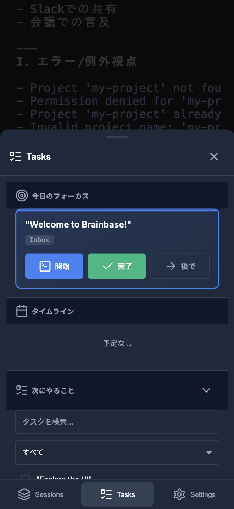

# 🧠 Brainbase

**複数プロジェクトを一元管理。見落とし・切り替えコストをゼロに。**
ローカル完結のAI-firstプロジェクト管理コンソール。デスクトップでもスマホでも、どこからでもアクセス。

[](LICENSE)
[](https://nodejs.org/)
[]()

---

## 🤔 こんな悩みありませんか？

- 複数案件を抱えると、各プロジェクトの状況把握に毎日30分溶ける
- タスク管理ツール、Slack、GitHub、メール...複数チャネルを行き来して疲弊
- 外出先で「あのタスク今どうなってたっけ？」→PCないと確認できない
- Claude Codeで作業→別プロジェクトに切り替え→Claude Codeセッション再起動の手間

**Brainbaseなら、すべてを一箇所に集約。デスクトップでもスマホでも、いつでもプロジェクト全体が見渡せます。**

---

## 📸 使用イメージ

### デスクトップ版

*複数プロジェクトのタスク・スケジュール・受信箱を一画面で確認*

### モバイル版

*外出先でもスマホからタスク確認・更新が可能*

### セッション管理

*プロジェクトごとにClaude Codeセッションを分離・切り替え*

---

## ✨ Key Features

- 📱 **モバイル対応**: スマホ・タブレットからも快適にアクセス。外出先でもプロジェクト状況を確認・タスク更新が可能
- 🔒 **ローカル完結**: データはすべて自分のマシンに保存。クラウド不要で安全
- 🤖 **AI統合**: Claude Code、Cursor等のAIコーディングアシスタントと連携
- 📊 **一元管理**: タスク、スケジュール、受信箱を一画面で確認
- 🔄 **セッション分離**: プロジェクトごとにClaude Codeセッションを分離（git worktree）
- 📝 **ファイルベース**: Markdown/YAMLで管理。エディタやClaude Codeから直接編集可能

---

## 🚀 Quick Start

### 前提条件
- **Node.js** v20.0.0 以上
- **tmux** (ターミナル多重化)
- **ttyd** (Web ターミナル)
- **Claude Code** (AI コーディング支援) - 任意
- **Git** v2.13.0 以上 (worktree サポート)

<details>
<summary>📦 前提条件のインストール方法</summary>

#### macOS (Homebrew)
```bash
# tmux
brew install tmux

# ttyd
brew install ttyd

# Claude Code (任意)
npm install -g @anthropic-ai/claude-code

# Git (通常は既にインストール済み)
brew install git
```

#### Linux (Ubuntu/Debian)
```bash
# tmux
sudo apt-get install tmux

# ttyd
sudo apt-get install ttyd

# Claude Code (任意)
npm install -g @anthropic-ai/claude-code
```

</details>

### セットアップ（3分）

1. **リポジトリクローン**
   ```bash
   git clone https://github.com/Unson-LLC/brainbase.git
   cd brainbase
   ```

2. **依存関係インストール**
   ```bash
   npm install
   ```

3. **初回セットアップ**
   ```bash
   ./setup.sh
   ```

   このスクリプトは以下を実行します:
   - `var/state.json` のサンプル作成（セッション管理用）
   - `data/_tasks/` ディレクトリ作成（サンプルタスク付き）
   - `data/_schedules/` ディレクトリ作成（サンプルスケジュール付き）
   - `data/_inbox/` ディレクトリ作成（受信箱）
   - `data/config.yml` の作成（設定ファイル）

4. **サーバー起動**
   ```bash
   npm start
   ```

5. **アクセス**

   **デスクトップ**: http://localhost:31013

   **モバイル**（3つの方法から選択）:

   ### 方法1: ローカルネットワーク経由（最も簡単）
   同じWi-Fi内からのみアクセス可能
   ```bash
   # ローカルIPアドレスを確認
   ifconfig | grep "inet "  # macOS/Linux

   # スマホのブラウザでアクセス
   # 例: http://192.168.1.10:31013
   ```

   ### 方法2: Quick Tunnels（一時的なテスト用）
   インターネット経由でアクセス可能。URLを知っていれば誰でもアクセス可能なので注意。
   ```bash
   # cloudflaredインストール（初回のみ）
   brew install cloudflared

   # Quick Tunnel起動
   cloudflared tunnel --url http://localhost:31013
   # → 表示されたURLにスマホからアクセス
   ```

   ### 方法3: Cloudflare Tunnel + Zero Trust（本番推奨）
   **前提条件**:
   - ✅ 独自ドメイン（Cloudflareで管理）
   - ✅ Cloudflareアカウント（無料）

   安全・継続的に外部からアクセス可能。WARPアプリで認証必須。

   📖 **詳細な手順**: [Cloudflare Tunnel設定ガイド](docs/cloudflare-tunnel-setup.md)

✅ **これで完了！** 3分でローカル環境が整います。

### 環境変数（任意）

```bash
# カスタムデータルート（デフォルト: ./data）
export BRAINBASE_ROOT=/path/to/your/data

# ランタイム用ディレクトリ（デフォルト: ./var）
export BRAINBASE_VAR_DIR=/path/to/your/var

# カスタムポート（デフォルト: 31013、worktree内では31014）
export PORT=4000

# サーバー起動
npm start
```

---

## 📖 使い方ガイド

### 初回起動後の流れ

1. **プロジェクト登録**
   - 左サイドバーの「+ New Session」をクリック
   - プロジェクト名とディレクトリパスを入力

2. **タスク管理**

  `data/_tasks/index.md` にYAMLフロントマター形式でタスクを記述します。

   ```markdown
   ---
   id: task-001
   title: "機能Aを実装する"
   status: todo
   project: my-project
   priority: 1
   tags: [feature]
   due: 2025-01-15
   ---

   # 機能Aを実装する

   詳細な説明をここに書く

   ---
   id: task-002
   title: "バグBを修正する"
   status: in-progress
   priority: 2
   ---

   # バグBを修正する
   ```

   | フィールド | 必須 | 説明 |
   |-----------|------|------|
   | `id` | ○ | 一意のタスクID |
   | `title` | ○ | タスク名 |
   | `status` | ○ | `todo` / `in-progress` / `done` |
   | `priority` | - | 優先度（数値、1が最高） |
   | `due` | - | 期限（YYYY-MM-DD） |
   | `tags` | - | タグ配列 |

   **UI操作**: 完了・優先度変更（defer）・削除はブラウザUIから可能

3. **スケジュール管理**

  `data/_schedules/YYYY-MM-DD.md` に日単位でスケジュールを作成します。

   ```markdown
   # 2025-01-09

   09:00 - 10:00 定例MTG
   10:00 - 12:00 開発作業
   14:00 - 15:00 クライアント打ち合わせ

   ## 作業可能時間
   - 午前: 10:30 〜 12:00
   - 午後: 15:00 〜 18:00

   ## タスク
   - [ ] 今日やること1
   - [ ] 今日やること2
   ```

   **対応フォーマット**:
   - `HH:MM - HH:MM タスク名`
   - `| HH:MM - HH:MM | タスク名 |`（テーブル形式）
   - `- [ ] タスク名`（チェックリスト）

4. **受信箱（Inbox）**

  `data/_inbox/pending.md` で通知・メモを管理します。

   ```markdown
   ---
   id: INBOX-001
   sender: John
   timestamp: 2025-01-09T10:00:00Z
   status: pending
   ---

   ### 確認依頼

   〇〇について確認お願いします。
   ```

   **UI操作**: 対応済みにするとリストから消えます

5. **セッション切り替え**
   - 左サイドバーでプロジェクトをクリック → 即座に切り替え
   - 各プロジェクトのClaude Codeセッションはgit worktreeで分離

---

## 🌳 git worktree による並行作業

Brainbaseは **git worktree** を活用し、プロジェクトごとにClaude Codeセッションを分離します。

### なぜworktreeを使うのか？

**従来の問題**:
- プロジェクトAで作業中 → プロジェクトBに切り替え → Claude Codeセッションが混在
- ブランチ切り替えのたびに作業ディレクトリが変わり、コンテキストが失われる

**worktreeの利点**:
- **並行作業**: 同じリポジトリの複数ブランチを同時に開ける
- **セッション分離**: プロジェクトごとにClaude Codeセッションを維持
- **高速切り替え**: ディレクトリ移動のみでプロジェクト切り替え完了

### 使い方（自動セットアップ）

Brainbaseは初回起動時に自動的にworktreeを作成します。手動操作は不要です。

詳細: [git worktree ガイド](docs/git-worktree-guide.md)

---

## 🏗️ Architecture

```
┌─────────────────────────────────────────┐
│           UI Components (View)           │
├─────────────────────────────────────────┤
│        Services (Business Logic)         │
├─────────────────────────────────────────┤
│      Repositories (Data Access)          │
├─────────────────────────────────────────┤
│      EventBus (Cross-Cutting)            │
└─────────────────────────────────────────┘
```

Brainbaseは以下のアーキテクチャパターンを採用:
- **Event-Driven Architecture**: EventBus, Reactive Store, DI Container
- **Test-Driven Development**: 80%+ coverage, Red-Green-Refactor cycle
- **Service Layer Pattern**: ビジネスロジックの一元化

詳細: [DESIGN.md](./DESIGN.md)

---

## 📚 Documentation

- [開発者向けガイド](./CLAUDE.md) - 開発標準・アーキテクチャ原則
- [設計ドキュメント](./DESIGN.md) - UI/UX設計・データフロー
- [リファクタリング計画](./docs/REFACTORING_PLAN.md) - 3-Phase移行戦略
- [git worktree ガイド](./docs/git-worktree-guide.md) - worktree詳細説明

---

## 🔮 Coming Soon

Brainbaseは今後、以下の機能拡張を予定しています：

### `/ohayo` コマンド（Google Calendar連携）

Claude CodeでMCPを使用してGoogle Calendarと連携し、今日の予定をタスクとして取り込むことができます。

```bash
# Claude Codeで実行
/ohayo
```

**フロー**:
1. Google Calendar MCPを通じてClaudeが今日の予定を読み取る
2. 予定を `data/_tasks/index.md` にタスクとして自動追加
3. Brainbase UIでタスク・タイムラインとして表示

> **Note**: この機能を使用するにはGoogle Calendar MCPサーバーの設定が必要です。

### その他の予定機能

- 📬 **Slack連携**: @メンションを受信箱に自動蓄積
- ⏰ **リマインダー**: 期限間近タスクの自動通知
- 📝 **会議議事録**: 音声ファイルからの自動議事録生成

これらの機能はプラグイン形式で提供予定です。

---

## 🤝 Contributing

We welcome contributions! Please see [CONTRIBUTING.md](./CONTRIBUTING.md) for details.

**開発ワークフロー**:
1. **Explore**: 既存コード調査
2. **Plan**: 実装方針決定
3. **Branch**: feature/session/* branch作成
4. **Edit**: TDD実装 (Red-Green-Refactor)
5. **Test**: カバレッジ80%以上
6. **Commit**: Decision capture + Conventional Commits
7. **Merge**: --no-ff merge to main

---

## ❓ FAQ・トラブルシューティング

### Q1: ttydが起動しない

**A**: tmuxがインストールされているか確認してください。
```bash
tmux -V
# tmux 3.x 以上が必要
```

### Q2: Claude Codeと連携できない

**A**: Claude CodeのAPIキーが設定されているか確認してください。
```bash
claude-code --version
# v1.0.0 以上推奨
```

### Q3: モバイルからアクセスできない

**A**: ファイアウォール設定を確認し、ポート31013が開放されているか確認してください。
```bash
# macOS
sudo lsof -i :31013

# ローカルIPアドレス確認
ifconfig | grep "inet "
```

### Q4: git worktreeが自動作成されない

**A**: Git v2.13.0以上が必要です。バージョンを確認してください。
```bash
git --version
```

### Q5: `./setup.sh`を実行せずに起動できますか？

**A**: 可能です。以下を手動で実行してください:
```bash
mkdir -p data var
cp state.sample.json var/state.json
cp -r _tasks-sample data/_tasks
cp -r _schedules-sample data/_schedules
cp -r _inbox-sample data/_inbox
cp config.sample.yml data/config.yml
```

その他のトラブルは [Issues](https://github.com/Unson-LLC/brainbase/issues) で報告してください。

---

## 📄 License

This project is licensed under the MIT License - see the [LICENSE](./LICENSE) file for details.

---

🤖 Built with [Claude Code](https://claude.com/claude-code)
