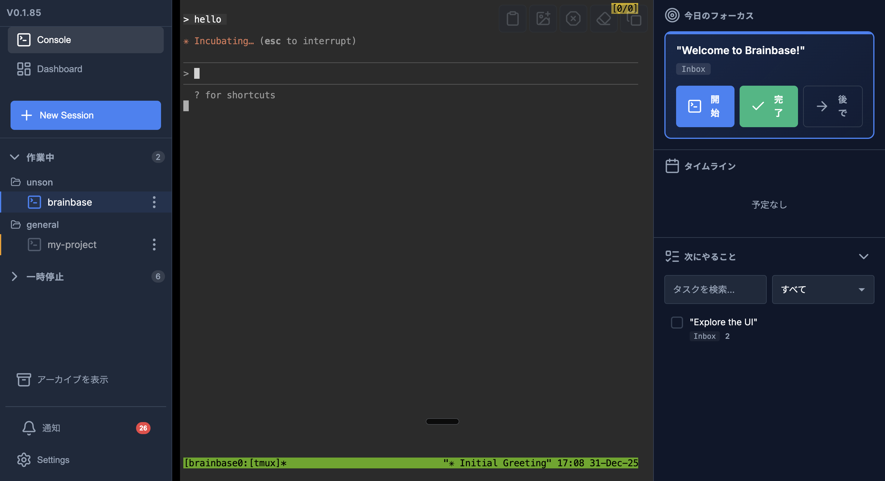
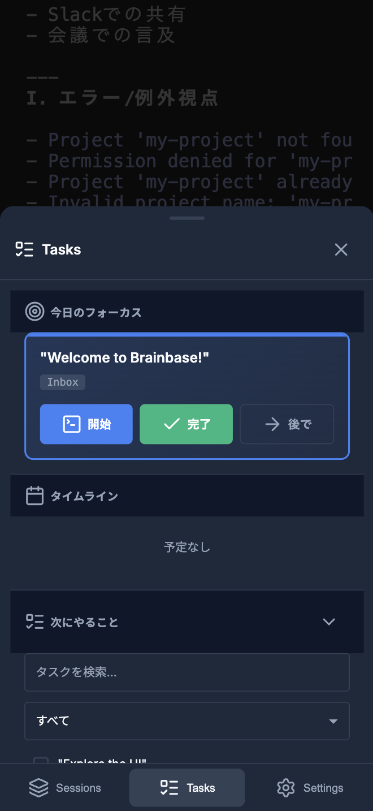

# Brainbase

AI-first project management console for local-first developer workflows.

[](LICENSE)
[](https://nodejs.org/)
[]()

Brainbase brings tasks, schedules, inbox items, and coding sessions into one interface. It is designed for developers who want a file-based, self-hosted workspace that still feels fast on both desktop and mobile.

## Screenshots


*Desktop overview for tasks, inbox, and schedules.*


*Mobile-friendly task management for on-the-go updates.*


*Session switching and isolated coding workspaces.*

## Features

- Local-first project management with Markdown and YAML backed data
- Unified dashboard for tasks, schedules, and inbox items
- Mobile-friendly UI for checking and updating work away from a desktop
- Session-oriented workflow support for multi-project coding
- File-based structure that works well with editors, Git, and AI coding tools
- MCP server packages under `mcp/` for Brainbase-related integrations

## Quick Start

### Requirements

- Node.js 20+
- npm
- Optional: `tmux`, `ttyd`, and `jj` for the full session-management workflow

### Setup

```bash
git clone https://github.com/Unson-LLC/brainbase.git
cd brainbase
npm install
npm run setup
npm start
```

Open `http://localhost:31013` after the server starts.

### Environment

You can override the default data and runtime locations if needed:

```bash
export BRAINBASE_ROOT=/path/to/data
export BRAINBASE_VAR_DIR=/path/to/var
export PORT=31013
npm start
```

## Architecture

- `server/`: Express server, routes, controllers, middleware, and backend services
- `public/`: Browser UI, modules, styles, and static assets
- `lib/`: Shared parsers, storage helpers, and domain-neutral utilities
- `mcp/`: MCP server packages and related integration modules

Brainbase follows an event-driven, service-oriented structure. Frontend modules live under `public/modules/`, while backend HTTP and service concerns are organized under `server/routes/`, `server/controllers/`, and `server/services/`.

## Development

```bash
npm install
npm test
npm start
```

Useful commands:

```bash
npm run dev
npm run test:coverage
npm run test:e2e
npm run lint
```

## Contributing

See [CONTRIBUTING.md](CONTRIBUTING.md) for contribution workflow, testing expectations, and review guidelines.

## License

This project is available under the [MIT License](LICENSE).
