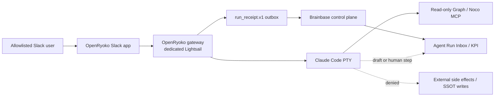

# ADR-020: AI employee node runtime boundary

## Context

Brainbase needs a continuously available Slack-facing AI employee without
moving Graph SSOT, approvals, operational receipts, or delegation policy onto
the gateway host. The first physical prototype runs OpenRyoko on a dedicated
Lightsail instance. Mana Lambda remains an independent receiving and
notification runtime during the pilot.

OpenRyoko provides the replaceable node body: Slack ingress, session routing,
Interactive PTY launch, and session visibility. Its local memory, todo, org,
and approval features must not become competing organizational truth.

## Decision

The AI employee is a node with four independently owned layers:

| Layer | Phase 1 owner | Authority |
|---|---|---|
| Face | dedicated OpenRyoko Slack app | pilot-channel interaction only |
| Body | OpenRyoko gateway on dedicated Lightsail | replaceable runtime and session state |
| Brain | Graph SSOT and curated Brainbase knowledge | organizational facts and durable knowledge |
| Brainstem | Brainbase control plane | Run Receipt, approvals, autonomy policy, Decision Events |

The gateway is consumed through the
[`Unson-LLC/OpenRyoko`](https://github.com/Unson-LLC/OpenRyoko) fork. The fork
keeps its upstream name so provenance remains obvious. It contains only
gateway-specific compatibility, security, and instrumentation patches.
Brainbase-owned contracts, node policy, deployment automation, evaluation
definitions, and runbooks remain in this repository. `brainbase-mana` is not
used as the fork name because Mana Lambda and the node runtime have different
availability and ownership boundaries.

`run_receipt.v1` is the Phase 1 operational ledger contract. OpenRyoko is a
generic run source and does not acquire provider-specific rounds, Judgment DAG, or
learning-candidate semantics merely to fit `external_runner.v0`.
`external_runner.v0` remains available for future rich worker dispatch where
those semantics are real.

Phase 1 is fixed at `draft_only`. A prompt instruction is not an enforcement
boundary. Acceptance requires an allowlisted capability boundary which denies
external side effects before tool execution. Slack posting is limited to the
response path in the pilot channel; Graph access is read-only; Graph SSOT
writes, email sends, arbitrary Slack sends, deployments, purchases, and other
irreversible operations are denied. Any requested side effect becomes a draft
or an explicit human step in Brainbase.

Lightsail stores only replaceable runtime state: packages, configuration
projections, sessions, outbox files, and bounded logs. Secrets remain
Infisical-owned projections. Facts, autonomy level, approvals, receipts, and
evaluation records are not authoritative on the node.

One public bot identity is independent of worker count. Later fan-out adds
workers behind the same entry point and must preserve worker attribution in
receipts; it does not require more Slack identities.

## Phase 1 trust boundary

## Repository and upgrade policy

- `rsensui2/OpenRyoko` is `upstream`; `Unson-LLC/OpenRyoko` is the reviewed
  fork.
- Prefer pinned upstream tags or SHAs. Upgrades occur through an explicit
  upstream merge/rebase PR with build, Slack smoke, PTY, and policy regression
  evidence.
- Do not move node contracts or Brainbase policy into the fork.
- Do not depend on unmerged fork behavior until the corresponding Brainbase
  deployment manifest pins that fork commit.
- If the fork cannot remain thin, replace the gateway rather than moving
  control-plane authority into it.

## Consequences

- OpenRyoko can be replaced without migrating organizational truth.
- Mana remains available as a fallback and is not made a dependency of the
  node.
- A successful Slack response or cron smoke test is technical-spike evidence,
  not proof that Phase 1 is accepted.
- The existing pilot is not `draft_only` while Claude runs with unrestricted
  bypass permissions. It must not receive broader channel membership or
  credentials before the capability boundary is proven.
- Max subscription/PTY operation and multi-workspace behavior remain
  separately verified compatibility constraints, not architecture facts.

## Rejected alternatives

- **Rename the fork `brainbase-mana`:** rejected because it hides upstream
  lineage and conflates Mana Lambda with a replaceable node body.
- **Store node facts in OpenRyoko memory:** rejected because it creates a
  second SSOT on an ephemeral host.
- **Use `external_runner.v0` for every Slack task:** rejected because it would
  fabricate provider-specific semantics.
- **Treat prompts as `draft_only`:** rejected because prompt injection can
  override behavioral instructions.
- **Install on the Graph SSOT Lightsail instance:** rejected because gateway
  failures must not affect the authority server.

## Verification required before acceptance

- One allowlisted user and one pilot channel can drive a multi-turn task.
- A Graph fact is read through the node while a Graph write attempt is denied
  before execution.
- Representative email, arbitrary Slack send, deployment, and direct network
  exfiltration attempts are denied or converted to a human step.
- Every terminal mention/cron run creates one idempotent `run_receipt.v1`
  record without copying prompt, transcript, customer text, or raw logs.
- Draft creation and human disposition can produce the existing Decision Event
  types without inventing acceptance when no evidence exists.
- Restart recovery, 4 GB memory/CPU behavior, rate-limit collisions, and
  receipt outbox recovery are measured.
