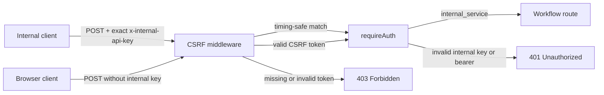
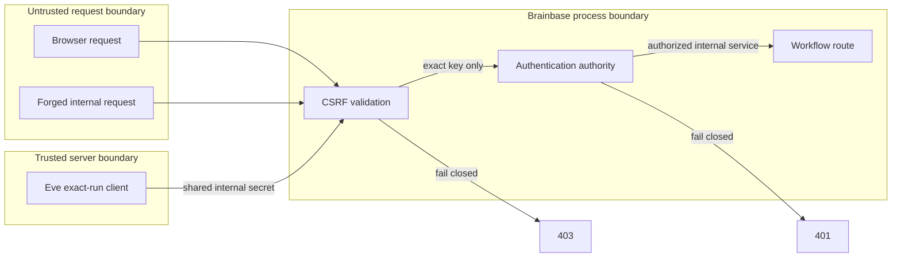

# ADR: internal API keyをCSRF層でも検証する

- Status: Accepted
- Date: 2026-07-13
- Story: `story-eve-internal-api-csrf-exemption`

## Context

Brainbaseは全APIの前段にCSRF middlewareを置き、その後にroute単位の`requireAuth`を実行する。`x-internal-api-key`はserver-to-server認証として`requireAuth`が受理するが、非ブラウザclientはCSRF tokenを取得できず、正しいkeyを持つ本番POSTも前段で403になっていた。

## Decision

CSRF middlewareは、設定済み`INTERNAL_API_SECRET`とrequest headerが完全一致するときだけ早期通過させる。比較はtiming-safeとする。認証・access contextの正本は引き続き後段の`requireAuth`であり、CSRF middlewareは`req.auth`や権限を設定しない。

path単位でworkflow API全体を除外しない。internal keyを持たないブラウザrequestは従来のCSRF token検証を通す。

## Flow

## Threat Model

## Consequences

- internal serviceはブラウザ用CSRF tokenなしでworkflow POSTを実行できる。
- keyの誤りやserver設定不足は前段で403となる。
- 同じsecret検証がCSRF層と認証層に存在するが、middleware順序上のfail-closedを維持するため意図的に許容する。
- 将来internal認証方式を置換するときは、両middlewareの共通validator抽出を別Storyで検討する。

## Rejected Alternatives

- workflow path全体の無条件CSRF除外: 認証前の信頼境界を広げるため不採用。
- CSRF middlewareをroute認証より後ろへ移動: 全APIのmiddleware順序と影響範囲が大きいため不採用。
- 本番運用でCSRF tokenを手動発行: server-to-server clientの契約にブラウザsessionを混在させるため不採用。
