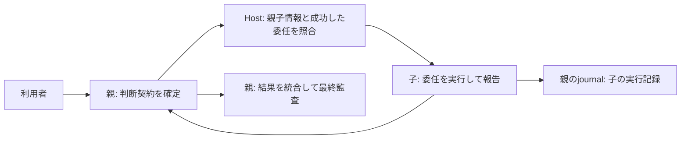

# 子エージェントの判断契約を親に集約する

状態: ローカルの既存プロジェクトHookへ反映済み。子の実行・親への報告を実Hostで確認。

Story: `parent-contract-delegation`

親が依頼の意味を判断し、Resolverで契約を確定する。子はHostが確認した委任の範囲で実行し、結果・失敗・未確認を親に返す。利用者向けの最終回答と監査の確定は親だけが担当する。

Host管理の子rolloutにある親ID・agent名・root_turn_idと、その子turn宛てに親が送った委任メッセージを照合する。forkでコピーされた親のメタデータは子の識別に使わず、先頭の子メタデータに対応するものだけ許容する。プロンプト内の親IDの自己申告は認めない。

親の有効な開始記録・未終了の判断契約・同じリポジトリを確認する。自然言語の委任範囲は子と親のモデルが判断する。子turnと元の委任の対応はHostのrolloutに保持される。この対応自体は個々の操作の認可ではなく、通常のツール権限や承認を追加・代替しない。

子は独立したResolver、状態確定、最終監査を呼ばない。PostToolUse・失敗・Stopは親journalの通常の実行イベントとして `delegated.*` 名に記録する。子の成功だけで親の必須能力や完了条件を満たしたことにはしない。未解決・終了済み・不正な親契約、対応する委任の欠落は子の操作を拒否する。

今回の対象は親から直接委任された子（depth 1）。孫への委任は独立したbindingの仕様がないため拒否する。別リポジトリへの委任も対象外。未対応を正常な委任へ推測しない。

反映は既存のプロジェクトHookが参照している統合checkoutへ検証済み変更を取り込む。CodexのHook信頼確認はHostの通常手順に従う。問題があれば参照先を直前のcheckoutへ戻し、journalは消さない。グローバルHook設定は変更しない。

## 検証と適用範囲

2026-09-09、履歴を引き継いだ既存の子に読み取りを再委任し、独立Resolverなしで統合版SHA `ea0a6a883` を取得して親へ返せた。親journalの `delegated.Bash` に成功が記録され、`satisfies` は空のままだった。子の開始不足による停止はこの経路で解消した。

対象の25テストと独立レビューを通過。子Stopの処理は単体テストで確認したが、この実Hostプローブでは `delegated.Stop` は観測されていないため、Stop配信までの実機検証は未完了。適用は既存の `diagnostic_continue` のプロジェクト範囲に限定し、通常モードやグローバルへの展開は別途検証する。

制御ツール名の検出は直接呼び出しとliteral参照の誤用防止であり、任意JavaScriptを隔離する仕組みではない。動的に構成されたツール名まで認可境界で遮断する保証は含めない。

Graphifyの既存グラフは見つからず、グラフによる影響範囲はunknown。コードと対象テストで差分を確認した。VibeProのSpecは追跡可能なdraftとして保存し、旧readinessのグラフ必須判定を実装・PRの追加ゲートにはしない。

### 実Hostでの終了再検証（2026-09-09）

統合版 `e50e5d66f` で、履歴を引き継いだ子の再開と新規生成の2経路を実行した。両方とも独立Resolverなしで読み取りに成功し、親へSHAを返した。Codex rolloutの `task_complete` をそれぞれ08:35:26Z、08:37:02Zに確認。親journalには成功した `delegated.Bash` が2件、`satisfies` は両方空、検査時点で親finalは未作成だった。

一方、`delegated.Stop` は0件。子の正常終了そのものは実機確認済みだが、終了を親journalへ記録する受入条件は未達。HookのStop通知経路のどの段階で欠落したかは未確定であり、単体テスト合格を実機合格に代用しない。PRはDraftを維持する。
