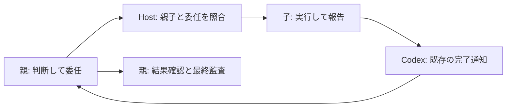

# 子エージェントの判断契約を親に集約する

Story: `parent-contract-delegation`

親が依頼を判断してResolverで契約を確定し、子は確認された委任範囲で実行・報告する。親が結果を確認し、利用者向けの最終回答と監査を確定する。

## 責任と記録

Host管理の子rolloutにある親ID・agent名・root_turn_idと、その子turn宛ての委任メッセージを照合する。履歴forkに含まれる親メタデータは子の識別に使わない。親の有効な開始記録・未終了の判断契約・同じリポジトリを確認する。自然言語の委任範囲は親と子のモデルが判断し、通常のツール権限・承認は維持する。

子は独立したResolverや最終監査を呼ばない。PostToolUseと失敗は親journalに実行イベントとして記録するが、親の必須能力や完了条件を自動で満たさない。

子の完了はCodexの既存通知と報告を親が確認する。子のStopがHostへ届いた場合は何も記録・確定せず終了する。専用の `delegated.Stop`、子の最終receipt、完了通知を複製する監視処理は作らない。完了通知だけで成果物の正しさを証明したことにはせず、親が依頼に必要な結果を確認する。

## 適用範囲

既存プロジェクトHookの `diagnostic_continue` 範囲で、同一リポジトリの直接の子（depth 1）を扱う。孫・別リポジトリ・未解決や終了済みの親・不明な委任は許可へ推測しない。通常モードとグローバルへの展開は対象外。

制御ツール名の検出は直接呼び出しとliteral参照の誤用防止であり、任意JavaScriptを隔離する認可境界ではない。

## 判断と検証

変更方針はSIMPLIFICATION。専用終了イベントの追加、既存通知の複製、子専用終了記録の削除を比較し、既存のCodex完了通知を利用する削除案を採用した。

2026-09-09、統合版 `e50e5d66f` で新規と再開の子が独立Resolverなしで読み取り・親への報告・正常終了に成功した。Codexの `task_complete` と親journalの `delegated.Bash` を2件ずつ確認し、親finalは作られていなかった。`delegated.Stop` はなくても、この委任から報告までの流れは成立した。

Graphifyはmissingで影響範囲unknown。対象コードと回帰テストで確認する。VibeProのStory・Spec draft・検証・レビューを同じ変更に紐付ける。

反映は既存のローカル統合checkoutへ検証済み差分を取り込む。グローバルHookは変更しない。問題時は対象commitをrevertし、journalは消さない。
