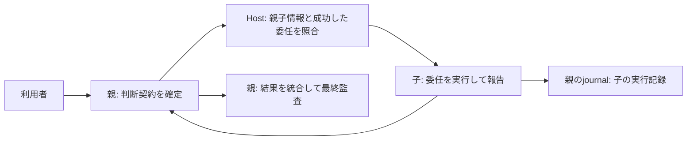

# 子エージェントの判断契約を親に集約する

状態: 実装済み、実Hostでの反映・検証待ち

Story: `parent-contract-delegation`

親が依頼の意味を判断し、Resolverで契約を確定する。子はHostが確認した委任の範囲で実行し、結果・失敗・未確認を親に返す。利用者向けの最終回答と監査の確定は親だけが担当する。

Host管理の子rolloutにある親ID・agent名・root_turn_idと、その子turn宛てに親が送った委任メッセージを照合する。forkでコピーされた親のメタデータは子の識別に使わず、先頭の子メタデータに対応するものだけ許容する。プロンプト内の親IDの自己申告は認めない。

親の有効な開始記録・未終了の判断契約・同じリポジトリを確認する。自然言語の委任範囲は子と親のモデルが判断する。子turnと元の委任の対応はHostのrolloutに保持される。この対応自体は個々の操作の認可ではなく、通常のツール権限や承認を追加・代替しない。

子は独立したResolver、状態確定、最終監査を呼ばない。PostToolUse・失敗・Stopは親journalの通常の実行イベントとして `delegated.*` 名に記録する。子の成功だけで親の必須能力や完了条件を満たしたことにはしない。未解決・終了済み・不正な親契約、対応する委任の欠落は子の操作を拒否する。

今回の対象は親から直接委任された子（depth 1）。孫への委任は独立したbindingの仕様がないため拒否する。別リポジトリへの委任も対象外。未対応を正常な委任へ推測しない。

反映は既存のプロジェクトHookが参照している統合checkoutへ検証済み変更を取り込む。CodexのHook信頼確認はHostの通常手順に従う。問題があれば参照先を直前のcheckoutへ戻し、journalは消さない。グローバルHook設定は変更しない。
