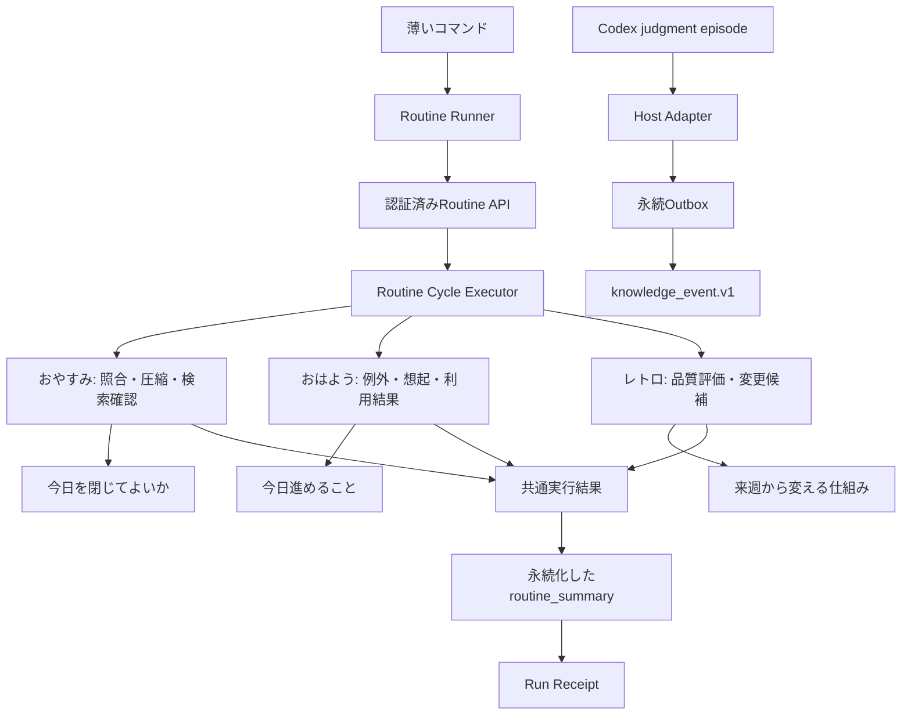

# Brainbase記憶循環ルーティンアーキテクチャ

## 境界

- Routine Runnerが`ohayo`、`oyasumi`、`retro`の唯一の実行入口を所有し、認証済みのBrainbase Routine APIへ接続する。
- Routine Cycle Executorが処理順、部分成功、成果物を所有する。
- Production Routine Portsは知識イベント、Run Receipt、Graph、Personal KG、利用結果の既存正本へ接続し、取得不能をゼロへ変換しない。
- Episode圧縮は対象イベント集合、ハッシュ、判断、結果、未解決事項を持つ`episode_compaction.v1`を同一トランザクションで永続化し、全件の更新と再読取後だけ完了とする。
- Run Receiptはルーティンの生存証跡であり、知識イベントやjudgment episode receiptの第二の正本にしない。
- Resolver Host Adapterは完了済み判断を知識イベントへ写像するが、参照Receiptを行動許可へ変換しない。

## データ流

## 原則

- 実行の順序と完了条件はコードで決め、Markdownへ複製しない。
- 確認済みの空集合と取得不能を分ける。
- `/ohayo`は生成ポート自身が選んだ最大3件だけを出力し、正式なsource event IDへ解決できた知識だけを再固定する。
- Judgment Outboxの未配信、再試行、Dead Letterは朝の異常とルーティン状態へ反映する。
- `/retro`は変更案を作る制御面であり、本番ルールの書込み面ではない。
- 内部処理結果と利用者向け成果を分離する。前者は照合・圧縮・指標を保持し、後者は`routine_output`として結論、次の判断、詳細の順に並べる。
- `routine_output`の各項目は出典参照と確認状態を持てる。Graph SSOT、Personal KG、Run Receiptの取得不能は空配列ではなく`coverage=partial`と異常へ反映する。
- 夜に抽出した候補は、個人の判断ならPersonal KGの「登録・確定レビュー」、組織で共有する事実・判断ならGraphの「昇格レビュー待ち」へ分ける。
- 週次は両レビューを並べるが、定期実行に承認権限を与えない。Graphへの書込みは、別経路で人が承認した候補だけを既存の昇格ゲートへ渡す。
- `active`、`blocked`、未完了のjudgment episodeは知識イベントへ変換しない。完了済み判断は安全な最終回答本文と`codex://threads/...`参照先を持たせ、ハッシュだけの検索不能な記憶にしない。
- Host Adapterの出力は記憶登録用の包絡であり、送信、公開、購入、デプロイなどの許可を持たない。
