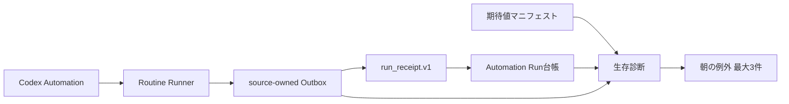

# Brainbase記憶ルーティン生存確認アーキテクチャ

## 境界

- Codex Automationsはスケジュールと実行場所を所有する。
- Brainbaseは期待値マニフェスト、Run Receipt、異常診断を所有する。
- source runtimeは実行IDと成果物参照を所有し、生ログや本文をReceiptへ複製しない。
- Run Receiptは既存Automation Run台帳へ投影し、第二のrun正本を作らない。

## データ流

## 原則

- `CODEX_THREAD_ID`がない実行はsource runとして捏造せず、blockedなconnector observationとして扱う。
- Codex project IDは実行場所の識別子であり、Brainbase project IDではない。
- Receipt deliveryとroutine executionの成否を分離する。
- 期限内のReceipt不在は明示的な異常であり、空配列へ変換しない。
- 期待値マニフェストは起動時に検証し、重複や不正な時刻を黙って無視しない。
- 必須成果物はReceiptの状態とは独立に検査する。`success/confirmed`でも成果物が欠ければblockedとする。
- Dead Letterの監視投影はautomation ID、作成時刻、ファイル位置だけを返し、失敗時の本文をAPIへ複製しない。
