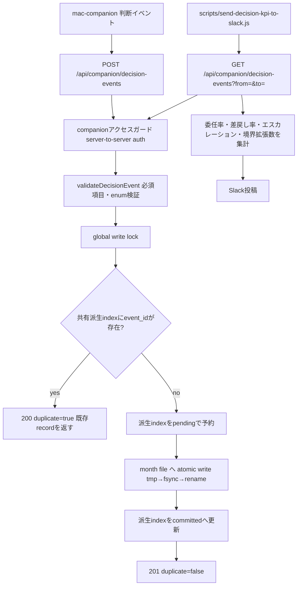
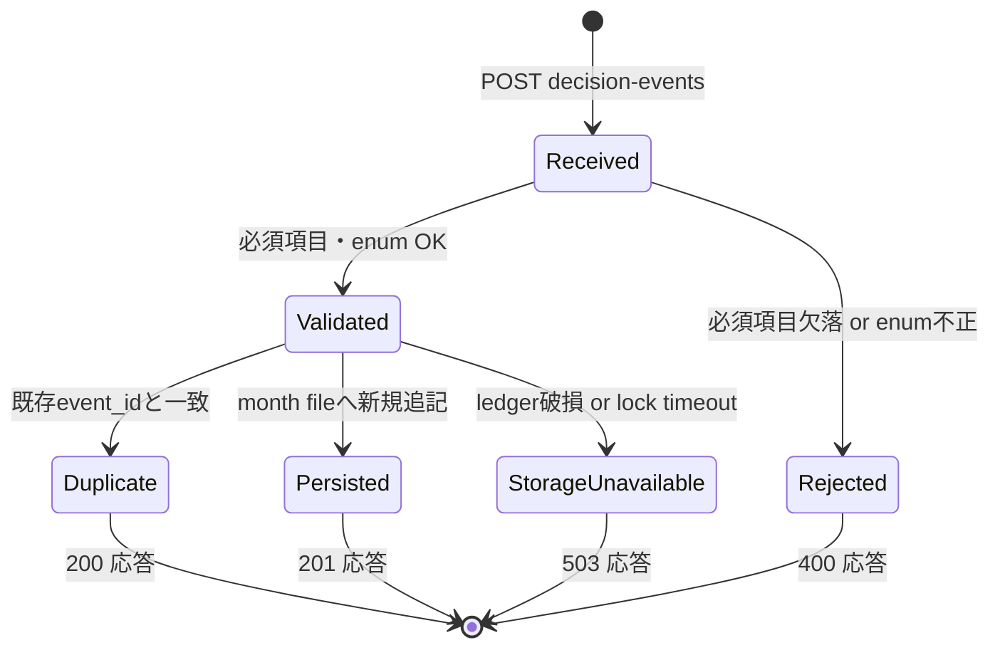
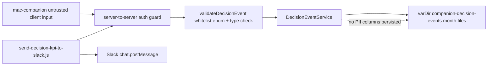

# 判断委任KPI フェーズ1 サーバー側 Architecture

## Flow

## State

## Boundaries

- 正本: `server/services/companion/decision-event-service.js` が書き込む `varDir/companion-decision-events/<yyyy-mm>.json`。mac-companion側のローカル状態は正本ではなく送信元。
- 入力契約: `event_id` / `occurred_at` / `item_dedupe_key` / `provider` / `event_type` は固定契約（mac-companion側と合意済み）。この契約フィールド名・型は本story内で変更しない。
- 冪等性境界: `event_id` は月別partitionおよび同一ホストのローカルfilesystem上で同一data directoryを共有するRuntimeプロセスをまたいで一意とする。`.write-lock/` のglobal write lock下で、再構築可能な `.event-id-index/` を確認・更新する。同一 `event_id` の再送は、再送時の `occurred_at` が別月でも最初の既存recordを返し、上書きも別月への二重保存もしない。旧ledgerに重複が残っていてもGET/KPIは最初のrecordだけを返す。ネットワーク共有filesystemや複数ホスト間の一意性は本実装の保証外とする。
- Partition境界: ledgerとして列挙するファイルは `yyyy-01.json`〜`yyyy-12.json` のみ。不正な月番号やquarantine/tmpファイルはindex・GET・KPIの対象外とする。
- 性能境界: 全履歴走査はRuntimeプロセスごとの初回cache構築、派生index再構築、またはledgerファイル署名の予期しない変更を検知した場合だけに限定する。以後のPOSTは共有indexと対象月ledgerだけを読み、GETはgenerationと月別ledgerのmetadata署名を確認し、通常は未読revisionのchangeだけを正本ledgerと照合して同期する。プロセス再起動時は正本ledgerからcacheと派生indexを再構築できる。
- 書込み境界: 新規eventはglobal write lock下で派生indexを`pending`として予約してから正本ledgerへatomic追記し、最後に`committed`へ更新する。途中停止でpendingが残った場合、次回アクセスが正本ledgerとの整合を回復する。
- 認証境界: 既存 `createCompanionAccessGuard`（server-to-server認証: internal / service-token / bearer(owner) のみ）をそのまま再利用し、新規の認可ロジックは追加しない。
- 集計境界: `scripts/send-decision-kpi-to-slack.js` は同一ホスト上のcompanion APIをHTTP経由で読むだけで、月次JSONファイルを直接読まない（サーバープロセス経由の一貫性を保つ）。

## Architecture Decision Quality

- Boundary: この変更は companion API配下の新規エンドポイント追加とローカル月別JSON ledgerへの永続化に限定する。既存の reply-draft / approval-inbox / people エンドポイントの挙動は変更しない。
- Compatibility impact: 新規エンドポイントの追加のみで、既存API契約への破壊的変更はない。
- Alternatives considered: 判断イベントをworkflow-repository.jsの既存ledger（workflow-ledger.json）に混在させる案は、判断委任KPIという独立した関心事を既存workflow監査ログと結合させ、スキーマ肥大化と無関係な参照を招くため却下し、専用サービス・専用ファイルに分離した。
- Rollback plan: PR revertでルート登録・controller・serviceを外せる。永続化された `companion-decision-events/*.json` は既存機能に影響しない付加データであり、削除しても他機能は継続動作する。
- Accepted followups: 本PRではイベント受信・冪等永続化・週次Slack集計に限定する。Postgres移行、GitHub Actionsからの直接集計、ダッシュボードUIは別作業とする。

## Threat Model

- Threat: 未認証または他ownerのクライアントがイベントを注入する可能性。
- Control: 既存の `createCompanionAccessGuard`（server-to-server auth必須）をそのまま適用し、新規の緩和は行わない。
- Threat: 不正な `event_type` / 欠落フィールドによるデータ破損。
- Control: `validateDecisionEvent` が固定enumとISO8601形式を検証し、不正な入力は永続化前に400で拒否する。
- Threat: `metadata` フィールドに任意のPII/個人情報が混入するリスク。
- Control: `metadata` はcompanion controller層で解釈せず、そのまま保存するだけの不透明領域として扱う。event本体のフィールド（event_id, occurred_at, item_dedupe_key, provider, event_type等）は個人を特定する情報を含まない設計。送信元（mac-companion）側でPIIを含めない運用を前提とし、本サーバー側では追加のスキーマ検証は行わない（フェーズ1のスコープ外）。
- Residual risk: `metadata` に将来PIIが混入した場合の検出はフェーズ1では未実装。フェーズ2でのスキーマ制約強化をフォローアップとする。

## Responsibility Authority

| Responsibility | Authority | Implementation |
| --- | --- | --- |
| 判断イベント受信認証 | 既存 companion access guard | `createCompanionAccessGuard` (`server/routes/companion.js`) |
| イベント入力契約検証 | mac-companion側と合意済みの固定契約 | `validateDecisionEvent` (`server/services/companion/decision-event-service.js`) |
| イベント永続化・冪等性 | DecisionEventService月別ledger（`event_id` は全partition共通で一意） | `DecisionEventService.insertEvent` |
| 週次KPI集計・Slack送信 | ローカルサーバー同居プロセス（launchd/cron想定） | `scripts/send-decision-kpi-to-slack.js` |

## Failure Behavior

- 不正なリクエストボディ（必須フィールド欠落・enum不正）は永続化前に400で拒否し、month fileは変更されない。
- 月別JSONファイルがJSONとして解析不能、`schema_version`が不一致、`events`配列を持たない、または配列内eventが契約違反の場合はquarantine（`<file>.corrupt-<timestamp>`へrename）し、再構築可能な派生indexも`.stale-*`へ退避して、そのリクエストを503 `decision_event_ledger_corrupt`で停止する。読取不能なfilesystemエラーも503へ正規化する。次回リクエストは残存する正本ledgerからcache/indexを再構築して再開できるが、破損を検知したリクエスト中に空ledgerとして上書きしない。
- 派生indexのcommitted/pending状態は正本ledgerを代替しない。index entryまたはgeneration changeが示すeventを正本ledgerで確認できない場合は、そのindexを隔離するか503で停止し、派生データだけをGETや重複判定へ採用しない。
- quarantineに失敗した場合は503 `decision_event_ledger_quarantine_failed`を返し、破損ファイルを保持する。global write lockを取得できない場合も503として書込みを行わない。
- `decisionEventService` が未設定の場合、ルートは503を返し、既存の他companionルートには影響しない。
- 週次集計スクリプトは対象期間のイベントが0件の場合、ゼロで委任率・差戻し率を偽装せず「計測不能」「イベント未受信」と明示する。

## Release Operations

- Release path: 通常のBrainbaseサーバーデプロイ・再起動で有効化する。`register-api-routes.js` が `DecisionEventService` を注入するため追加のoperator設定は不要。
- Rollback path: PR revertでルート・controller・serviceの登録を外す。既存の `varDir/companion-decision-events/*.json` は他機能に影響しない付加データなので残しても問題ない。
- Observability path: operatorは `GET /api/companion/decision-events?from=&to=` で任意期間のイベントを確認できる。
- Support path: 週次集計スクリプトはlaunchd/cronから実行し、HTTPエラーまたは`events`配列を欠くAPI契約違反ではSlack投稿前に失敗する。失敗時はSlack投稿が行われないことで検知する（既存 weekly-story-progress.js と異なりGitHub Actions経由の失敗通知は設けない。理由は本story commitメッセージ参照）。

## Replay Evidence

- `tests/server/services/companion/decision-event-service.test.js` が validateDecisionEvent の厳密なISO8601・暦日検証、同月・月跨ぎ・別service instance間のinsertEvent冪等性、generation差分同期、lockのatomic公開、ledger追記後のpending復旧、派生indexの正本照合、未変更ledger本文を再読しない挙動、署名変更後の再検証、既存の月跨ぎ重複を読取時に一件へ収束する挙動、不正月partitionの除外、月別ファイル分割、不正schema・不正eventを含む破損ファイルと派生indexのquarantine、次回復旧、filesystemエラーの503正規化、listEventsの範囲フィルタを再生する。
- `tests/server/routes/companion-decision-events.test.js` が POST/GETルートの201/200/400/403/503応答、破損ledgerの503契約、companionアクセスガードの適用を再生する。
- `tests/e2e/story-brainbase-decision-events-kpi-v1-decision-events-api-contract.spec.ts` が月跨ぎ再送、旧ledger重複のGET/KPI二重計上防止、厳密な入力契約をHTTP境界から再生する。
- `tests/server/scripts/send-decision-kpi-to-slack.test.js` が委任率・差戻し率の計算式と「計測不能」「イベント未受信」表示を再生する。
