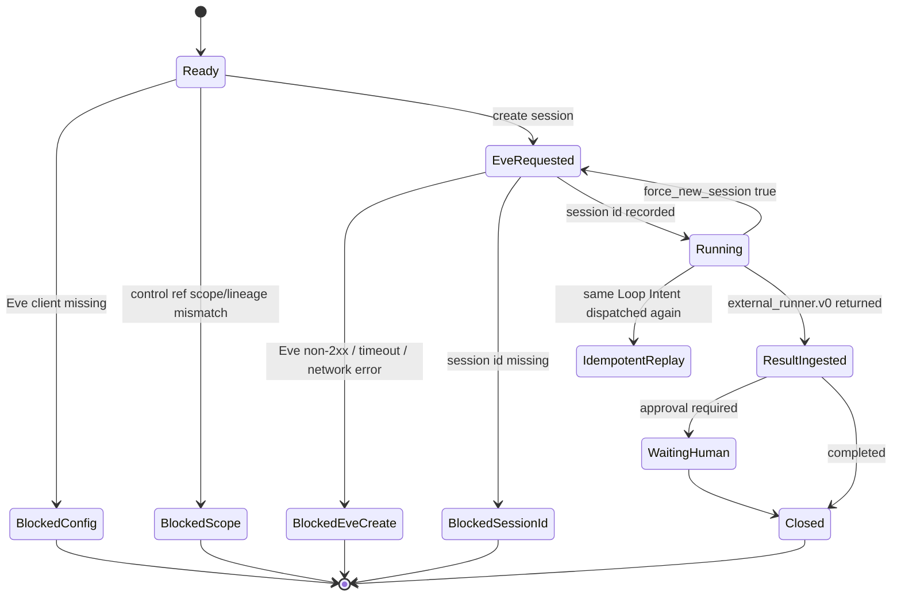

# Eve Runtime Session Connection Architecture

## 決定

BrainbaseはEve SDKの内部状態へ依存せず、公式HTTP APIを呼ぶ薄い `EveSessionClient` を持つ。v0では `POST /eve/v1/session` でsessionを作成し、Eveの戻りは既存の `external_runner.v0` ingestでBrainbaseへ取り込む。

Eve session作成はWorkflow Control配下の操作として扱う。API境界は `/api/workflows/control/loop-intents/:loopIntentId/eve-session` で、対象Loop Intent、Role Agent、Workflow Template、Workflow Binding、TriggerをBrainbase側で解決し、scopeとlineageを検証してからEveへ渡す。

## 責務分離

| Layer | 責務 |
|---|---|
| Brainbase Workflow Control | Loop Intent、Role Agent、Workflow選択、Loop Eligibility、owner、approval ownerを管理する |
| Workflow Control UI | Loop Intent行からEve dispatch、idempotent replay、force新規session、失敗表示を扱う |
| Brainbase Eve dispatch | Eve sessionを作成し、session refをWorkflow Run / Auditへ保存する |
| Eve Runtime | agent実行、durable session、tool実行、approval requestなどのruntime機能を担う |
| External Runner Ingest | Eve実行結果を `external_runner.v0` としてBrainbase正本へ戻す |
| Graph SSOT / Candidate Store | Decision、Task、Learning Candidate、Graph昇格候補をBrainbase側で審査する |

## Flow

```mermaid
flowchart LR
  operator["Operator"]
  loopIntent["Loop Intent"]
  controlRefs["Role Agent / Template / Binding / Trigger"]
  dispatcher["EveSessionDispatchService dispatchLoopIntentToEve"]
  client["EveSessionClient"]
  eve["Eve API /eve/v1/session"]
  wmc["Workflow Mission Control"]
  ingest["external_runner.v0 ingest"]
  graph["Graph SSOT / Candidate Store"]

  operator --> loopIntent
  loopIntent --> dispatcher
  controlRefs --> dispatcher
  dispatcher --> client
  client --> eve
  eve --> client
  client --> dispatcher
  dispatcher --> wmc
  eve --> ingest
  ingest --> wmc
  ingest --> graph
```

## State



## Threat Model

```mermaid
flowchart TD
  actor["Authenticated Brainbase operator"]
  api["Workflow Control API"]
  dispatcher["Brainbase Eve dispatch"]
  eve["Eve Runtime"]
  graph["Graph SSOT"]
  external["External send / publish / contract"]

  actor --> api
  api --> dispatcher
  dispatcher --> eve
  eve --> dispatcher
  dispatcher --> graph
  dispatcher --> external

  graph -. "blocked: candidate review required" .-> dispatcher
  external -. "blocked: human gate required" .-> dispatcher
```

## データ保存

- `workflow_runs`: Eve sessionを開始したことを `status=running`、`action_required=await_eve_result` として保存する。
- `run_steps`: `eve_session_create` stepを保存する。
- `context_snapshots`: dispatch時点のLoop Intent、Role Agent、Template、Binding、Triggerを保存する。
- `loop_intents.metadata.eve_session_ref`: `session_id`、`continuation_token`、`workflow_run_id`、`expected_result_contract` を保存する。
- `audit_logs`: `workflow.eve_session.dispatched` を保存する。

Workflow Control UIはLoop Intent行のEve dispatch結果から該当Workflow RunのRun Traceへ直接遷移できる。Run TraceではEve session id、continuation tokenの有無、expected result contract、dispatch auditを確認できるが、continuation token本体は表示しない。`continuation_token` が `null` として保存されている場合も公開面へ `continuation_token:null` を返さず、`continuation_token_present=false` だけを表示する。

Workflow Control UIはEve dispatch用Workflow / Runに汎用の `実行` / `Rerun` 操作を表示しない。Eve dispatchはLoop Intentを入口にした外部runtime接続であり、汎用run / rerun経路を押せるUIにすると、backendが拒否する死に操作を人間に見せることになるためである。Run Traceの `stop_conditions` は永続化済み値が配列でない場合に空扱いで隠さず、`Stop Conditions Warning` として表示する。

Eve create失敗、Eve session id欠落、Control Ref不整合、Eve client未設定では、`workflow_runs`、`run_steps`、`context_snapshots`、`loop_intents.metadata.eve_session_ref` を保存しない。dispatch成功時点でも `workflow_outputs` と `workflow_human_steps` は作らず、Learning CandidateやGraph昇格は `external_runner.v0` ingest以後のBrainbase Human Gateで扱う。

## Control Ref Guard

Eve dispatch前に、BrainbaseはLoop Intentが参照するcontrol refの整合性を検査する。org/project scopeだけでなく、Workflow Bindingの `role_agent_instance_id` と `workflow_template_id`、Workflow Triggerの `workflow_binding_id`、Loop Intentの `trigger_id` と `workflow_trigger_id` が同じLoop Control bundleを指していることを必須にする。既存 `eve_session_ref` を返すidempotent replayもこの検査後にだけ成立する。`eve_session_ref.workflow_run_id` がある場合は、参照先run / workflowのworkspace、org、project、loop_intent_id、workflow_id、`implementation_key=eve-session-dispatch` も検証する。これにより、別projectのRunや同じproject内の別Workflowが誤って混ざった状態でEveへ外部実行または成功replayされることを防ぐ。

Loop Intent自体が `enabled=false`、`status=blocked/human_only/cancelled/canceled`、`eligibility.status=blocked/human_only`、または `blocked_reasons` を持つ場合も、UIだけでなくサービス/API層でEve dispatchを拒否する。拒否理由はAPI responseと `/workflows` UIの両方に表示し、operatorが「なぜ送れないか」を判断できる状態にする。

## Runtime Boundary

Eve dispatchで作られるWorkflowは `implementation_key=eve-session-dispatch` を持つが、これは通常の `manual-placeholder` workflowではない。汎用 `/api/workflows/:workflowId/run` は製品廃止に伴い404へ落とし、rerunも明示的に拒否する。Eve sessionや `external_runner.v0` ingestを迂回させず、実行入口は常に `/api/workflows/control/loop-intents/:loopIntentId/eve-session` に固定する。

Bindingが既存 `workflow_id` を指す場合、そのWorkflowは既に `implementation_key=eve-session-dispatch` でなければならない。Bindingに `workflow_id` がない場合にBrainbaseが生成するfallback IDも同じ検査に通す。同じorg/project内であっても、`manual-placeholder` などの汎用WorkflowをEve dispatch用Workflowとして上書きしない。これは、既存の汎用run/rerun経路を後から壊すことを防ぐためのControl Plane境界である。

`continuation_token` はBrainbase内部の再接続用metadataとして保存するが、Brainbase API caller input、Eve handoff context、Brainbase API response、context snapshot、Workflow Run detail/list API、Loop Intent list APIへは直接出さない。callerが `continuation_token` / `continuationToken` を指定した場合は、Eve APIを呼ぶ前に拒否する。さらに `EveSessionClient.createSession` 自体も `continuationToken` / `continuation_token` inputを拒否し、将来の内部callerがEveSessionDispatchServiceの所有権検証を迂回してEve resumeを行えないようにする。Eveがcontinuation tokenを返さなかった場合も `continuation_token:null` を公開面へ残さず、`continuation_token_present=false` へ正規化する。force新規sessionでは過去sessionのtokenをredactし、新しいsession idを含む一意run idでWorkflow Mission Control上の証跡を分離する。

Eve session作成は外部副作用なので、作成後にBrainbase側のrun/context/audit永続化が失敗した場合は完全rollbackできない。この場合は `blocked_eve_dispatch_persistence_failed` として成功扱いを止め、best-effortでrecovery用Workflow Run、audit、Loop Intent `eve_session_ref` を残す。これにより次回retryは新規Eve sessionを作らず既存session refを返し、operatorが `operator_reconcile_eve_session` として復旧できる。

同一Loop IntentのEve dispatchは、process-local in-flight mapだけに依存せず、repository lockを取得してからEve APIへ送る。JsonFile repositoryではlock fileをatomicに作成し、別processが同じLoop Intentを同時dispatchする場合はEve API呼び出し前に `blocked_eve_dispatch_in_progress` として止める。lock取得後はrepositoryを再読込し、別processが直前に保存した `eve_session_ref` があれば新規Eve sessionを作らずidempotent replayを返す。

Eve create timeoutは、BrainbaseがEve session idを受け取っていないだけで、Eve側ではsessionが作成済みの可能性がある。このためtimeoutを単なる `blocked_eve_session_create_failed` に丸めて自動retryさせない。timeout時は `blocked_eve_session_timeout_recovery_required` としてsession id unknownのblocked recovery run、audit、Loop Intent `eve_dispatch_timeout_recovery` を保存し、operator reconciliationまで同一Loop Intentの再dispatchを拒否する。Eve 401/403/5xxやTCP接続失敗など、remote sessionが成立したと判断できないnon-timeout failureは従来通り部分書き込みなしで失敗させる。

`operator_reconcile_eve_session`、`operator_reconcile_eve_session_timeout`、`EVE_API_TOKEN` ローテーション、raw `continuation_token` を含むvar-dir状態ファイルの権限境界は、[Eve Session Dispatch 復旧Runbook](../brainbase-capabilities/runbooks/eve-session-dispatch-recovery.md)を正とする。

## Job Infrastructure / Trigger Scope

このStoryは新しいscheduler、queue worker、または常駐job infrastructureを追加しない。時間トリガー、イベントトリガー、人間トリガーはいずれもBrainbaseのWorkflow Trigger / Loop Intentとして正本化し、この接続では「既にLoop Intentとして選ばれた実行単位をEve sessionへdispatchする」境界だけを扱う。

時間トリガーのcron化、イベントトリガーのsource event ingest、Eve schedules / channelsとの双方向同期は後続Storyの責務にする。v0で重要なのは、どのJob基盤から起動されても同じ `/api/workflows/control/loop-intents/:loopIntentId/eve-session` とControl Ref Guardを通り、Workflow Mission Controlに同じ証跡が残ることである。

## 公式API境界

Eve docsのSessionsでは、clientが `POST /eve/v1/session` でsessionを作成またはresumeし、bodyに `message`、任意で `continuationToken` と `context` を送る。成功時は `x-eve-session-id` headerと `continuationToken` を受け取る。Brainbase v0はsession idを `x-eve-session-id` headerからのみ採用し、response bodyのsession idは正本として信頼しない。またBrainbase API callerや内部service callerから任意の `continuationToken` をEveへ中継しない。resume相当の操作は保存済み `eve_session_ref.workflow_run_id` の所有権検証を通したidempotent replayとして扱う。stream継続は `GET /eve/v1/session/{sessionId}/stream` のNDJSON eventで扱う。

`EVE_API_TIMEOUT_MS` は外部runtimeの停止境界である。不正値や空値でtimeoutを無効化せず、既定値へ丸める。Eveへ渡す `loop_control.stop_conditions` は空配列にせず、Binding / Loop Intent側に停止条件がない場合もBrainbase側の既定停止条件を付与する。各stop conditionは非空文字列だけを許可し、objectなどを `"[object Object]"` に暗黙変換してEveへ渡さない。永続化済みのBinding / Loop Intent / Eligibilityに非配列のstop conditionが残っている場合も、欠落扱いでdefaultへ落とさず、Eve handoff前に拒否する。

参照: https://vercel.com/docs/eve

## v0でやらないこと

- Eve stream eventを常時購読してUIへ表示すること。
- Eve approvalをBrainbase Human Stepへ双方向同期すること。
- Eve agent directory生成やVercel deploy自動化。
- EveのmemoryをBrainbase Personal KGの正本として採用すること。
