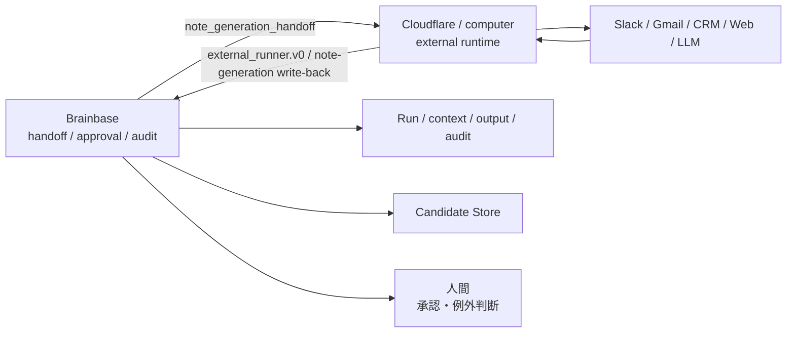

# External Runtime Adapter Contract Architecture

## 方針

BrainbaseはBusiness Loop Control Planeであり、Cloudflare/computerは外部実行面である。Brainbaseは外部ランタイムを起動・再照合せず、実行結果を `external_runner.v0` で受け取り、正本構造へ写す。

## 責務分界

- Brainbase: 正規化済み入力、受け渡し契約、結果の検証、run/context/output/audit、学習候補、承認。
- Cloudflare/computer: 実行、ツール操作、再試行、スケジュール、実行中の状態管理。
- External Runtime Adapter: provider固有の内部モデルを持ち込まず、結果をBrainbaseの契約へ正規化する。

## Flow

1. Brainbaseが `note_generation_handoff` を `ready` として返す。
2. Cloudflare/computerが受け渡しを取得し、外部ツールを使って処理する。
3. 実行結果を `external_runner.v0` または専用write-back APIへ返す。
4. Brainbaseがcontract、trace、evidence、stop condition、redaction、promotion policyを検証する。
5. run/context/human step/output/auditを保存し、Learning CandidateはCandidate Storeへ送る。
6. Graph SSOTへの昇格は人間承認とpromotion flowを通す。

Brainbaseは外部ランタイムのsession作成、stream polling、provider固有continuation token、再照合schedulerを持たない。

## 状態写像

| External status | Brainbase run status | closure_state | action_required |
|---|---|---|---|
| `completed` | `success` | `closed` | `none` |
| `approval_required` / `waiting_human` | `waiting_human` | `open` | `approve` |
| `blocked` | `needs_action` | `needs_action` | `resolve_blocker` |
| `failed` | `failed` | `needs_action` | `check_error` |
| `cancelled` | `cancelled` | `closed` | `none` |
| その他 | reject | - | - |

冪等キーは `run.project_id + runner.type + runner.external_run_id` とする。別projectの同じexternal run idは別runとして扱う。

## Production Path Matrix

| Surface | 入力 | 保存先 | 検証 |
|---|---|---|---|
| Handoff | review package ingest | response `note_generation_handoff` | meeting automation tests |
| Result ingest | `POST /api/external-runner/ingest` | run/context/output/audit/candidate | route/service tests |
| Note write-back | `POST /api/workflows/control/meeting-pack/note-generation` | `meeting_note_draft` | workflow route tests |
| Approval | human step resolution | run/output/audit | workflow tests |

## Auth Boundary

`/api/external-runner/ingest` はserver-to-server APIであり、cookie認証だけのbrowser requestを受け付けない。bearer、service token、internal API keyなどのserver credentialを使う。service/internal credential以外ではowner、cost owner、approval ownerを認証主体以外へ委任できない。
