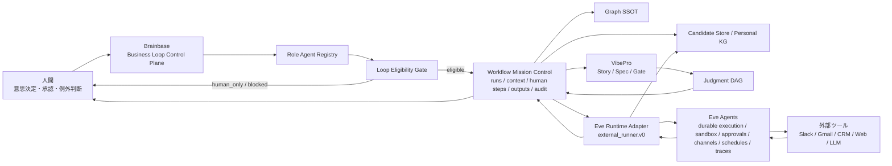
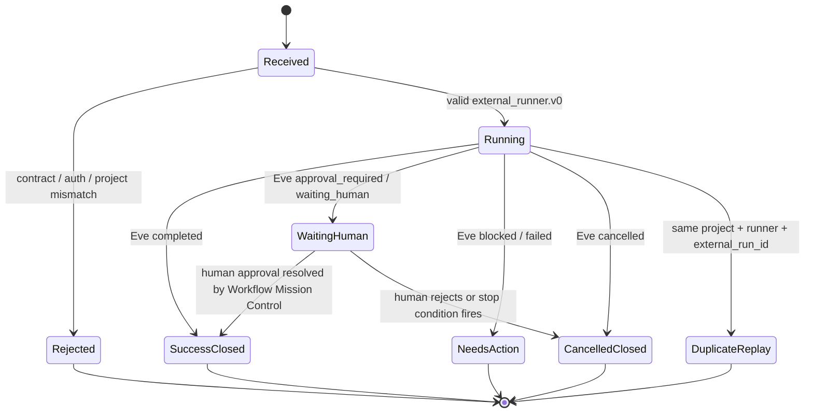

# Eve Runtime Adapter Contract Architecture

## 方針

BrainbaseはBusiness Loop Control Planeであり、EveはAgent Runtimeである。AdapterはEveの実行結果をBrainbaseの正本構造へ写す境界であり、Eveの内部モデルをGraph SSOTやWorkflow Mission Controlへ直接侵入させない。

## 責務分界

- Brainbase: 正本、判断DAG、承認、監査、学習候補、Loop化可否、owner/cost owner/approval owner。
- Eve: agent定義、durable execution、sandbox、tool approval、subagents、evals、connections、channels、schedules、tracing、deploy。
- Eve Runtime Adapter: Eve差分の正規化、contract検証、Workflow Mapping、Evidence Gate、Learning Mapping、Audit Mapping。

## Ingest Flow

1. Eve agentがRole Agentとして実行される。
2. Eveは `external_runner.v0` envelopeをBrainbaseへ返す。
3. Adapterはcontract、trace、round evidence、stop condition、redaction、promotion policyを検証する。
4. requestがservice/internal credentialではない場合、payload上のowner/cost owner/approval ownerが認証主体本人と一致することを検証する。
5. Workflow Mission Controlへrun/context/human step/output/auditを保存する。
6. Learning CandidateはCandidate Storeへ送る。未接続時またはwrite失敗時はdeferred auditとして残し、duplicate replayでも見える状態を保つ。
7. Graph SSOTへの昇格は人間承認とpromotion flowを通す。

## 状態遷移

| Eve status | Brainbase run status | closure_state | action_required | 補足 |
|---|---|---|---|---|
| `completed` | `success` | `closed` | `none` | 通常完了。round evidenceをauditへ残す。 |
| `approval_required` | `waiting_human` | `open` | `approve` | 外部送信・公開・契約・Graph昇格前の人間承認待ち。 |
| `waiting_human` | `waiting_human` | `open` | `approve` | Eve側のhuman approval待ちをBrainbase側でも明示する。 |
| `blocked` | `needs_action` | `needs_action` | `resolve_blocker` | runner側の停止理由をBrainbase側の対応待ちとして残す。 |
| `failed` | `failed` | `needs_action` | `check_error` | 失敗理由を監査・対応対象として残す。 |
| `cancelled` | `cancelled` | `closed` | `none` | 停止条件または人間判断による終了。 |
| その他 | reject | - | - | v0 contractで未定義のstatusは保存前に拒否する。 |
| 同一project内の同一run再送 | `duplicate` | 既存run維持 | 既存run維持 | `run.project_id + runner.type + external_run_id` を冪等キーにする。別projectの同一 `external_run_id` は別runとして扱う。 |
| 既存Workflow ID衝突 | reject | - | - | 既存Workflowのprojectとpayloadの `run.project_id` が一致しない場合は `workflow_project_mismatch` として保存前に拒否する。 |
| owner委任不一致 | reject | - | - | service/internal credential以外では、payloadのowner/cost owner/approval ownerが認証主体本人と一致しない場合に保存前拒否する。 |

## Job Infrastructure

Eve側の `schedules` / durable execution / retry はAgent Runtime責務として扱い、Brainbase v0はschedulerを内製しない。Brainbaseはscheduled Eve runの結果を `external_runner.v0` として受け取り、Workflow Mission Controlのrun、context、human step、output、audit、learning candidateへ正本化する。

Brainbase側で必要なjob infrastructureはingest後の管理面に限定する。具体的には、idempotency keyによるduplicate replay防止、human approval待ちの可視化、Candidate Store write失敗のdeferred audit化、audit logsによる再実行判断、owner/cost owner/approval ownerの保存前検証である。Eve schedule自体の登録・停止・retry cadenceはAdapter contractに入れず、将来のRole Agent Registry / Loop Eligibility GateがEve agent directoryと接続する時点で扱う。

## Production Path Matrix

| Surface | 入力 | 保存先 | 証跡 | 検証 |
|---|---|---|---|---|
| API boundary | `POST /api/external-runner/ingest` | Workflow Mission Control | contract errorまたはrun id | route test / E2E contract |
| Workflow run | Eve run envelope | `workflow_runs` | `external_runner.ingested` audit | service test / E2E contract |
| Workflow ownership | `run.workflow_id` | 既存Workflowまたは新規Workflow | project一致検証 / `workflow_project_mismatch` | service test / route test |
| Fallback workflow ownership | omitted `run.workflow_id` | project-scoped generated Workflow | project id in generated workflow id | service test |
| Loop ownership delegation | `loop_control.owner_id` / `cost_owner_id` / `approval_owner_id` | save前route boundary | `loop_control_delegation_not_allowed` | route test |
| Human step | approval required output | `workflow_human_steps` | approval owner / prompt | service test / E2E contract |
| Learning | `learning_candidates[]` | Candidate Storeまたはaudit | evidence refs / promotion policy / deferred reason | service test / E2E contract |
| Learning actor boundary | non-service `learning_candidates[]` | Candidate Storeまたはaudit | actor defaults to authenticated person | route test |
| Auth | external runner API registration | `workflowAuthGuard` | bootstrap route registration | route test / E2E contract |
| Compatibility | `/api/sessions/report_activity` | session activity telemetry | local hook / CLI activity report | existing CSRF exception preserved |

## Path Surface Coverage Matrix

| Path / surface | Criticality | Evidence |
|---|---:|---|
| API boundary: `/api/external-runner/ingest` | high | `tests/server/routes/external-runner-routes.test.js`, `tests/e2e/story-external-runner-adapter-contract-v0-contract.spec.ts` |
| Service mapping: run/context/human step/output/audit | high | `tests/server/services/external-runner-ingest-service.test.js`, E2E `S-001` / `S-002` / `S-002b` / `S-003` |
| Persistence/idempotency: duplicate replay and project scope | high | service tests and E2E `S-004` / `S-004b` |
| Ownership delegation: owner/cost owner/approval owner | high | route tests and E2E `S-004c` |
| Learning surface: Candidate Store / deferred audit | high | service tests and E2E `S-005` / `S-005b` |
| Human approval surface | high | service tests and E2E `S-002` / `S-002b` plus WMC Run Trace E2E |
| UI output surface: Run Trace Decision Context | medium | `tests/e2e/story-brainbase-workflow-mission-control-contract.spec.ts` |
| Auth / CSRF compatibility | high | external-runner route tests, E2E `S-006`, unit `S-007` |

## CSRF / Auth Boundary

`/api/external-runner/ingest` はEveや内部サービスからのserver-to-server POSTであり、browser session CSRF tokenには依存しない。その代わり、cookie認証だけのrequestは受け付けず、bearer、service token、internal API key、またはtest/dev用insecure headerのようなserver credential経路に限定する。

ただし、Brainbase上のWorkflow owner、cost owner、approval ownerはpayloadだけで自由に委任させない。service tokenまたはinternal API keyはBrainbaseが信頼したEve runtime credentialとして委任を許可し、それ以外のcredentialでは `loop_control.owner_id`、`loop_control.cost_owner_id`、`loop_control.approval_owner_id` が認証主体本人と一致することを保存前に要求する。

既存の `/api/sessions/report_activity` CSRF例外は、ローカルhook/CLIがsession activity telemetryを送るための互換境界である。Eve Runtime Adapterのcontractとは別物として維持し、外部runner ingestの権限拡張には使わない。
