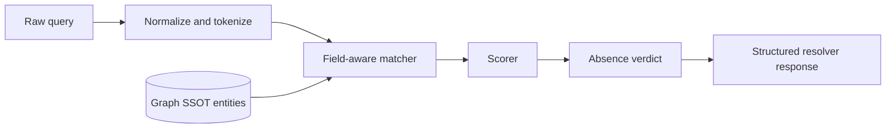

# Graph entity resolver architecture

## Context

Brainbase Graph search is currently exposed as a simple search surface. That is
not enough for raw user phrases because a compound query can miss entities that
would be found by atomic lookup. The resolver must therefore sit between raw
agent/user text and the existing Graph entity index.

## Boundary

The resolver is a deterministic MCP read path. It must not mutate Graph records,
import local notes, or treat non-Graph files as canonical data.

## Components

- Normalizer: strips honorific suffixes, normalizes width and case, and derives
  no-space variants for terms such as `TechKnight` and `Tech Knight`.
- Tokenizer: splits broad phrases on whitespace, punctuation, slashes, pipes,
  commas, and Japanese separators.
- Field-aware matcher: evaluates terms against canonical fields by entity type,
  including person `name`, `aliases`, `role`, `org`, `org_tags`, `projects`,
  `source`, `source_path`, `legacy_source_path`, and `content`.
- Scorer: favors exact `name` and exact `aliases`, then structured fields, then
  content matches. Noisy unmatched tokens must not suppress exact person matches.
- Verdict builder: returns `no_candidate_after_resolver_checks` only after
  tokenized matching and configured fallbacks run. A single raw compound query
  is never enough to report `not_in_graph`.

## Evidence Contract

Every candidate result must include field-level evidence so the calling agent can
explain why the candidate was returned. The response contract includes:

- `candidates[]`
- `matched_terms`
- `matched_fields`
- `score`
- `confidence`
- `why`
- `searched_terms`
- `fallbacks_used`
- `absence_verdict`

## Failure Modes

- If no high-confidence candidate is found, the resolver reports low confidence
  instead of confirming absence.
- If only org/project fields match, the resolver exposes those fields so the
  agent does not imply a person-name match.
- If Graph has no standalone org entity but person records mention the term in
  structured fields, the resolver returns those person candidates with field
  evidence.

## Compatibility

Existing `search`, `get_entity`, `get_context`, and `list_entities` behavior is
unchanged. The resolver is additive and becomes the preferred tool for raw
phrases, while existing tools remain available for direct lookup and inspection.
