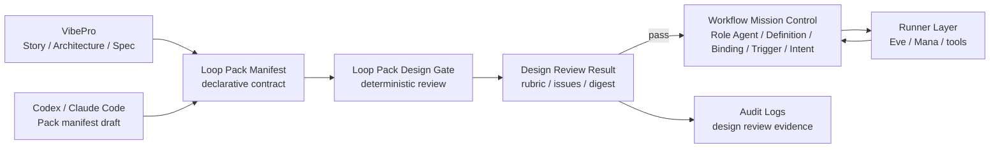
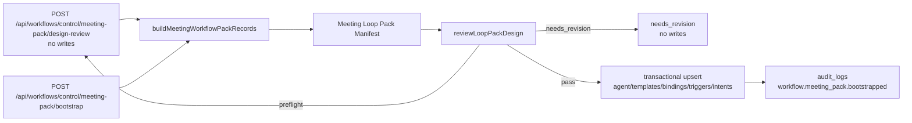
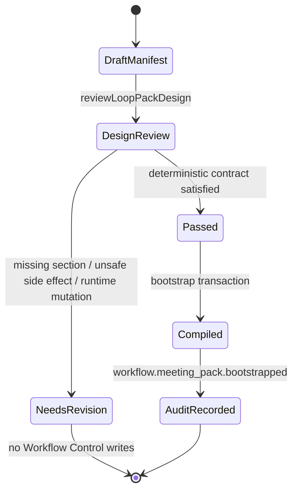

# Loop Pack Design Gate Architecture

## 方針

Loop Pack Design Gateは、Brainbase Loop Packの設計時審査レイヤーである。PackがWorkflow Mission Control recordsへcompileされる前に実行される。

## レイヤー境界

| Layer | Owns | Does not own |
|---|---|---|
| Design Layer | Story, Architecture, Spec, Loop Pack Manifest, completion rubric, stop conditions, budget, judge seats | Runtime ledger state |
| Control Plane | Role Agent, Workflow Definition, Binding, Trigger, Loop Intent, Run, Human Step, Output, Audit | External model execution semantics |
| Runner Layer | Eve/Codex/Claude/Mana execution, tool calls, drafts, traces | Brainbase SSOT, Graph promotion, approval truth |

## 契約

`Loop Pack Manifest v0` はpurpose、inputs、Role Agent、Workflow Definitions、bindings、triggers、Human Gates、outputs、audit evidence、promotion candidates、learning candidates、success metrics、completion rubric、stop conditions、budget、judge seatsを含む必要がある。

## Meeting Packへの適用

## 状態図

## Preflight API

`POST /api/workflows/control/meeting-pack/design-review` はoperator向けのpreflight pathである。

Input:

- `org_id`
- `project_id`

Output:

- `meeting_workflow_pack_design.pack_id`
- `meeting_workflow_pack_design.loop_pack_manifest`
- `meeting_workflow_pack_design.loop_pack_design_review`

Persistence:

- `role_agent_instances`、`workflow_templates`、`workflow_bindings`、`workflow_triggers`、`loop_intents`、`audit_logs` は書かれない。
- operatorはbootstrap前にこのendpointで `status`、`rubric`、`issues`、`required_actions` を確認する。

`POST /api/workflows/control/meeting-pack/bootstrap` はwrite pathである。同じmanifestとDesign Gateを使うが、review statusが `pass` の場合だけWorkflow Control recordsを書く。

## Job Infrastructure

v0は新しいscheduler、worker、queue、lambda、long-running job infrastructureを導入しない。Meeting Workflow Pack definitionsにscheduled trigger metadataがあるため `schedule` という語は出るが、このStoryはtrigger definitionをWorkflow Mission Controlへ取り込むだけである。実際のserver-side scheduled executionは後続Storyの既存Workflow Mission Control scheduler/run infrastructureが持つ。

- scheduling_owner: bootstrap後のscheduled trigger metadataはWorkflow Mission Controlが持つ。
- job_infrastructure: このStoryでは新しいruntime job infrastructureを開始しない。
- runner_start: Pack bootstrap中にEve、Mana、Codex、Claude Code、provider callsは起動しない。
- transaction_owner: 単一のtransactional write boundaryは `bootstrapMeetingWorkflowPack` が持つ。

## Gate Behavior

- Required sectionsが存在する。
- すべてのworkflow templateにbindingがある。
- すべてのbindingに少なくとも1つのtriggerがある。
- Required trigger classesが存在する。
- Risky write-backsにHuman Gate protectionがある。
- Completion rubric、stop conditions、budget、judge seatsが存在する。
- Runner policyがPack作成としてのdirect runtime state mutationを拒否する。

## 永続化境界

v0は新しいledger collectionを追加しない。Design reviewはAPIで返され、bootstrap audit logの中に保存される。

## Release Ops

release_note: このreleaseは、Meeting Workflow Pack作成のためのserver-side Design Gateとno-write preflight endpointを追加する。Operatorはbootstrap前に `loop_pack_design_review.status`、`manifest_digest`、`issues`、`required_actions`、`rubric` を確認できる。

rollout_plan: 既存Workflow Control routesと一緒にserver/API changeをdeployする。既存workflow recordsとruntime runsはmigrationしない。deploy後に新しいPack bootstrapを実行できるが、idempotentでありDesign Gateが `pass` を返す場合だけ書き込む。

rollback_instruction: このcommitをrevertするか、`POST /api/workflows/control/meeting-pack/design-review` とDesign Gate bootstrap pathの利用を止める。新collectionや不可逆migrationは導入しない。作成済みWorkflow Control recordsは従来と同じMeeting Pack recordsであり、既存Workflow Control APIsで確認できる。

observability_evidence: bootstrap audit logはDesign Review statusとdigest付きで `workflow.meeting_pack.bootstrapped` を保存する。preflight endpointは設計上audit recordを書かない。route/service testsがno-write pathとaudit-visible bootstrap pathの両方を検証する。

## Failure Modes

- `missing_required_section`
- `workflow_without_binding`
- `binding_without_trigger`
- `missing_trigger_class`
- `unsafe_side_effect`
- `missing_loop_closure_rubric`
- `missing_budget_or_stop`
- `missing_judge_seat`
- `direct_runtime_mutation_not_for_pack_creation`
