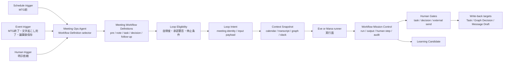
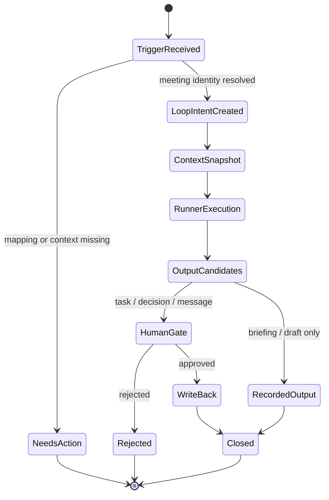

# Mana Meeting Workflow Pack Architecture

## 方針

Mana Meeting Workflow Packは、会議前後の業務をBrainbaseのBusiness Loop Control Planeに載せる最初の実運用Workflow Packである。中心はPrompt TemplateではなくWorkflow Definitionであり、Meeting Ops Agentは定義を選択するRole Agentとして扱う。

## Workflow Definition Pack

| Definition | Trigger | Human Gate | Write-back |
|---|---|---|---|
| `pre-meeting-briefing` | `schedule`, `human` | 共有前は任意 | Workflow output |
| `transcript-to-meeting-note` | `event`, `human` | 正式議事録化前に必須 | Meeting Note draft |
| `meeting-note-to-tasks` | `event`, `human` | task作成または担当者確定前に必須 | Task candidate / Task Store |
| `meeting-note-to-decisions` | `event`, `human` | Graph SSOT Decision昇格前に必須 | Decision candidate / Graph SSOT |
| `post-meeting-follow-up-message` | `event`, `human` | 外部送信前に必須 | Message draft / external channel |

## UI Composition

`/workflows` のProject detail内にあるAgent Loop Controlを拡張し、Meeting Workflow Packを次の投影で見せる。

- Role Agent identity: `Meeting Ops Agent`。
- Instance context: `project_id` / `org_id` / tool scope / approval policy。
- Workflow Definition lanes: `schedule` / `event` / `human`。
- Human Gate queue: task、Decision、messageの承認待ちをrisk順に見る。
- Run Trace requirements: meeting source、workflow definition、human gate、write-back target、evidence refs。

UIは正本ではなく投影である。実データは既存のWorkflow Mission Control APIとLoop Control APIが保持する。v0では、Meeting Packの初期表示はデザイン正本に基づくprojectionとして提供し、既存APIデータがある場合は件数や状態を反映する。

## Data Boundary

- Workflow Definitionは現行実装上は `workflow_templates` に投影される。UI上は「Workflow Definition」と表記するが、backend renameはこのStoryでは行わない。
- Meeting source、meeting identity、write-back targetなどの会議固有フィールドは、Loop Intent `input_payload`、Workflow Run metadata、output metadata、audit evidenceで表現する。
- Graph SSOTへのDecision昇格はHuman Gate通過後だけ許可する。
- 外部message送信はHuman Gate通過後だけ許可する。

## State Model

## Implementation Scope

This story implements the first UI projection:

- Meeting Workflow Pack cockpit in Agent Loop Control.
- Definition lanes and guardrails.
- Human Gate queue projection.
- Run Trace expectation surface.
- Story/Architecture/Spec/Design linkage.

It does not implement Eve execution, Mana event ingestion, external message send, or Graph SSOT write-back.
