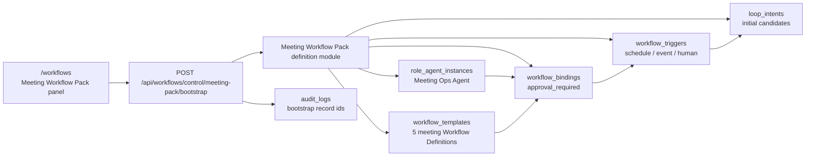
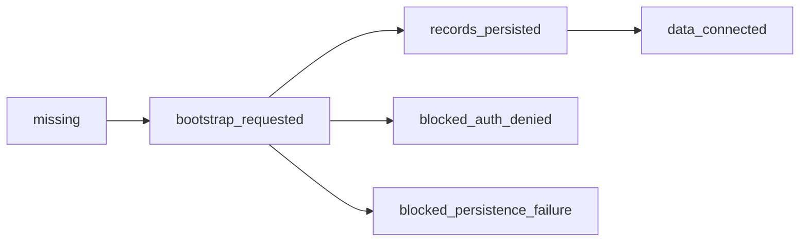

# Mana Meeting Workflow Pack Data Architecture

## Direction

Meeting Workflow Pack v1 turns the v0 UI projection into Workflow Control data. Brainbase remains the control plane. Mana and Eve remain execution surfaces.

## Data Ownership

- The meeting pack definition module is code-level seed data, not a separate source of truth for runtime state.
- Persisted Workflow Control records remain in the existing workflow ledger collections.
- Bootstrap is idempotent: stable ids are reused and repeated calls update records instead of duplicating them.
- Initial Loop Intents are candidates only. They require real meeting identity before execution and do not create runs.

## Bootstrap Contract

`POST /api/workflows/control/meeting-pack/bootstrap`

Input:

- `org_id`
- `project_id`
- `seed_loop_intents` optional boolean, default `true`

Output:

- `meeting_workflow_pack.role_agent_instance`
- `meeting_workflow_pack.workflow_templates`
- `meeting_workflow_pack.workflow_bindings`
- `meeting_workflow_pack.workflow_triggers`
- `meeting_workflow_pack.loop_intents`

## Job Infrastructure

This Story defines job control records, not a scheduler process. Time, event, and human triggers are persisted as `workflow_triggers` so Eve or Mana can later bind scheduler/event-channel infrastructure to the same Brainbase records.

- Schedule trigger definitions are stored but not fired by bootstrap.
- Event trigger definitions are stored but no webhook or message consumer is started.
- Human trigger definitions are stored and surfaced as operator-selectable Workflow Control data.
- The bootstrap endpoint is transactional. `auth_denied` exits before writes; `persistence_failure` rolls back partial records; `provider_failure` is outside this bootstrap path because no external provider is called.

## State Machine

## UI Contract

The Meeting Workflow Pack panel reads existing Workflow Control data:

- A definition is configured only when a matching meeting `workflow_template` and an enabled `approval_required` binding exist.
- Matching templates alone are partial configuration; the panel must keep showing `bootstrap needed`.
- Missing or partially configured definitions keep showing in the trigger lanes, but receive `missing` status.
- Bootstrap button calls the bootstrap endpoint, then refreshes Workflow Control data for the selected project.
- The panel shows `data connected` and disables bootstrap only when the Meeting Ops Agent, all five definition bindings, expected triggers, and initial loop intents are available.

## Boundaries

This Story does not implement Eve execution, Mana event ingestion, Workflow Run creation, Graph SSOT write-back, Task Store writes, or external sending.
