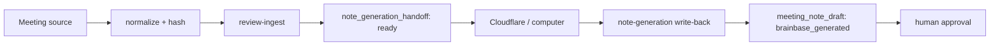

# Meeting Note Generation Handoff Architecture

## Decision

`ingestReviewPackage` は `meeting_note_draft` とhuman stepを記録し、Cloudflare/computer向けの `note_generation_handoff` を返す。Brainbase自身は外部ランタイムを起動・監視・再照合しない。

外部ランタイムはhandoffに含まれるrun、package、source hash、write-back pathを使い、`POST /api/workflows/control/meeting-pack/note-generation` へ生成済み議事録を返す。Brainbaseはhashとrun/outputの対応を検証し、`generation_status` を `brainbase_generated` へ進める。

## Boundary

- Brainbase: source normalization、handoff、hash検証、write-back、承認、監査。
- Cloudflare/computer: 生成処理、ツール実行、再試行、実行状態。
- handoffは実行完了を意味しない。結果がwrite-backされるまで生成状態は未完了。
- wrong hash、unknown run/output、project mismatchは保存前に拒否する。
