# Meeting Note Generation DAG Wiring Architecture

## Decision

Review Package ingest (`ingestMeetingReviewPackage`) remains the single entry point that records the `meeting_note_draft` output and human steps. This story wires two missing edges around it, without changing its approval semantics:

1. **Generation dispatch edge**: after a successful (non-idempotent) ingest, the workflow service best-effort dispatches the `transcript_to_meeting_note` loop intent to an Eve session via the existing `dispatchLoopIntentToEve` path. Dispatch failure or an unconfigured Eve client never fails the ingest; the outcome is recorded in the ingest response (`note_generation_dispatch`) and audit log.
2. **Generation write-back edge**: a new control contract `POST /api/workflows/control/meeting-pack/note-generation` lets a runner (Eve session, codex, claude_code, mana) replace the `meeting_note_draft` output payload with the generated minutes, transitioning `generation_status` from `brainbase_source_ready` to `brainbase_generated`.

Upstream of both edges, the source sync worker guarantees the generation input is readable text: transcripts arriving as JSON-encoded segment arrays (Plaud `data_content` shape) are expanded to speaker-attributed plain text inside `normalizeSourceArtifact`, before hashing and deduplication.

## Boundary

Workflow service owns:

- Auto-dispatch decision after ingest (configured / unconfigured / failed classification).
- Note-generation write-back validation: run existence, output existence, `source_text_hash` match, monotonic `generation_status`.
- Audit trail for both dispatch attempts and write-backs.

Workflow service does not own:

- The generation itself (runner responsibility, via Eve session handoff).
- Publishing minutes (existing `approve_meeting_note_publish` human step, unchanged).
- Transcript normalization (sync worker responsibility).

Source sync worker owns:

- Detecting JSON segment transcripts and normalizing them to plain text before `transcript_hash` computation.

## Scenario Mapping

- S-001 maps to `normalizeSourceArtifact`: JSON segment detection → speaker text expansion → hash/dedupe on normalized text.
- S-002 maps to the ingest tail: loop intent resolution → `dispatchLoopIntentToEve` guarded by `eveSessionClient.isConfigured()` → `note_generation_dispatch` result recording.
- S-003 maps to `recordMeetingNoteGeneration`: run/output resolution → hash validation → payload replacement → `brainbase_generated`.

## Data Flow

```mermaid
flowchart LR
  plaud["Plaud data_content JSON segments"] --> norm["transcriptSegmentsToText"]
  norm --> artifact["source_artifact.source_text (readable)"]
  artifact --> pack["Review Package (brainbase_source_ready)"]
  pack --> ingest["ingestMeetingReviewPackage"]
  ingest --> output["meeting_note_draft output"]
  ingest --> autodispatch["auto dispatch (best-effort)"]
  autodispatch --> eve["Eve session run (await_eve_result)"]
  eve --> writeback["control/meeting-pack/note-generation"]
  writeback --> output2["meeting_note_draft (brainbase_generated)"]
  output2 --> human["approve_meeting_note_publish"]
```

## Failure Isolation

- Eve unconfigured → `note_generation_dispatch: { status: 'skipped', reason: 'eve_not_configured' }`; manual dispatch via `/control/loop-intents/:id/eve-session` remains available.
- Eve dispatch error → `status: 'skipped'`, `reason: 'dispatch_failed'` + error detail in audit; ingest still returns 201.
- Write-back with wrong hash → 400 `blocked_source_hash_mismatch`; output untouched.
- Write-back for unknown run/output → 404 / 400; output untouched.
- Re-generation write-back → allowed, payload overwritten, audited; `generation_status` never regresses to `brainbase_source_ready`.
