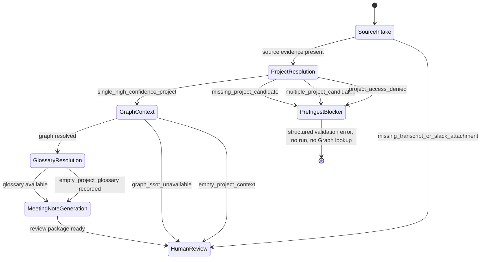

# Meeting Pack Graph SSOT Playbook Architecture

## DAG

```mermaid
flowchart TD
  source["source_intake<br/>Slack attachment / transcript / evidence refs"] --> project["project_resolution_gate<br/>org/project/case"]
  project --> graph["project_scoped_graph_context<br/>Graph SSOT getContext"]
  graph --> mention["mention_resolution<br/>person/org/service identity"]
  graph --> glossary["glossary_resolution<br/>glossary_term"]
  mention --> note["meeting_note_generation<br/>facts from transcript only"]
  glossary --> note
  note --> tasks["task_candidate_generation"]
  note --> decisions["decision_candidate_generation"]
  decisions --> promotion["graph_promotion_candidates"]
  tasks --> human["human_review_package"]
  promotion --> human
  human -. "approval required" .-> taskStore["Task Store"]
  human -. "approval required" .-> graphStore["Graph SSOT writes"]
  human -. "approval required" .-> external["Slack / Gmail"]
```

## Trust Boundary

```mermaid
flowchart LR
  transcript["Transcript / Slack attachment<br/>fact source"] --> generator["Meeting Pack generation"]
  graph["Graph SSOT<br/>identity / relationship / glossary context"] --> generator
  generator --> package["Review Package"]
  package --> ingest["WorkflowService ingest"]
  ingest --> metadata["run metadata / context snapshots / outputs"]
  metadata --> gate["Human Gate"]
  gate -. "after approval only" .-> writes["Task / Decision / Graph / External writes"]
  graph -. "must not be treated as spoken facts" .-> generator
```

## Exception Branches



## Data Persistence

- `workflow_runs.metadata.project_resolution`: project確定の根拠。
- `workflow_runs.metadata.graph_ssot_playbook`: DAG、Graph取得状態、用語集状態、例外分岐、生成契約。
- `context_snapshots.source_type=graph_ssot`: Graph取得成功時は `verified_from_graph_ssot`、失敗時はReview Package候補fallback。
- `workflow_outputs.type=meeting_note_draft.payload.graph_ssot_playbook`: Mac Companionで公開前に読むべきPlaybook。
- `validation_error.details.project_resolution` / `validation_error.details.graph_ssot_playbook`: project未確定またはaccess deniedでrun作成前に止めたpre-ingest blocker。Graph SSOT lookupは実行しない。

## Non Goals

- Graph SSOTへの自動登録はしない。
- 未登録peopleやglossary termをingest時に作成しない。
- Graph SSOTをTranscript欠落の代替事実ソースにしない。
- 汎用workflow rerun導線でReview Packageを書き換えない。
