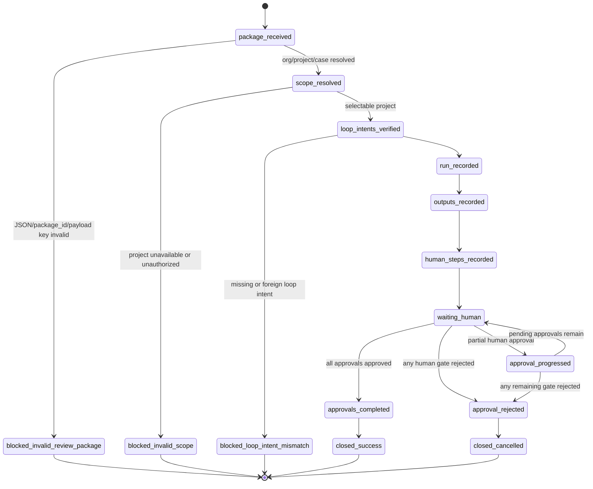
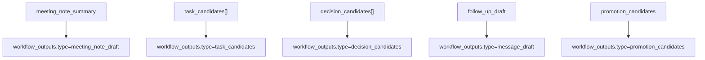

# Meeting Review Package Ingest Architecture

## 位置づけ

この機能は Eve Runtime Adapter ではない。Eve 接続前に、Codex が生成した Review Package を Brainbase の Workflow Mission Control に載せるための control-plane ingest である。

Brainbase の責務は、実行結果候補を正本化することではなく、人間確認前の候補、証跡、停止条件、承認待ちを保持することである。したがって ingest は Task / Decision / Graph / 外部送信を実行せず、Human Gate で止める。

```mermaid
flowchart LR
  package["Codex生成 Review Package JSON"] --> api["POST /api/workflows/control/meeting-pack/review-ingest"]
  api --> shape["Package Mapping Verifier<br/>required payload keys"]
  shape --> scope["Scope Resolver<br/>org / project / case"]
  scope --> verify["Loop Intent Verifier<br/>required keys / org / project"]
  verify --> run["workflow_runs<br/>meeting_review_package_ingest"]
  run --> snapshots["context_snapshots<br/>calendar / slack / graph / package"]
  run --> outputs["workflow_outputs<br/>note / tasks / decisions / follow-up / promotion"]
  run --> human["workflow_human_steps<br/>pending approvals"]
  run --> audit["workflow_audit_logs"]
  human -. "承認まで実行しない" .-> task["Task Store"]
  human -. "承認まで昇格しない" .-> graph["Graph SSOT"]
  human -. "承認まで送信しない" .-> external["Slack / Gmail"]
  eve["Eve Runtime Adapter<br/>後続Story"] -. "同じoutput契約へ差し替え" .-> api
```

## データ境界

Review Package は API の JSON body として渡す。API は任意の local file path を読む責務を持たない。ファイルから読みたい場合は、operator script や Codex が JSON を読み込んで body として渡す。

`org_id` と `project_id` は明示入力を優先する。明示されていない場合のみ、`review_package.meeting_identity.candidate_org_id` と `candidate_project_id` を使う。`case_scope` は `meeting_identity.case_scope` または明示入力を run metadata に残す。

## Trigger / Job Infrastructure

このStoryは workflow scheduler を実装しない。入口は人間またはCodex/operator scriptが呼ぶ `POST /api/workflows/control/meeting-pack/review-ingest` であり、時間トリガー、Calendar polling、queue worker、cron、Eve schedule は後続Storyの責務である。

したがって v1 の scheduling owner は Brainbase operator で、job infrastructure は既存のBrainbase API processである。新しいworker、queue、lambda、cron、containerは追加しない。review packageを時間・イベントトリガーで自動投入する場合も、同じAPI contractへJSON bodyを渡すだけにする。

`meeting-review-package-ingest` workflow は既存の `POST /api/workflows/:workflowId/run` と `POST /api/workflow-runs/:runId/rerun` からは実行できない。これらの汎用run/rerun導線はReview Package JSON、Loop Intent照合、5 outputs、5 Human Gatesを持たないため、このworkflowではvalidation errorとして拒否する。承認後の進行は `resolveHumanStep` の専用処理で元runを更新し、汎用run再実行には戻さない。

## Runモデル

v1 は、5つの会議 workflow を個別に実行済みとは扱わない。Codex生成Packageは、会議レビュー単位の aggregate output であるため、単一の ingest workflow run にまとめる。

run は次の意味を持つ。

| Field | Value |
|---|---|
| `workflow_id` | `wf_<org>_<project>_meeting_review_package_ingest` |
| `status` | `waiting_human` |
| `closure_state` | `open` |
| `action_required` | `approve` |
| `human_waiting` | `true` |
| `runner.type` | `codex_generated_package` |
| `runner.eve_connected` | `false` |

Eve 接続後は、Eve run が同じ output / human step 契約で返す。Brainbase 側の保存先は変えない。

## State Diagram



## Output Mapping



各 output は次を必ず持つ。

- `package_id`
- `case_scope`
- `loop_intent_id`
- `write_back_target`
- `evidence_refs`
- `requires_human_approval=true`
- `payload`

`meeting_note_summary`、`task_candidates`、`decision_candidates`、`follow_up_draft`、`promotion_candidates` の payload key が欠落している場合は、`workflow_runs` を作る前に `blocked_invalid_review_package` として拒否する。

## Human Gate Mapping

| Human Step | Protects | Write-back |
|---|---|---|
| `approve_meeting_note_publish` | 議事録公開 | `meeting_note_draft` |
| `approve_task_candidates` | Task作成 | `task_store` |
| `approve_decision_candidates` | Decision / Graph昇格 | `graph_ssot_decision` |
| `approve_follow_up_draft` | 外部送信 | `external_message_draft` |
| `approve_promotion_candidates` | Graph / Learning候補昇格 | `candidate_store` |

これらはすべて `pending` で作成する。1件だけ承認された場合、元の review run は `waiting_human/open/action_required=approve` のまま残り、未承認stepを Workflow Mission Control に出し続ける。5件すべてが承認された時点でのみ、元runを `success/closed/action_required=none` に更新する。いずれかのstepがRejectされた場合は、元runを `cancelled/closed/action_required=none` に更新し、残りのpending stepも `cancelled` にして後続Approveで成功へ戻さない。承認APIの実 write-back は別Storyで扱う。

Graph context は `source_type=graph_ssot` の context snapshot に置くが、package由来の候補であるため `verification_status=candidate_from_review_package` と `promoted_to_graph_ssot=false` を保持する。これにより、検証済みGraph SSOT正本と候補を混同しない。

## 冪等性

`run_id = package_id + org_id + project_id + meeting_review_package_ingest` から安定生成する。同じ package を再取り込みした場合は既存 run と関連 records を返し、新規 write はしない。

## 失敗境界

- project が選択不能なら書かない。
- actor が project にアクセスできなければ書かない。
- required output payload key が欠落している場合は書かない。
- `loop_intent_ids` の required key が欠落している、存在しない、または別 org / project なら書かない。
- JSON payload がない、または `package_id` がない場合は書かない。
- 途中で永続化が失敗した場合は transaction rollback する。

## Release / Support / Rollback

- Release時にoperatorへ伝えることは、`/workflows` に `Meeting Review Package Ingest` が承認待ちrunとして出ること、Eve未接続であること、外部write-backは実行されないことである。
- Support時の一次確認は、run metadataの `package_id` / `case_scope` / `runner.type`、context snapshotの `meeting_source.content_hash`、human stepのpending数、audit action `workflow.meeting_review_package.ingested` を見る。
- RollbackはDB正本の外部副作用を戻す操作ではない。v1ではTask/Graph/外部送信をしないため、誤Packageは対象runを無効化し、正しいPackageを別 `package_id` で再取り込みする。
- 部分書き込みのrollbackはservice transactionで検証し、途中失敗時に run/output/human step/audit が残らないことをテスト証跡とする。

## UIへの見え方

`/workflows` は `waiting_human` の run を優先表示する既存仕様を持つ。したがってこの ingest run は、Meeting Workflow Pack Cockpit の実データ接続前でも Workflow Mission Control 上の承認待ちとして見える。

`meeting-review-package-ingest` はReview Package API専用の取り込みworkflowであり、通常のWorkflow実行ではない。そのため `/workflows` では汎用のRun/Rerun操作を出さず、Human GateのApprove/Rejectだけをoperator操作として出す。
