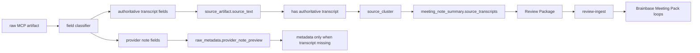

# Meeting Source Brainbase Note Generation Architecture

## Decision

Meeting Source MCP sync worker treats Tactiq/Plaud transcript text as source material for Brainbase Meeting Pack generation. It does not treat Tactiq/Plaud generated notes, markdown, or AI summaries as Brainbase minutes.

The Review Package boundary carries:

- source event provenance
- full primary/supporting transcript material
- hash/length checks
- provider note non-authoritative flags
- Brainbase generation metadata

Review Package ingest and the downstream Meeting Pack loops remain responsible for Graph SSOT playbook attachment, People SSOT owner resolution, and publishable meeting note review.

## Boundary

Source sync worker owns:

- Selecting authoritative transcript fields from provider artifacts.
- Retaining full transcript text as source material.
- Marking provider-generated note fields as non-authoritative metadata.
- Excluding artifacts without authoritative transcript text from Meeting Pack candidate clusters.
- Reporting candidate exclusions in preview results with explicit reasons such as `provider_note_available_without_transcript`.
- Returning preview clusters without full `source_text`; full transcripts stay in confirm-time state.
- Constructing `meeting_note_summary` as Brainbase-owned input to `transcript_to_meeting_note`.

Source sync worker does not own:

- Graph SSOT project certainty.
- People SSOT owner defaults.
- Publishing final minutes.
- External provider note adoption.

## Scenario Mapping

- S-001 maps to the transcript gate and dedupe path: only transcript-backed artifacts enter candidate clusters.
- S-002 maps to the field classifier: provider note fields are stored as non-authoritative metadata and are excluded from Brainbase minutes.
- S-003 maps to preview exclusions: note-only artifacts are returned in exclusion summaries and skipped during confirm ingest.

## Data Flow

## Field Priority

Authoritative source text priority:

1. `text`
2. `transcript`
3. `transcript_text`

Non-authoritative provider note priority:

1. `note_text`
2. `content`
3. `markdown`
4. `summary`
5. `ai_summary`
6. `meeting_summary`

If no transcript field is present, the artifact remains fetched provider metadata but is not a Meeting Pack source candidate. Provider note-like fields are never promoted into authoritative source text.

## Review Package Shape

`meeting_note_summary.source_transcripts` is the durable handoff for Brainbase generation. The `body` field is a Brainbase-owned markdown seed and must be regenerated from `source_transcripts` when publishable minutes are needed.

This keeps UI compatibility with existing Review Package cards while avoiding the incorrect behavior where provider preview text masquerades as Brainbase minutes.

## Risk Controls

- Existing dedupe and cursor logic is unchanged.
- Provider secrets are unaffected.
- Review Package fields are additive.
- Tests assert absence of provider note strings in Brainbase note body.
- Tests assert note-only provider artifacts produce zero Meeting Pack candidates.
- Tests assert preview results explain note-only exclusions.
- Preview API redacts full transcript text from returned clusters.
- Hash equality between source event and meeting note source prevents preview/text mismatch.
