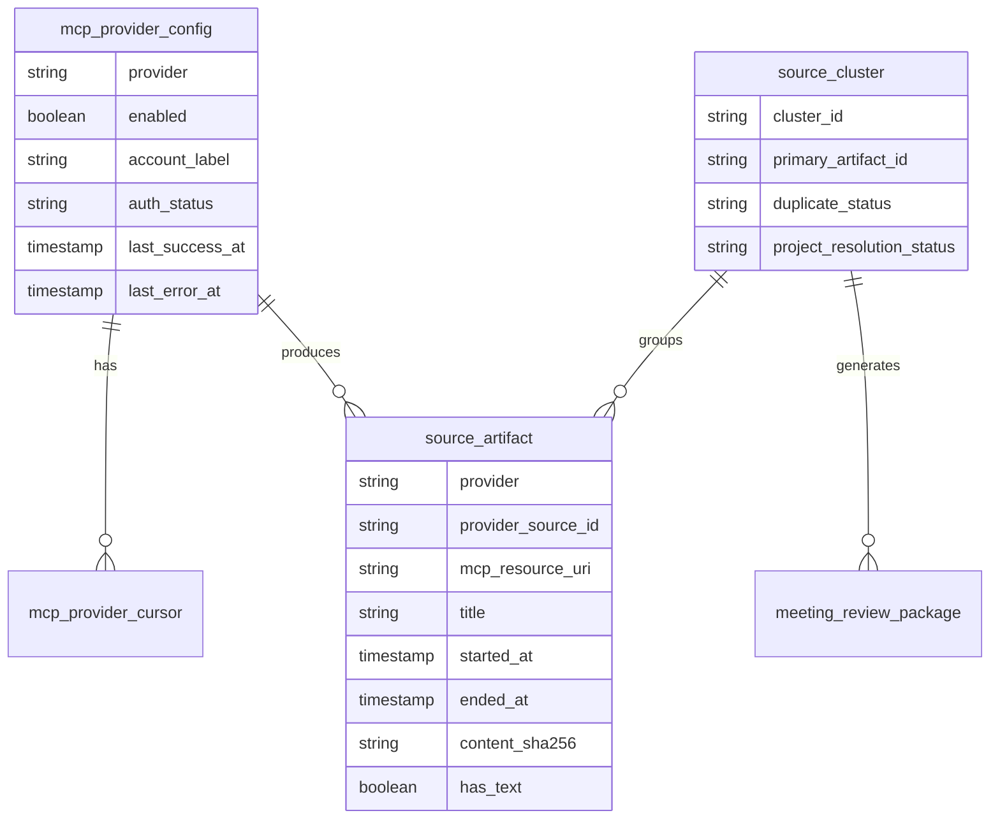
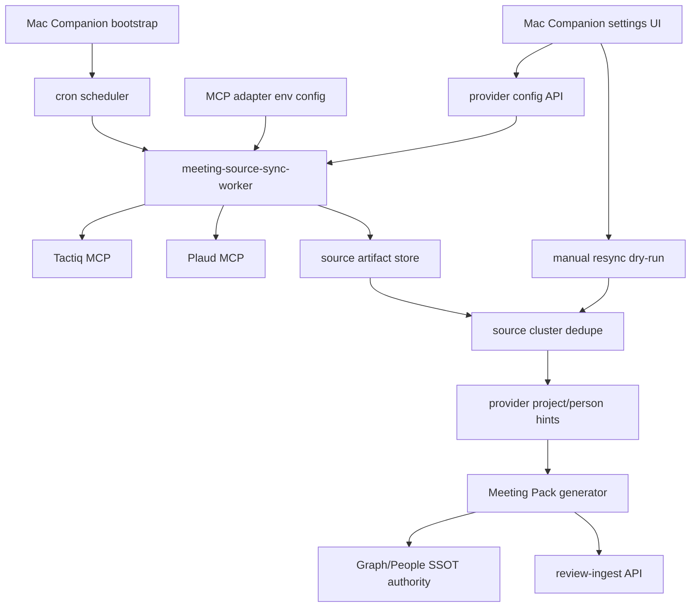

# Meeting Source MCP Sync Worker Architecture

## Decision

Meeting Pack source ingestion is provider-first. A cron worker polls Tactiq MCP and Plaud MCP directly, normalizes their transcripts/notes into source artifacts, dedupes them into source clusters, attaches project/person lookup hints, and submits Review Packages with `source_event` to review-ingest.

Calendar is not the source of truth because calls, offline conversations, and ad hoc discussions may not have calendar events. Slack is not the source of truth because Slack posts are notification or reference pointers. Tactiq/Plaud transcript or note content is the fact source.

## Boundary / Scope / Owner

The source sync worker owns:

- Provider configuration lookup for enabled Tactiq/Plaud MCP connections.
- Provider polling with independent cursors and overlap windows.
- Raw artifact normalization into source artifacts.
- Cross-provider dedupe and primary source selection.
- Review Package generation input assembly with `source_event` and provider-derived lookup hints.
- Cursor advancement and sync status persistence.

Mac Companion settings UI owns:

- Provider connect/reconnect/test controls.
- Provider sync status and error display.
- Manual resync dry-run preview and confirmation.
- Bounded replay filters and operator visibility.

Review Package ingest owns:

- Persisting `source_event` and protected outputs.
- Running the existing Graph SSOT / People SSOT authority before project-scoped graph writes or task owner defaults are committed.
- Human Gate review and idempotent run handling.

Review Package ingest does not call Tactiq/Plaud directly.

## Runtime Wiring

The Mac Companion backend creates `MeetingSourceMcpSyncService` during core service bootstrap. Production MCP adapters are loaded from `BRAINBASE_MEETING_SOURCE_MCP_ADAPTERS_JSON`, so Tactiq/Plaud MCP server transport details stay outside the Meeting Pack generator.

Example:

```json
{
  "tactiq": {
    "transport": "streamable_http",
    "url": "http://127.0.0.1:8787/mcp",
    "tool": "list_transcripts"
  },
  "plaud": {
    "transport": "stdio",
    "command": "plaud-mcp",
    "args": ["--stdio"],
    "tool": "list_recordings"
  }
}
```

The scheduled worker starts only when `BRAINBASE_MEETING_SOURCE_SYNC_ENABLED=1`. It uses `BRAINBASE_MEETING_SOURCE_SYNC_INTERVAL_MS`, `BRAINBASE_MEETING_SOURCE_SYNC_LOOKBACK_MS`, `BRAINBASE_MEETING_SOURCE_SYNC_ORG_ID`, `BRAINBASE_MEETING_SOURCE_SYNC_PROJECT_ID`, and optional `BRAINBASE_MEETING_SOURCE_SYNC_CASE_SCOPE`. If org/project scope is missing, the worker creates a bounded preview but does not submit or advance cursors.

## Data Model



## Execution Topology



## Idempotency

The worker uses three layers of idempotency:

1. Provider idempotency: `provider + provider_source_id`.
2. Content idempotency: `content_sha256`.
3. Cluster idempotency: stable `source_cluster_id` derived from best available source id/hash/time window.

Review Package `package_id` is derived from `source_cluster_id`, not provider artifact id, so Tactiq/Plaud duplicates do not create separate workflow runs.

## Source Selection

Primary selection order:

1. Source routing policy match: online Tactiq, offline/call Plaud, Tactiq-unavailable online Plaud.
2. Completeness score: transcript text present, duration present, speaker labels present, timestamps present.
3. Freshness: latest provider update when content hashes differ.
4. Human confirmation: required when duplicate conflict remains.

## MCP Settings UI Contract

The settings UI reads provider status from a backend API rather than directly inspecting secrets. The API returns:

```json
{
  "provider": "tactiq",
  "enabled": true,
  "auth_status": "connected",
  "capabilities": {
    "list": true,
    "read": true
  },
  "account_label": "ksato@example.com",
  "last_success_at": "2026-07-02T09:30:00+09:00",
  "last_error": null,
  "cursor": {
    "updated_since": "2026-07-02T09:00:00+09:00",
    "overlap_minutes": 30
  }
}
```

The UI never receives secret values after save. Reconnect and test connection are explicit actions.

## Rollback Plan

Worker rollout can be disabled by setting both provider configs to disabled or disabling the cron schedule. Review Package ingest remains compatible because `source_event` is additive metadata. Settings UI can remain visible with provider disabled state.

## Observability

Required logs and metrics:

- poll started/completed per provider
- artifacts fetched/normalized/skipped
- duplicate clusters created
- primary source selected
- Review Packages generated/submitted
- provider auth/rate-limit errors
- cursor advance decisions
- manual resync dry-run preview result
