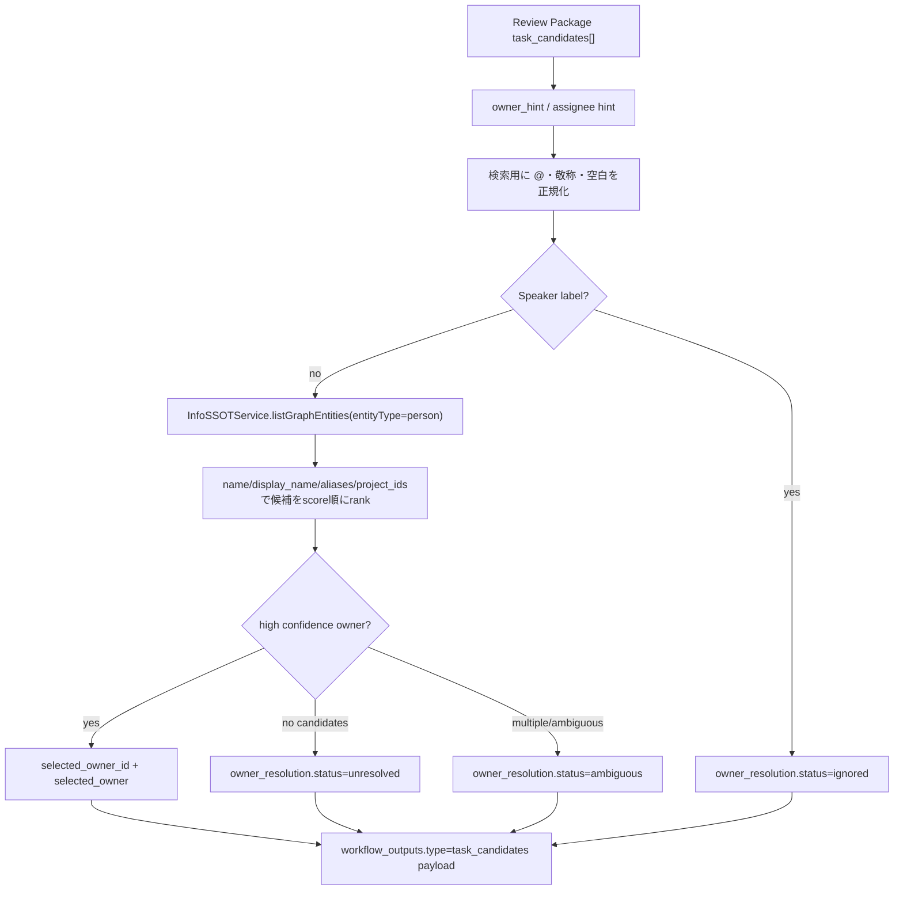
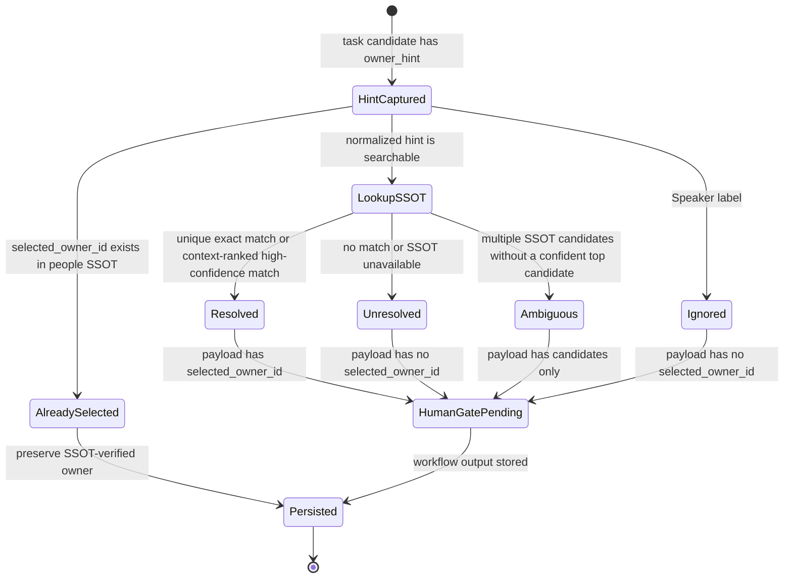
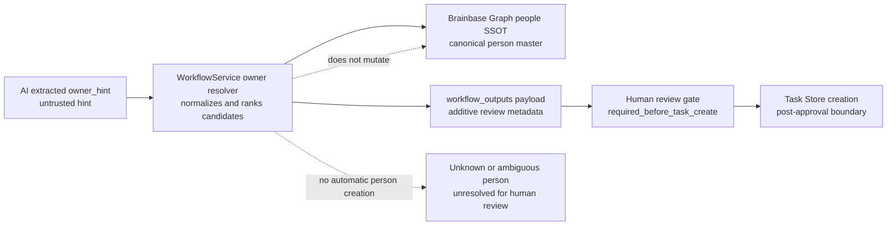

# Meeting Task Owner SSOT Resolution Architecture

## Flow

## State

## Boundaries

- 正本: Brainbase Graph SSOTの `person` エンティティ。
- 入力ヒント: Review Package内の `owner_hint`。これは正本ではなく検索語としてだけ使う。
- 既存担当者ID: Review Package内の `selected_owner_id` は正本ではなく、Brainbase Graph SSOTに存在するperson idとして検証できた場合だけ `already_selected` として維持する。
- 書き込み先: `workflow_outputs.type=task_candidates` のpayload。Task Store作成は承認後の別境界。
- 利用者画面: Mac Companionはpayloadの `selected_owner_id` を初期選択として扱い、変更時は既存のpeople SSOT APIで候補を取得する。

## Architecture Decision Quality

- Boundary: この変更の境界はMeeting Review Package ingest内のTask候補payload enrichmentに限定する。Task Store作成、people SSOT登録、既存human gateの承認状態は変更しない。
- Compatibility impact: API入力契約とDB schemaは変更しない。追加される `selected_owner_id` / `selected_owner` / `owner_candidates` / `owner_resolution` は既存クライアントが無視できる後方互換のpayloadフィールドである。
- Alternatives considered: AI抽出の `owner_hint` をそのまま担当者正本にする案は、表記ゆれ・話者ラベル・未登録者を誤って正本化するため却下した。Mac Companion上の手動選択だけにする案は、毎回の確認負荷が高く、SSOT alias/project contextを活用できないため却下した。
- Rollback plan: PR revertで `WorkflowService` のowner resolver呼び出しを外す。既に保存された追加payloadは付加情報なので、既存Review Package承認フローとTask Store作成は従来通り継続できる。
- Accepted followups: 本PRではingest時の候補抽出・自動選定・UI表示理由に限定する。people SSOTへの新規person登録API対応、既存workflow_outputの一括再解決、alias整備運用は別作業として扱う。

## Threat Model

- Threat: AIが `@矢島様` や `Speaker 1` を担当者らしく出しても、それ自体は正本ではない。
- Control: Graph people検索結果は `owner_candidates[]` に残す。`selected_owner_id` を付与するのは、候補が1件で `person.name` / `display_name` / `aliases[]` に完全一致する場合、または `project_ids` が対象projectに一致しscore差を持つ高信頼候補として第一候補になる場合に限る。
- Control: unknown、ambiguous、speaker label、SSOT unavailableは `owner_resolution` に理由を残し、Task Store作成やpeople SSOT登録を自動実行しない。
- Residual risk: people SSOT側のaliasやproject linkageが不足している場合、候補は出ても自動選択されないことがある。これはMac Companionの担当者選択・SSOT登録導線で人間が補正する。

## Responsibility Authority

| Responsibility | Authority | Implementation |
| --- | --- | --- |
| Canonical person identity | Brainbase Graph SSOT people | `InfoSSOTService.listGraphEntities` |
| AI extracted hint | Meeting Review Package payload | `owner_hint` remains unchanged |
| Task candidate storage | Workflow output payload | `MeetingAutomationService.ingestReviewPackage` |
| Human approval | Existing Review Package human gate | `required_before_task_create` remains pending |
| Task Store creation | Existing post-approval workflow | Not changed by this story |

## Failure Behavior

- SSOTが利用できない場合、Review Package ingest自体は継続し、該当Task候補に `owner_resolution.status=unresolved` を付ける。
- 未登録者はローカルに仮作成しない。Mac Companion側の登録UIでGraph SSOTへ登録してから再選択する。
- 話者ラベルは担当者候補に昇格しない。

## Release Operations

- Release path: 通常のBrainbase server deployまたは再起動で有効化する。`core-services` が `MeetingAutomationService` へ `InfoSSOTService` を注入するため、追加のoperator設定は不要。
- Rollback path: PR revertで `resolveMeetingReviewTaskOwnersFromSSOT` の呼び出しとservice injectionを外す。payloadの追加フィールドは後方互換の付加情報であり、既存Review Packageの承認状態を変更しない。
- Observability path: operatorは `workflow_outputs` の `task_candidates` payloadで `owner_resolution.status`、`reason`、`selected_owner_id`、`owner_candidates` を確認する。人間承認が必要な状態は既存のhuman gateに残る。
- Support path: `unresolved` / `ambiguous` / `ignored` はMac Companionの担当者選択UIで人間が補正する。Graph SSOT登録が必要な人物はpeople SSOTの登録導線で作成し、ingestは自動登録しない。

## Replay Evidence

- `tests/server/services/workflow-org-agent-control.test.js` replays resolved, unresolved, and speaker-label candidates through `ingestReviewPackage` and asserts the stored `workflow_outputs.payload`.
- `tests/e2e/story-meeting-review-package-ingest-v1-contract.spec.ts` replays the broader Meeting Review Package ingest contract, including output creation, human steps, idempotency, reject behavior, and Mission Control review visibility.
