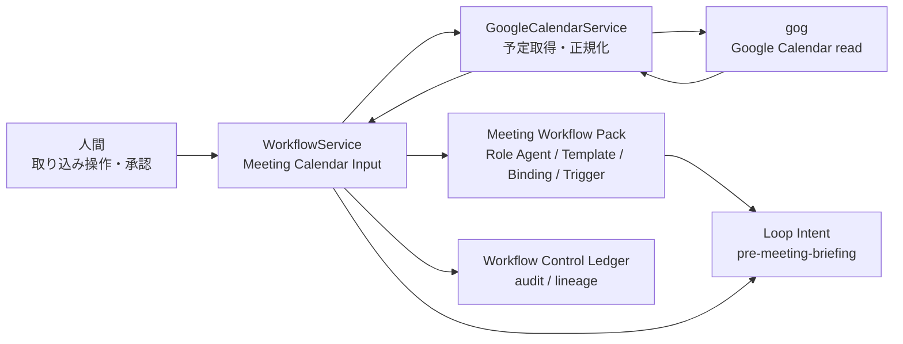

# Meeting Workflow Pack Calendar Input Architecture

## 方針

CalendarはMeeting Workflow Packの最初の入力源であり、実行runnerではない。
Brainbase側ではCalendar予定を`meeting_identity`へ正規化し、Workflow Control PlaneのLoop Intentとして保存する。
これにより、後続の議事録生成・Task候補・Decision候補・Follow-upは同じ会議IDを参照できる。

## 構成

## 責務分界

- `GoogleCalendarService`
  - `gog`を実行する唯一のCalendar adapter。
  - Calendar予定をBrainbaseで扱える予定オブジェクトへ正規化する。
  - event id、開始終了、参加者、会議URLなど、Meeting Loopに必要な入力情報を落とさない。
- `WorkflowService`
  - Meeting Workflow PackのRole Agent / Template / Binding / Triggerを存在保証する。
  - Calendar予定を`pre-meeting-briefing`のschedule trigger Loop Intentへ変換する。
  - all-dayなど会議Loopにできない予定をskipとして明示する。
- API route
  - `/api/workflows/control/meeting-pack/calendar-inputs`で取り込みを開始する。
  - 外部送信やGraph書き込みは行わない。

## データの流れ

1. 運用者がorg/project、期間、account、calendar idを指定する。
2. `WorkflowService`がMeeting Workflow Packの定義をseedなしでupsertする。
3. `GoogleCalendarService`が`gog calendar events`から予定を取得する。
4. timed eventを`meeting_identity`へ変換する。
5. `pre-meeting-briefing`のschedule triggerに紐づくLoop Intentを安定IDで作成する。
6. all-day eventや取り込めないeventは`skipped_events`として返す。
