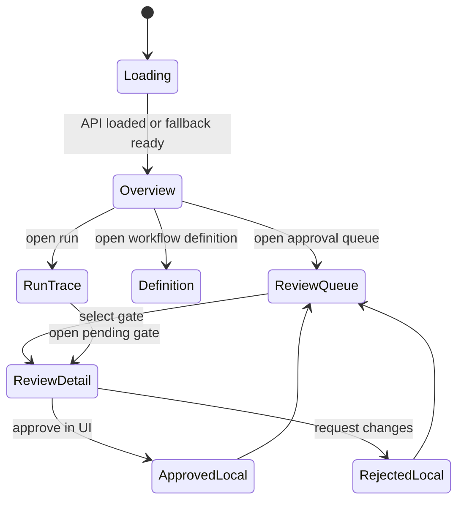

# Meeting Workflow Pack Cockpit UI Architecture

## 位置づけ

`/workflows` は Workflow Mission Control の横断 inbox であり、全 project の action required、human waiting、failed、recent run を扱う。

`/meeting-workflow-pack.html` は Meeting Workflow Pack の専用 Cockpit である。Role Agent が workflow を選び、会議から生まれた task / decision / follow-up の human gate をさばき、Brainbase に戻る証跡を確認するための画面とする。

```mermaid
flowchart LR
  user["Human Operator"] --> cockpit["Meeting Workflow Pack Cockpit"]
  workflows["/workflows<br/>Workflow Mission Control"] --> cockpit
  cockpit --> api["Workflow Control APIs"]
  api --> role["role_agent_instances"]
  api --> templates["workflow_templates"]
  api --> bindings["workflow_bindings"]
  api --> triggers["workflow_triggers"]
  api --> intents["loop_intents"]
  cockpit --> localState["Local HITL State<br/>approve / reject / edit"]
  localState -. "v1: no write-back" .-> taskStore["Task Store"]
  localState -. "v1: no promotion" .-> graph["Graph SSOT"]
  localState -. "v1: no external send" .-> external["Slack / Gmail"]
```

## UI構造

zip prototype の構造をそのまま採用する。

- Header: `AGENT LOOP CONTROL`、Instance switcher、Role Agent switcher、承認待ち count。
- Left Rail: `対応 · OPERATE` と `リファレンス · REFERENCE`。
- Overview: Meeting Ops Agent の説明、metrics、会議ライフサイクル。
- Review Queue: human gate が必要な候補の一覧。
- Review Detail: 候補選択、編集、差し戻し、承認。
- Run Trace: source、note summary、write-back status、audit evidence。
- Stub Agents: Sales / Back-office / Marketing の未構築 agent shell。

## データ投影

Cockpit は以下の既存 API を読む。

- `GET /api/workflows/control/role-agents?project_id=:projectId`
- `GET /api/workflows/control/templates?project_id=:projectId`
- `GET /api/workflows/control/bindings?project_id=:projectId`
- `GET /api/workflows/control/triggers?project_id=:projectId`
- `GET /api/workflows/control/loop-intents?project_id=:projectId`

読み取った実データは以下へ写す。

| Source | Cockpit projection |
|---|---|
| `role_agent_instances` | Instance / Role Agent rail |
| `workflow_templates` | Workflow Definition cards |
| `workflow_bindings` | autonomy / enabled / org-specific binding |
| `workflow_triggers` | schedule / event / human lane |
| `loop_intents` | Review Queue / Run Trace / human gate count |
| `loop_intents.input_payload` | task candidates / decision candidates / follow-up draft |
| `loop_intents.eligibility` | gate required / risk / approval state |

API が空でも、Meeting Pack の5定義は画面で確認できる必要があるため、静的 definition fallback を持つ。ただし fallback は「正本」ではなく表示用の未接続状態として扱う。

## State Machine



## 安全境界

v1 の承認操作は local UI state のみである。次の副作用は実行しない。

- Task Store への task 作成。
- Graph SSOT への Decision 昇格。
- Slack / Gmail への外部送信。

高リスクの `Decisions 昇格` と `Follow-up 送信` には確認 checkbox を表示し、実 write-back ではないことを明示する。
