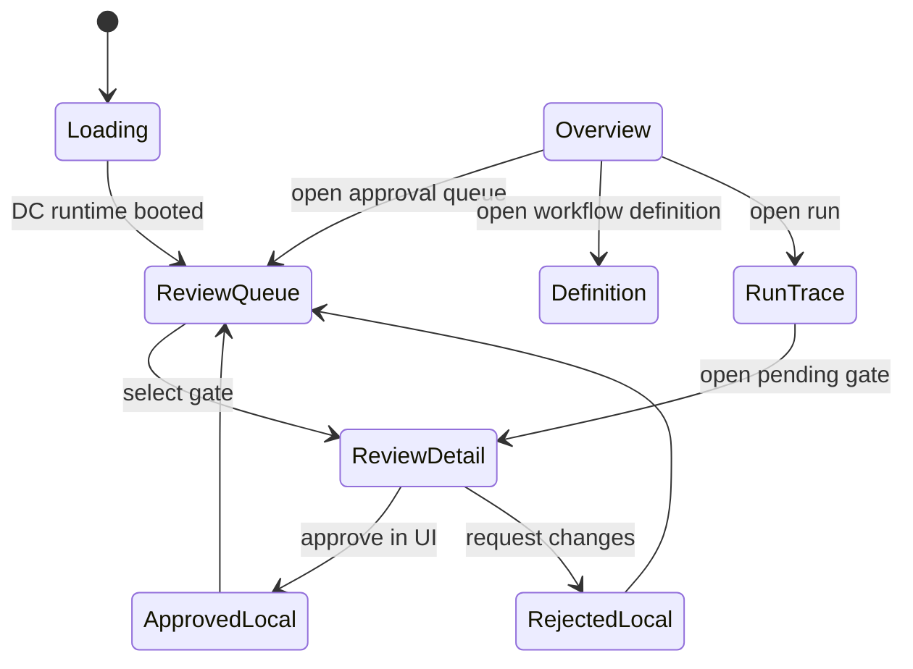

# Meeting Workflow Pack Cockpit UI Architecture

## 位置づけ

`/workflows` は Workflow Mission Control の横断 inbox であり、全 project の action required、human waiting、failed、recent run を扱う。

`/meeting-workflow-pack.html` は Meeting Workflow Pack の専用 Cockpit である。Role Agent が workflow を選び、会議から生まれた task / decision / follow-up の human gate をさばき、Brainbase に戻る証跡を確認するための画面とする。

```mermaid
flowchart LR
  user["Human Operator"] --> cockpit["Meeting Workflow Pack Cockpit"]
  workflows["/workflows<br/>Workflow Mission Control"] --> cockpit
  cockpit --> prototype["Promoted zip prototype<br/>meeting-workflow-pack.dc.html"]
  prototype --> localState["Prototype Local State<br/>review / run / definition / agent"]
  cockpit --> localState["Local HITL State<br/>approve / reject / edit"]
  localState -. "v1: no write-back" .-> taskStore["Task Store"]
  localState -. "v1: no promotion" .-> graph["Graph SSOT"]
  localState -. "v1: no external send" .-> external["Slack / Gmail"]
```

## UI構造

zip prototype の構造をそのまま採用する。今回の目的は画面再現であり、`public/meeting-workflow-pack.html` は `docs/design/prototypes/meeting-workflow-pack/meeting-workflow-pack.dc.html` と同一内容にする。runtime も `public/support.js` として同一内容を配信する。

- Header: `AGENT LOOP CONTROL`、Instance switcher、Role Agent switcher、承認待ち count。
- Left Rail: `対応 · OPERATE` と `リファレンス · REFERENCE`。
- Overview: Meeting Ops Agent の説明、metrics、会議ライフサイクル。
- Review Queue: human gate が必要な候補の一覧。
- Review Detail: 候補選択、編集、差し戻し、承認。
- Run Trace: source、note summary、write-back status、audit evidence。
- Stub Agents: Sales / Back-office / Marketing の未構築 agent shell。

## データ投影

このStoryでは実データ投影を行わない。zip prototype の local state をそのまま使い、以下を再現する。

| Prototype State | Cockpit projection |
|---|---|
| `ORGS` | Instance menu |
| `AGENTS` | Role Agent menu / stubs |
| `WF` | Workflow Definition cards |
| `RUNS` | Review Queue / Run Trace |
| `steps` | approve / reject local state |
| `excl` / `edits` / `reason` | review detail editing state |

Workflow Control API 接続は次Storyで扱う。その際も、今回再現した header、left rail、review queue、review detail、run trace、stub agent の画面構造を壊さない。

## State Machine



## 安全境界

v1 の承認操作は local UI state のみである。次の副作用は実行しない。

- Task Store への task 作成。
- Graph SSOT への Decision 昇格。
- Slack / Gmail への外部送信。

高リスクの `Decisions 昇格` と `Follow-up 送信` には確認 checkbox を表示し、実 write-back ではないことを明示する。
