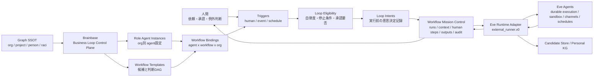
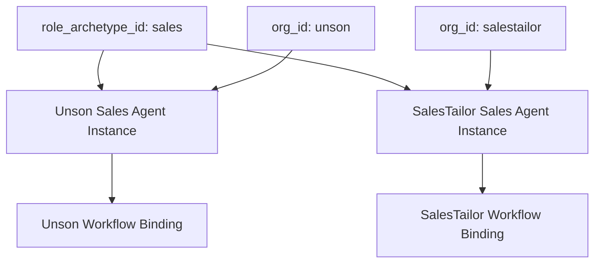
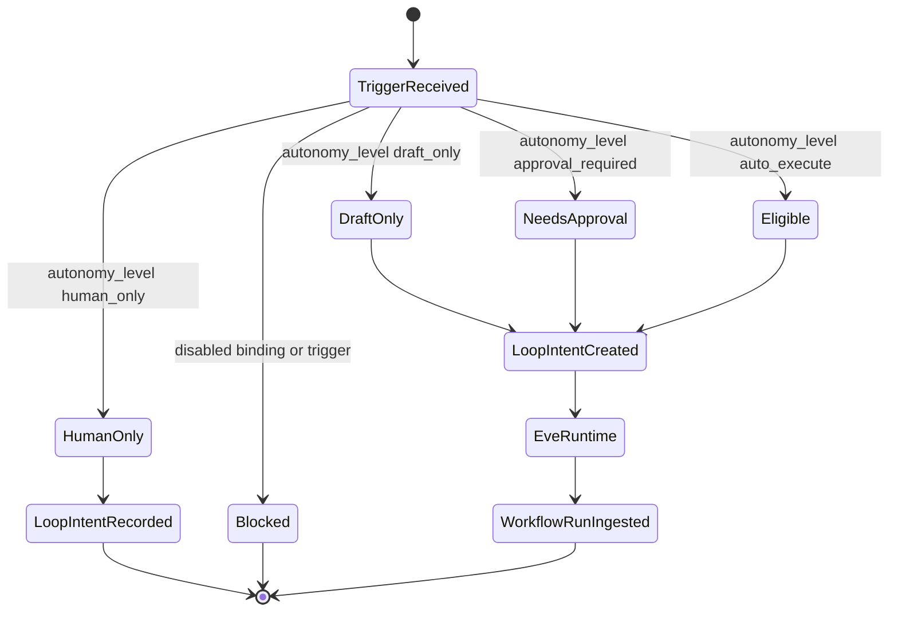

# Org Agent Loop Control Architecture

## 方針

Org Agent Loop Controlは、Graph SSOTを参照しながらWorkflow Mission Controlに置く運用台帳である。Brainbaseは組織ごとのRole Agent、Workflow選択、Trigger、Eligibility、承認、監査、学習候補を保持し、EveはAgent Runtimeとして実行を担当する。

## 責務分界

- Graph SSOT: 組織、プロジェクト、人物、RACI、顧客、案件、意思決定などの正本。
- Workflow Mission Control: Role Agent Instance、Workflow Template、Workflow Binding、Trigger、Loop Intent、run、context、human step、output、audit。
- VibePro / Judgment DAG: Story、Spec、Gate、判断DAGの根拠。
- Eve: agent実行、durable execution、sandbox、tool approval、subagent、eval、channel、schedule、trace。

## Org差分の扱い

UnsonとSalesTailorでは、同じ営業Agentでも渡すcontext、許可ツール、承認者、停止条件、Workflow候補が違う。したがってv0ではRole Agentを抽象ロールだけで保存せず、`role_agent_instances.org_id` と `workflow_bindings.org_id` を必須にする。

## Trigger Model

3つのTriggerは入口だけが違い、Loop Eligibility以降は同じ構造に流す。

| Trigger | 例 | Brainbaseで持つ理由 |
|---|---|---|
| `human` | 人間が営業Agentへ依頼 | 依頼者、目的、承認境界を明示するため |
| `event` | CRM更新、Slack投稿、Gmail受信 | どのイベントがどのAgentを起動したか監査するため |
| `schedule` | 毎朝、毎週、月次 | Eveのschedule実行結果をBrainbaseの正本へ接続するため |

## Job Infrastructure

v0ではBrainbase内に新しいjob schedulerを実装しない。Eveのdurable execution、channels、schedules、retry、sandboxをAgent Runtime責務として使い、BrainbaseはTrigger定義、Loop Intent、Eligibility、承認、監査、Learning Candidateの正本化を担当する。

時間TriggerはBrainbaseの `workflow_triggers.trigger_type=schedule` として管理するが、実際のcron実行、再試行、agent process維持はEve側で行う。イベントTriggerも同様に、CRM、Slack、Gmail、Webhookなどの購読・connectionはEveまたは外部connectorが担い、Brainbaseは発火結果の入力を `loop_intents.input_payload` とWorkflow Runとして保存する。

この分界により、Brainbaseは「いつ何が発火し、どのAgentがどのWorkflowを選び、どの自律度で進めたか」を保持し、Eveの実行基盤実装には依存しない。

## Eligibility State

## Data Ownership

Role Agent / Workflow / Trigger / Loop IntentはGraph SSOTの新しい真理ではない。これらはBrainbaseが実行管理するための運用正本であり、Graphの `org_id`、`project_id`、`person_id`、`raci_id` を参照する。v0の実装境界では、`org_id` はGraph同期済みproject configのproject id / alias / repo由来キーに一致する既知参照だけを保存できる。任意文字列の `org_id` をWMCへ保存して組織真理を増やしてはならない。

Loop Control参照付きEve payloadが既存 `workflow_id` を指定する場合、そのWorkflowは同じ `org_id` / `project_id` に属している必要がある。既存のproject-onlyまたはorgなしWorkflowをorg付きLoop Control runへ暗黙再利用すると、run/context/output/auditだけがorg付きでworkflow面がorgなしになるため、Brainbaseは保存前に拒否する。

Workflow Templateはglobal / org-scoped / project-scopedを持てる。project-scopedの選択UIやAPIでは、そのproject専用templateだけでなくglobal templateも候補として返す。Binding作成時にproject限定templateだけをproject一致検証し、global templateは複数org/projectで再利用できる。

Eveの同一 `external_run_id` 再送は冪等性のため同じWorkflow Runへ畳む。ただし畳めるのは正規化payloadのrun/context/human/output/audit/Learning Candidateが保存済み証跡と一致する場合だけで、Role Agent参照やoutput、Learning Candidateが変わった再送は `duplicate_payload_mismatch` として拒否する。
