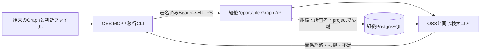

# OSS Graphを組織環境へ持ち込む

## 判断と範囲

今回のStoryは、OSS利用者が記録したGraphと判断根拠を失わず、同じ検索要求で組織環境を利用できること。制御方針は **SIMPLIFICATION（共通化）**。別々の検索実装を互換に保ち続ける代わりに、OSSの検索コアを組織側でも実行する。

既存の組織Graphは独自のOntologyと関係の一意制約を持つ。OSSの関係IDや有効期間を強制変換すると情報を失うため、組織PostgreSQL内の所有者専用領域にGraph v2と対応する判断根拠のスナップショットを保存する。組織の共有事実への昇格は別の明示的な操作とし、今回の移送では行わない。

## 保持する契約

- entity ID、edge ID、関係、有効期間、metadata、provenance、Graphに対応する判断根拠を保持する。
- personal KG、ローカルの元ファイル、旧relationshipsは送信しない。
- 同じGraph IDへの同内容の再送は成功。異なる内容は競合として拒否し、上書きしない。新スナップショットは新しいGraph IDを用いる。
- 移行CLIは保存後にbundleを取得し、内容ダイジェストを照合する。元ファイルは残し、接続先も自動変更しない。
- 組織接続の設定不足、認証失敗、通信失敗をローカル検索の成功に置き換えない。
- 検索コアはAPIなしでも実関係を探索する。意味検索のプロバイダがなければ不足として返す。

## コアの配布

`vendor/brainbase-oss-graph` は公開OSSのビルド済みモジュール。`scripts/sync-oss-graph-core.mjs <OSS checkout>` で明示的に更新する。`source-lock.json` に元コミットとソース・生成物のSHA256を保持する。独立した検索ロジックを組織側に追加しない。

## 反映と復旧

組織側のSQL migrationとAPIの反映が先。次に新しいOSS CLIで移行し、読戻しが成功してから組織接続を設定する。失敗時は元ファイルでローカル利用を継続できる。既存の組織Graph検索はこの経路と別に維持する。

この変更はGraphと検索の移行互換であり、製品全機能の完全上位互換、共有Graphへの自動昇格、本番環境での移行完了を意味しない。

## 検証

通常の限定テストは `tests/server/services/portable-graph-service.test.js` と `tests/server/middleware/csrf-portable-graph.test.js`。

実DB検証は `node scripts/verify-portable-graph-postgres.mjs <外付け作業ディレクトリ> [ビルド済みOSS checkout]`。新規の一時PostgreSQLだけを起動し、非superuserでRLS・保存・HTTP経路を確認して停止する。OSS checkoutを指定すると実CLIの移行と実MCP呼出しも検証する。既存DBの接続情報は使用しない。

組織側の任意の埋め込み設定は `BRAINBASE_EMBEDDING_URL` / `BRAINBASE_EMBEDDING_MODEL` / `BRAINBASE_EMBEDDING_API_KEY`。移行元の設定や資格情報は自動転送しない。同一の生成モデルを使う比較と、未設定時の不足表示を区別する。
