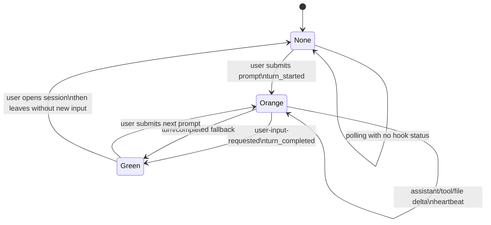

# Session Activity Indicator Lifecycle

## 目的

セッション一覧のアクティブインジケータを、`orange / green / none` の3状態で一貫して扱うための設計メモ。

## 意味

- `orange`: ユーザが入力を送ってから、AI が処理を止めるまで
- `green`: AI が止まって、次のユーザ入力を待っている
- `none`: 未実行、既読化済み、または状態なし

## 状態遷移図

## フロー図

```mermaid
flowchart LR
    A[User inputs prompt] --> B[Codex emits turn started]
    B --> C[notify callback]
    C --> D[/api/sessions/report_activity lifecycle=turn_started/]
    D --> E[SessionManager sets isWorking=true]
    E --> F[Sidebar shows orange]

    F --> G[Codex emits delta events]
    G --> H[notify callback heartbeat]
    H --> I[SessionManager keeps working]

    I --> J[Codex emits user-input-requested or turn/completed]
    J --> K[notify callback turn_completed]
    K --> L[SessionManager sets isDone=true]
    L --> M[Sidebar shows green]

    M --> N[User switches away without new prompt]
    N --> O[markDoneAsRead]
    O --> P[Sidebar clears to none]
```

## イベントマッピング

### Orange 開始

- `agent-turn-start`
- `agent-turn-begin`
- `turn/started`
- `task_started`

### Orange 維持

- `assistant-message`
- `assistant-response`
- `assistant-message-complete`
- `assistant-response-complete`
- `item/agentMessage/delta`
- `item/assistantMessage/delta`
- `item/commandExecution/outputDelta`
- `item/fileChange/outputDelta`
- `item/completed`

### Green 遷移

- `user-input-requested`
- `request-user-input`
- `waiting-for-user-input`
- `turn/completed`
- `task_complete`
- `turn/failed`
- `turn/interrupted`

## 実装位置

- notify 入口: [scripts/codex-notify.sh](/Users/ksato/workspace/code/brainbase/scripts/codex-notify.sh)
- server 状態機械: [server/services/session-manager.js](/Users/ksato/workspace/code/brainbase/server/services/session-manager.js)
- status API: [server/controllers/session-controller.js](/Users/ksato/workspace/code/brainbase/server/controllers/session-controller.js)
- client 表示: [public/modules/session-indicators.js](/Users/ksato/workspace/code/brainbase/public/modules/session-indicators.js)
- 緑既読化: [public/app.js#L1114](/Users/ksato/workspace/code/brainbase/public/app.js#L1114)

## 実装ルール

- notify payload は `type` 固定で決め打ちしない
- `method`, `turnId`, `turn.id`, `threadId`, `thread.id` も拾う
- `assistant-message-complete` を done に倒さない
- done は `AI が入力待ちに戻った` シグナルを優先する
- `turn/completed` は後方互換の fallback として扱う
