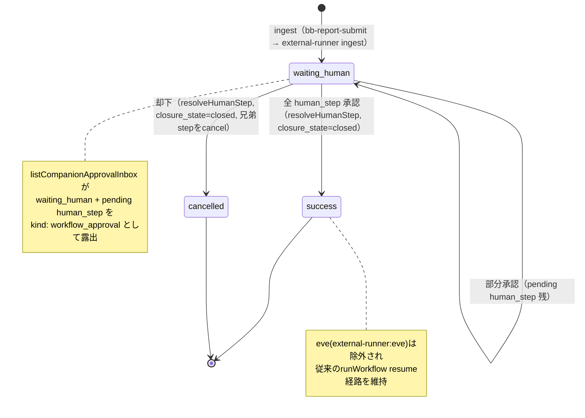
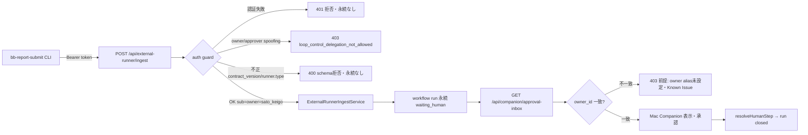

# Architecture: agentレポートを Companion approval inbox に集約する（C2）

- story-id: `story-brainbase-agent-report-approval-inbox`
- date: 2026-07-05
- branch: `session/2026-07-05-c2-agent-report-inbox`
- status: implemented

## 目的

`/ceo` `/cso` `/retro` の各agentコマンドが `_inbox/pending.md` へ直書き＋`/tmp/{ceo,cso,retro}/` へ詳細出力しており、誰にも読まれず滞留・消失していた（`/tmp` は再起動で消える）。これを既存の workflow engine（external-runner ingest）経由で Companion approval inbox に集約し、「表示→承認→クローズ」まで閉じるループにする。

## データフロー

```
/ceo /cso /retro コマンド
  ↓ markdown レポート
scripts/bin/bb-report-submit.mjs（新規CLI）
  ↓ external_runner.v0 payload（runner.type=agent_report）
POST /api/external-runner/ingest（既存エンドポイント）
  ↓ ExternalRunnerIngestService → EveRuntimeAdapter
workflow run（implementation_key=external-runner:agent_report,
  status=waiting_human, pending human_step, outputs=report_markdown）
  ↓ listCompanionApprovalInbox が waiting_human + pending human_step を拾う
GET /api/companion/approval-inbox（kind: workflow_approval）
  ↓ ポーリング
Mac Companion（別リポジトリ・表示consumer）
```

## スコープ境界（Consumer）

本PRのスコープは **brainbase 側の ingest → approval-inbox API 露出まで**。

- **表示 consumer は brainbase 内蔵 Web UI ではなく、別リポジトリの Mac Companion**。
  - `/Users/ksato/workspace/code/brainbase-mac-companion` の Swift 実装
    （`BrainbaseApprovalInboxClient.swift` / `BrainbaseApprovalItem.swift`）が
    `GET /api/companion/approval-inbox` をポーリングし、承認 Focus Queue として表示する（実装済み）。
- したがって「brainbase の `public/` Web UI に inbox 表示 consumer が無い」ことは欠落ではなく設計どおり。
- in-repo の検証境界は「ingest 後に `waiting_human` run が期待どおりの形
  （status / closure_state / action_required / human_waiting / human_steps / outputs）で永続され、
  approval-inbox API がそれを返せる」ことまで（route層 supertest で担保）。

## 契約拡張（サーバー変更点）

1. `server/services/external-runner/contract-schema.js`
   `ALLOWED_RUNNER_TYPES` に `agent_report` を追加。`runner.type=agent_report` のとき
   `runner.eve.trace_ref` を要求しない。eve 系の検証は不変。

2. `scripts/bin/bb-report-submit.mjs`（新規CLI）
   markdown → external_runner.v0 payload 組み立て → ingest POST。送信失敗時のみ
   `_inbox/pending.md` にフォールバック追記（後方互換）。`submitReport()` は
   `fetchImpl` / `tokenReader` 注入でテスト可能。フォールバック channel は sender の
   `agent/` プレフィックスから導出（`agent/cso` → `cso`）。

## 承認後クローズ（orphan run 対策）

agent_report run は実行可能な workflow 実体（登録ランナーハンドラ）を持たない **承認専用 run**。
従来 `resolveHumanStep` はこれを `runWorkflow(step.workflow_id)` の generic フォールバックへ流し、
ハンドラ未登録のため **孤児 needs_action run** を残していた。

対応（`server/services/workflow/workflow-service.js`）:

- `isAgentReportWorkflow`（`implementation_key === 'external-runner:agent_report'`）と
  共通述語 `isApprovalOnlyIngestWorkflow`（meeting_review_package と共有）を追加。
- `resolveHumanStep` を meeting_review_package と同様に特殊ケース化:
  - human step 全承認 → run を `status=success` / `closure_state=closed` にクローズ
  - 却下 → run を `cancelled` にし、兄弟 pending step を cancel
  - 部分承認 → `waiting_human` を維持
- **eve 系（`external-runner:eve`）は除外**: 正当な登録ハンドラを持ち resume 経路が必要なため巻き込まない。

## テスト

- `contract-schema`: agent_report 受理 / eve 要件スキップ / 不正 payload 拒否
- `external-runner-routes`: agent_report が route 層（auth 込み）を通り waiting_human run として永続される
- `external-runner-ingest-service`: 承認 / 却下 / 部分承認の3経路で run がクローズし、孤児 needs_action run がゼロ
- `bb-report-submit`: payload 組み立て、run.id 冪等、submitReport 送信成功 + フォールバック3経路（fetch 失敗 / HTTP 非2xx / token 欠如）

## 図

### state: agent_report run の状態遷移



### threat_model: agent_report ingest の脅威と緩和



脅威と緩和:
- **なりすまし送信**: owner/approver/human-step の required_by が認証 actor と一致しない場合、runner.type 非依存の delegation guard が 403 で拒否（既存 eve spoofing テストで担保）。
- **不正 payload**: contract-schema が contract_version / runner.type / 必須フィールドを永続前に検証、400 で拒否。
- **孤児 run 蓄積**: 承認専用 run を resolveHumanStep が確実にクローズ（本PRで対策済み）。
- **読み取り 403（前提条件・スコープ外）**: `companion.js` の owner_id 一致チェックにより、正規トークンの personId が `sato_keigo` と一致しないと approval-inbox 読み取りが 403。env `BRAINBASE_PERSONAL_KG_OWNER_ALIAS_IDS` への alias 追加が C2 稼働の前提（Known Issue）。

## リリース・運用（release_ops）

### Release note

C2「agent レポート → Companion approval inbox 集約」。`/ceo` `/cso` `/retro` のレポートが
新規 CLI `bb-report-submit` 経由で workflow engine external-runner ingest に入り、
`GET /api/companion/approval-inbox` に承認待ちとして露出。承認で run がクローズ。

### Operator action（本番反映手順）

1. C2 を develop へマージする。
2. brainbase サーバー（launchd, port 31013）を再起動する（**必須**: 稼働サーバーは
   agent_report 未マージの古い contract-schema を持ち、再起動しないと ingest が 400 で拒否される）。
   再起動前に必ずアクティブセッション数を確認し許可を得る（絶対ルール 11）。
3. Companion 承認導線を有効化する前提として、正規トークンの personId
   （`per_01KGYC7NNS0VXADK7NP48W4VR5`）を owner として認識させる: env
   `BRAINBASE_PERSONAL_KG_OWNER_ALIAS_IDS` に追加（または owner ID 正式化）。
   未設定だと `GET /api/companion/approval-inbox` が 403 になり Mac Companion の承認欄が空になる。
4. `/ceo` `/cso` `/retro` を実行し、Mac Companion 承認 Focus Queue にレポートが出ることを確認する。

### Observability

- ingest 成否: `bb-report-submit` が `run.id` と HTTP status を stdout に出力。失敗時は
  `_inbox/pending.md` にフォールバック追記（人間が grep で検知可能）。
- run 状態遷移: workflow run の status/closure_state（waiting_human → success/cancelled）と
  audit log（`workflow.run.agent_report_approvals.*`）。

### Rollback instruction

- 契約変更の revert: `ALLOWED_RUNNER_TYPES` から `agent_report` を除去すれば元に戻る。
- 新規 CLI（bb-report-submit）と docs は独立で、削除しても既存機能に影響なし。
- workflow-service の特殊ケースは述語追加のみで、revert しても既存 eve/meeting_review 経路は不変。
- DB migration なし（既存 workflow run/human_step/output テーブルに新 run を追加するのみ）。冪等 run.id で二重取り込みなし。
- ロールバック後、稼働サーバーを再起動すれば旧挙動に戻る。

## 既知の制約

- **ライブ E2E**: `~/.brainbase/tokens.json` 失効（JWT 秘密鍵ローテーション）によりブロック中。
  インプロセス E2E（route層 supertest + integration）で代替検証済み。本番有効化には佐藤の再認証が必要。
