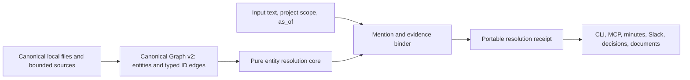

# Canonical Entity Resolution Architecture

## Decision

Brainbase OSSの正規Graph、文章解決、証拠Receiptを一つの依存方向へ統合する。

依存方向は`adapters -> receipt/evidence binding -> pure resolver -> canonical Graph/Ontology`とする。adapter、CLI、MCP serverはalias、candidate ranking、失敗判定、digest規則を独自実装しない。

## Responsibility boundaries

- `canonical graph contract`: Graph v1/v2、entity、typed edge、relation registry、stable ID、endpoint/cardinality validationを所有する。
- `storage adapter`: 4 canonical files、lock、journal、recovery、v1 dual-read、明示migrationを所有する。Graph v2のために5本目のcanonical fileを増やさない。
- `resolution core`: canonical entity index、alias・敬称のquery-time正規化、project scope、relation path、`as_of`、candidate rankingを副作用なしで所有する。
- `evidence binder`: mention span、input hash、candidate evidence、source state、結果集約、deterministic receipt digestを所有する。
- `projection adapter`: legacy relationship、decision、Personal KGを既存shapeへ投影し、`canonical|projection|unresolved`を明示する。
- `consumer adapters`: 入力取得と各利用経路の承認だけを所有し、共通result/receiptをそのまま受け渡す。

## Canonical Graph v2

`graph.json`は明示的なdiscriminated unionとする。

- v1: `version: 1`と既存entity。read-only互換を維持する。
- v2: `version: 2`、`ontology` binding、正規entity、typed edge。
- entityはstable `id`、`type`、`name`に加え、任意の`aliases`と有効期間を持てる。
- edgeは`id`、`fromId`、`relation`、`toId`、任意の有効期間とprovenanceを持つ。
- edge IDと一意性keyは`fromId|relation|toId`のcanonical tupleから決定的に生成する。

最初のcore relation registryは次に限定する。

| relation | from | to | 意味 |
|---|---|---|---|
| `member_of` | person | org | 人物が組織に所属する |
| `participates_in` | person | project | 人物がプロジェクトに関与する |
| `accountable_for` | person | project | 人物がプロジェクトの最終責任を持つ |
| `owned_by` | project | org | プロジェクトを組織が所有する |
| `governs` | decision | project | 判断・原則がプロジェクトへ適用される |
| `supersedes` | decision | decision | 新しい判断が過去の判断を明示的に置き換える |

roleやcontextは`participates_in`または`accountable_for` edgeの属性として保持できる。projectionはcanonical entityではないため、core edgeを捏造せず`projectionOf`で正規IDを参照する。

## Contract versioning

次の版を独立に管理する。

- `contractSchemaVersion`: Ontology manifest自体の文法。
- `ontologyId`と`ontologyVersion`: entity/relationの意味契約。
- `graphSchemaVersion`: JSON保存形状。
- `resolverVersion`: 正規化、scope、ranking、曖昧性判定。
- `receiptSchemaVersion`: portable receipt shapeとdigest規則。
- `releaseDigest`: 内容のimmutableな識別子。

既存Portable Ontology `1.0.0`を上書きしない。Graph v2 relation registryを含む新しいOntology releaseは新versionとして追加し、過去snapshotを当時のversionで監査できるようにする。

## Resolution semantics

Resolver inputは文章、任意の抽出済みmention span、任意のproject IDとscope policy、必須の`as_of`、許可entity type、canonical snapshotから構成する。scope policyは`strict|prefer_project|allow_global_fallback`を明示し、project指定時の既定は`strict`とする。文章抽出とentity rankingは別段階にし、抽出器が渡した未知spanも`unresolved`として証拠化する。

1. mention候補とUTF-16 code unit準拠の`start`/`end`を抽出する。
2. NFKC、空白、大小文字、明示alias、日本語敬称のquery-time variantを作る。
3. name/alias exact matchを先に、部分一致を後に候補化する。
4. project scope内のdirect edge、近いrelation path、`as_of`で有効なentity/edgeを根拠として順位付けする。scope外探索はpolicyが許可した場合だけ行う。
5. 同一最上位根拠が複数あれば`ambiguous`、候補なしは`unresolved`とする。曖昧性をscore閾値だけで消さない。

敬称除去は候補探索だけに用い、`田中さん`と`田中`をcanonical mergeするwrite操作には使わない。同姓同名はproject edgeや文章文脈で一意にならなければambiguousのまま返す。

## Source and resolution states

取得元と解決結果を直交させる。

- source: `complete|partial|unavailable|invalid`
- per mention: `resolved|ambiguous|unresolved`
- aggregate: `complete|partial|none|blocked`

`unavailable|invalid`は原則`blocked`であり、mention 0件や`unresolved`へ変換しない。`partial` sourceから解決できた候補はsource limitationをReceiptに残す。

## Receipt and privacy

portable receiptは入力本文や回答本文を永続化しない。入力のSHA-256、文字数、mention span、surface hash、候補IDと根拠、採用ID、source authority/revision hash/status/issue code、scope policy、`as_of`、全version、summary、digestを保持する。sourceの生revision、診断message、runtime pathも保存しない。sourceが`unavailable|invalid`なら解決件数を`null`にして未検証を0件へ丸めない。実行中のAPI resultは表示用surfaceと正規化表現を返せるが、portable receiptのcanonical payloadとdigest対象から除外する。

digestはcanonical JSONに対するSHA-256とし、生成時刻、runtime固有path、表示用surfaceを除外する。同じ契約入力から同じdigestを再計算できる。Receiptの存在はwriteや外部送信のauthorizationではない。

## Migration and atomicity

v1は読み取れるが、v2対応writerはmigration前の通常writeを拒否する。migrationはpure plannerを先に実行し、defaultをdry-runとする。

- unique exact matchと既存IDの明示参照だけを自動edge化する。
- ambiguous/unresolvedは計画へ残し、`--write`をblockするか明示的な解決入力を要求する。
- `--write`はlock内で再読込し、input aggregate hashがdry-run時と同じか確認する。
- 既存4-file atomic publish、backup、rollback、recoveryを維持する。
- 再実行は同じedge IDを返し、no-opになる。

## Compatibility

- 既存CLI flag、MCP tool名、required input、`SearchResult`旧5 field、`get_context`旧fieldを維持する。
- 新しいcanonical ID、record class、projection origin、relation path、authorityはadditive fieldとする。
- legacy relationship、decision、Personal KGはreadableなprojectionとして返すが、正規Graphと表示しない。
- Graph v2を理解しない旧writerがedgeを読み捨てて再保存する経路を禁止する。
- OSS coreにUnson内部Graph、tenant、RACI、署名鍵、production credentialを含めない。

## Integration sequence

1. Story、Architecture、Spec、contract fixtureを固定する。
2. Graph v2・relation registry・migrationとResolver/Receipt pure coreを並列実装する。
3. 全writerを共通edge builderへ統合し、MCP/CLI projectionを共通Resolverへ接続する。
4. downstream利用adapterを共通Receiptへ接続する。
5. local tarball consumer、実MCP、実agent、Cycle 09を実行する。
6. develop merge後にだけnpm公開し、fresh registry installで同じjourneyを再実行する。

## Failure semantics

- malformed Graph、未知version、未知relation、欠落endpoint、型/cardinality違反はfail loudする。
- source unavailableと検索0件を区別できないadapter resultは受理しない。
- Receipt digest、input hash、span、source revisionが一致しない場合はconsumerへ渡さない。
- unsupported Resolver/Receipt versionを暗黙変換しない。
- migrationやwriterの途中失敗は4 canonical files全体を旧状態へ復旧する。
