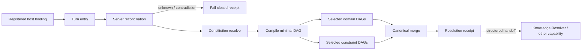

# Judgment Resolver architecture

## Decision

Brainbaseに、登録済みhost bindingが推論・行為の前に利用する、状態を持たないJudgment Resolver境界を追加する。Resolverは巨大な固定手順を実行するengineではなく、turn request、認証context、callerのclassification proposal、サーバー管理のJudgment Runtime Manifestから、今回適用するConstitutionと最小の実行部分グラフをcompileする。

判断の実行構造は次の責務へ分離する。

1. repoのalways-loaded instruction/Skillが、Brainbase管理対象turnをResolver入口へ送り、MCP adapterが現在の問いと必要な会話文脈を含むpublic body全体を署名する。
2. host側は自然言語の分類を提案できるが、DAG、policy、provenance、安全floor、検証済み分類を指定できない。
3. server-side Reconcilerがrequest、認証済みentry context、manifestの意味matcherからdomain/signalとminimum action/riskを導出し、提案はserver detectionで裏づけられた時だけ使う。
4. Resolverが適用policyとDAGを選び、active node、edge、各active nodeの実行定義、後続capability call、未確認事項、binding状態をreceiptとして返す。
5. AIまたは上位orchestratorがreceiptの`active_node_definitions`に従ってactive DAGだけを実行する。候補生成はLLMへ残し、順序、制約、棄却条件はreceiptが拘束する。

Resolver自身は業務情報を検索しない。既存Knowledge Resolver、Graph SSOT、Personal KG、repository、Driveなどは後続capabilityとして指示する。Knowledge Resolverは「どの正本を検索すべきか」を決める独立サブノードとして再利用し、Judgment Resolverへ統合・複製しない。



## Host entry boundary

Brainbase serverはCodex app、Claude Code、その他hostが生成する任意のmessageを直接interceptできない。したがってv1は次を明示的に分離する。

- **host-contract enforcement**: `CLAUDE.md`とbyte-identicalな`AGENTS.md`のalways-loaded instruction、およびthin Skillが通常turnの回答前に`brainbase_judgment_resolve`を一度呼ぶ。contract testはinstructionとSkillの存在・一致を確認する。exactly-onceはhost契約であり、stateless serverが未呼び出しを検知したという主張はしない。
- **trusted binding transport**: MCP adapterは、現在の問いと任意の`conversation_context`を含むpublic bodyを配列順まで保存してcanonical化する。そのexact request digestと`adapter_id`, `adapter_version`, `turn_id`, UTC millisecond RFC 3339の`issued_at`を、domain tagを含むcanonical JSON arrayへencodeし、`BRAINBASE_JUDGMENT_BINDING_SECRET`でHMAC-SHA256署名して専用HTTP headerへ送る。serverはmanifest登録、body digest一致、malformed/future/expired時刻、constant-time署名比較を検証する。MCPとserverはnested/Unicodeを含む同じgolden vectorを持つ。anti-replay max ageとfuture skewはsecurity transport設定であり、判断selectorの数値閾値ではない。
- **server enforcement**: APIはhost署名、認証、project scope、personal owner visibility、input reconciliation、manifest integrityを必ず強制する。receiptはaction authorizationではなく、既存toolのauth/approvalを置換しない。host runnerはwrite/external時に独立したaction authorizationを要求し、その成功後だけ実行へ進む。
- **coverage truth**: 検証済みcontextのreceiptだけが`host_binding.status=managed`と`enforcement_level=host_contract`を返す。bindingを読み込まないhost、未登録/mismatch/stale署名、tool不達、receipt未取得は共通host resultの`management_status=unmanaged`、`receipt=null`、非空warningとなり、Brainbase管理済みと表示できない。検証済みの`needs_classification|needs_policy_resolution` receiptは`managed`のまま`execution_status=stopped`とし、未導入hostと分類を混同しない。host contract helperは列挙外action kindを含む未認可actionを停止し、failureを報告する。tool unavailable、missing receipt、403 binding rejectionをbehavioral fixtureで固定する。

この境界により「判断」と「強制」を混同しない。全action toolへのreceipt gateは別Storyであり、v1は未実装のserver enforcementを主張しない。

## Classification trust boundary

公開入力の`classification_proposal`はuntrusted hintである。serviceは次の順に正規化する。

1. 現在のrequestとserver-owned intent-to-effect rulesからminimum action/riskを導く。過去発話のaction verbで現在turnの作用を勝手に引き上げない。
2. manifestのserver-owned意味matcherが`conversation_context.text + current request`から継続中のdomain/signalを検出し、現在のrequestに明示されたwrite、merge、delete、send、publish、purchase等から安全floorを追加する。
3. proposalがfloorより弱い、server検出domain/signalを欠く、proposalだけが意味分類の根拠、requestと矛盾する、または確度がunknownなら`needs_classification`へ送る。
4. `general`は低作用の挨拶・説明・要約・定義確認としてsafe-general matcherが肯定一致し、他domain/safety matcherが未検出でintent/actionも整合する場合だけ成立する。matcherが何も検出しなかったという消極的理由では成立しない。その他はserver検出で裏づけられたdomain/signalだけをcanonical orderへ正規化する。

callerはDAG/policy ID、trusted provenance、reconciled classificationを指定できない。callerの`confidence=confirmed`も保証水準を上げない。server matcherは完全な自然言語理解ではないため、receiptは`classification_assurance=verified|bounded|unknown`とreconciliation reasonsを返す。意味分類がproposalだけに依存する場合は`unknown`となり、domain DAGへ進まない。

## Judgment Runtime Manifest

Git管理された単一の版付きmanifestに次を保持する。

- Constitution: policy ID、version、priority、strength、型付きscope、visibility、owner、evidence requirement、型付きeffect、instruction
- Node registry: node ID、kind、instruction、required capability template
- DAG registry: common entry、domain DAG、conditional constraint DAG、適用policy
- Selector mapping: server-owned意味matcherと、列挙済みdomain、signal、action、riskからDAGを選ぶ決定規則
- Host binding registry: adapter ID、version、enforcement level、fail behavior

manifestはrequestから上書きできない。digestはmanifest自身に期待値を埋めず、`brainbase-canonical-json-v1`でcanonical化したUTF-8 bytesのSHA-256とする。別ファイルのappend-only runtime lockはschema versionと順序付きentriesを持ち、runtime versionの重複、current pair不一致、previous entriesのprefix変更を検証する。serviceはpair不一致を拒否し、manifest変更時はruntime versionとlock末尾entryを同じ変更で更新する。

## Minimal DAG compilation

管理対象turnはentry、reconciliation、Constitution resolve、DAG compileを通る。その後は選ばれたdomain DAGとconstraint DAGだけへ分岐し、canonical merge nodeで合流する。複数domainも並列branchとして表し、全10段階を直列に実行しない。短い追従発話はhostが渡した`conversation_context`からdomain/signalを継続できるが、文脈は暗黙に復元せず、`source_turn_ids`で出所を束縛する。

receiptは`active_nodes`と同順・同数の`active_node_definitions`を含む。各定義はmanifestのnode registryから投影した`id`, `kind`, `instruction`, `required_capability_template`であり、hostはnode IDだけを見て独自のpromptへ再解釈してはならない。

unknownまたは矛盾分類ではdomain DAGへ進まず、`entry -> reconcile -> clarification -> receipt`だけを返す。構造的制約違反は既存案へのpatch nodeではなく`rederive_required`で表し、次のresolutionを新しい入力で行う。各receiptは非循環である。

## Policy conflict resolution

scopeは`global(0)`, `organization(1)`, `project(2)`, `owner(3)`の型と対象IDを持ち、それぞれ常時、`access.tenantId`、`access.projectCodes`、`access.personId`へexact matchした時だけ適用する。hard policyは`require|forbid`、soft policyは`prefer`だけを持つ。適用policyは`strength(hard before soft) -> priority(desc) -> scope specificity(desc) -> id(asc)`でcanonical sortする。同じtargetへの反対hard effectは、高priority、次に高specificityを採用する。敗者とhardに負けたsoft policyはreceiptの独立した`suppressed_policies`へwinner IDと`lower_priority|lower_specificity|hard_over_soft`理由を付ける。priorityとspecificityが同じ反対hard effectだけは一方を選ばず、HTTP 200の`needs_policy_resolution` receiptでfail-closedにする。

## Knowledge Resolver composition

knowledge nodeはKnowledge Resolverを直接実行せず、次の型付きhandoffをreceiptへ含める。

```json
{
  "capability": "knowledge.resolve",
  "status": "required",
  "input": {
    "intent": "lookup",
    "audience": "team",
    "content_type": "canonical_fact",
    "project_code": "brainbase"
  }
}
```

`audience`または`content_type`が不足すれば`needs_classification`とし、LLMに再推測させない。後続callerはKnowledge receiptを別に保持し、Judgment receiptを検索実行済み証跡として扱わない。

## Personal policy access

policyは`visibility: owner|organization`と任意の`owner_person_id`を持つ。`personal_judgment`は`req.access.personId`がownerまたは設定済みaliasと一致する時だけ選択できる。`internal_api`等のowner不明service credentialはpersonal policyを受け取れず、403相当の`personal_judgment_not_accessible`となる。organization policyへの暗黙fallbackは、別人の判断を本人のものとして扱うため行わない。team audienceはKnowledge Resolverの取得範囲であり、Judgment Constitution policyのvisibilityとは分離する。

## Invariants

- 全段階を毎回実行せず、未選択DAGとpolicyはactive planへ入れない。
- policy、DAG、node、provenance、安全floorを公開requestから注入できない。
- 不明・未確認を「存在しない」「安全」「実行可能」へ変換しない。
- 根拠のない数値閾値をselectorへ置かない。
- 候補生成の並列性と候補採用の制御を分離する。
- 判断結果と強制権限を混同しない。
- 累積問題では問題の時間・範囲以上を観測できる制御階層を要求する。
- 追加前に削除、統合、再設計、廃止を比較する。
- 内部工程の高度化だけを外部成果として扱わない。
- ResolverはGraph、Personal KG、document body、実行traceを保存しない。
- active graphは常にDAGである。
- request digestは署名対象のpublic bodyを配列順まで含めて正確に表し、plan digestはtransport由来のrequest digestを除いて正規化済み判断計画を表す。

## Alternatives rejected

- **毎ターン固定の10段階を直列実行する**: 不要な判断と取得を増やす。
- **LLM promptだけに判断基準を書く**: model/context/prompt driftで再現性を失う。
- **API/MCP toolを公開しただけで全turn強制とみなす**: hostが呼ばない経路を検知できない。
- **caller classificationを確定値として信用する**: hard constraintを間接回避できる。
- **既存workflow engineへ埋め込む**: 不要な状態管理と実行機構を持ち込む。
- **Knowledge Resolverを置き換える**: 意味・判断順序と情報源routingを混ぜる。
- **receiptをaction許可証として扱う**: 判断とenforcementを混同する。

## Verification

- service unit testsでreconciliation、全domain/signal route、policy access/conflict、決定性、非循環性、manifest pairを確認する。
- API integration testsでhost署名の未登録/mismatch/malformed/future/stale/request不一致、strict auth、project scope、personal owner、400/403/500変換を確認する。
- MCP testsでschema、cross-runtime署名golden vector、認証、scope、upstream error、receipt、dispatcher順序を確認する。
- host contract testsでCLAUDE/AGENTS一致、always-loaded entry rule、Skill/capability/runbook参照と、tool unavailable・missing receipt・binding 403時のunmanaged、分類待ち・policy競合時のmanaged/stopped、列挙外action kind、独立認可なしのwrite/external停止を確認する。
- Knowledge Resolver regression、server関連tests、MCP全tests、typecheckを確認する。
