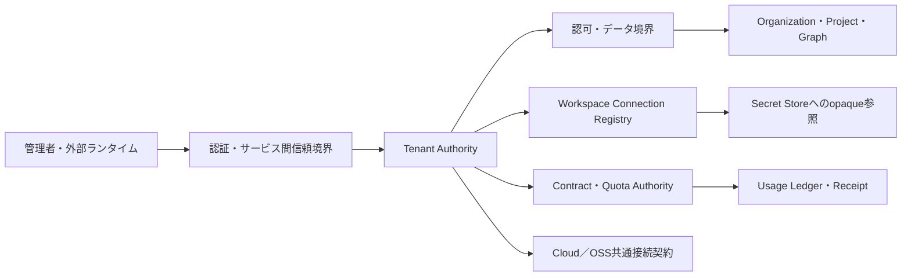

# Brainbaseマルチテナント基盤アーキテクチャ

## 対応Story

- [BrainbaseをCloud／OSS共通のマルチテナント基盤にする](../management/stories/active/story-brainbase-multitenant-platform.md)
- 統合先: `Unson-LLC/mana-runtime:story-slack-mana-brainbase-multitenant-e2e`

## 決定

Brainbaseは、契約主体とデータ境界を表すcanonical tenantの唯一の正本を持つ。organization、membership、project、Graph data、workspace connection、contract、usage、Receiptはtenantへ明示的に帰属させる。workspace ID、project code、organization名、deployment名はtenant IDの代用にしない。

Cloud版と互換OSS版は同じ外部接続契約を実装する。配置方式や任意機能は異なってよいが、認証、認可、tenant context、失敗分類、Receiptの意味は変えない。

## 責務と正本

| 対象 | 正本・責務 | 正本ではないもの |
|---|---|---|
| tenantの識別と状態 | Brainbase Tenant Authority | Slack、mana-runtime設定、workspace名 |
| organization・membership・project | tenant配下のBrainbase管理領域 | 表示名、project code単体 |
| workspace connection | Brainbase Connection Registry | Slack event、runtime cache |
| credential本文 | tenant分離されたSecret Store | Graph、通常DB列、ログ、Receipt |
| 契約・上限・課金方針 | Brainbase Contract Authority | mana-runtimeのローカル既定値 |
| 利用量・原価証跡 | 相関ID付きUsage Ledger／Receipt | Slack返信、推定値 |
| Slack受信と実行分離 | mana-runtime | Brainbase |

## 論理構成

### 制御面

Tenant Authority、membership、connection、contract、capability、revisionを管理する。外部ランタイムへ渡すのは検証済みtenant contextとopaqueなcredential参照だけである。

### データ面

Graph、project、MCP、background job、migration、usage書込みは、認証済み主体とtenant contextの両方を照合してから処理する。tenantを受け取らない内部経路も既定tenantへ補完せず拒否する。

### Cloudflare private bridge

mana-runtimeのCloudflare Service Bindingが参照する`brainbase-tenant-runtime`はBrainbase所有の薄いprivate bridgeとして配備する。公開`workers.dev`／preview URLは持たせず、現行consumerが必要とする`POST /api/v1/runtime/provider-requests:forward`だけをallowlistする。bridgeはbodyを256 KiBに制限し、callerのCookie、forwarding header、Access headerを破棄し、Worker SecretのAccess Service Tokenで専用HTTPS Tunnel originへ転送する。

Tunnel hostのcloudflaredはNode tenant runtimeのloopback portへ接続する。Node側のservice auth、TenantContext署名検証、authoritative revision、credential brokerを正本のまま使い、bridgeへtenant判断やcredential materializeを複製しない。origin、期待hostname、Access資格情報が欠けるか不一致なら、Nodeの別host／portや別deploymentへfallbackせず503で停止する。Nodeのnon-loopback listenは明示opt-inのまま維持する。

### 監査面

管理変更、connection更新、権限判断、usage、Receiptを同一相関IDで関連付ける。未計測、取得不能、部分取得は独立したevidence stateとして保持し、0件・0円・成功へ変換しない。

## Tenant Context契約

境界を越えるcontextは、少なくとも次の意味を持つ。

- canonical tenant
- 認証されたactorと委任元
- workspace connectionと有効revision
- 許可されたorganization、project、data scope、capability
- correlationとidempotencyの識別子
- contract／quota判断の参照revision

contextは署名または同等の改ざん検知を備え、各境界で再検証する。cacheは正本のrevisionを上書きせず、失効や不一致を検出したら業務処理前に停止する。

## 信頼境界と拒否規則

1. 外部入力はtenantを主張できても決定できない。
2. 認証後、最初の業務処理より前にTenant Authorityで一意解決する。
3. 未解決、複数解決、失効、改ざん、scope不足、revision不一致はfail closedにする。
4. 別tenant、別connection、別credential、default projectへのfallbackを禁止する。
5. 越境拒否では対象resourceの存在を漏らさない。
6. 管理API、MCP、job、migration、監査経路へ同じ規則を適用する。

tenant runtimeのfeature flagはtenant境界を迂回する許可ではない。runtimeが無効、未設定、または正本へ到達不能な場合、認証済み管理APIと監査APIは`upstream_unavailable`として503で拒否する。公開副作用を行うbackground jobは起動時にtenant boundary gatewayを必須化する。review pack producerはdeployment-localの明示設定からcanonical tenant／resource bindingを各Ledger rowへ永続化し、jobはそのbindingをclaimおよびprovider呼出しより前に`entry_point=background_job`で照合する。gateway、設定、bindingのいずれかがなければ既定tenantを補完せず停止する。旧`PostingService.tick`はproduction schedulerのcall siteではなく、公開経路は`run-sns-scheduled-posts.js`から`SnsScheduledPublisher.run`へ限定する。

SNS Cockpitの`/api/sns-growth`は認証と`admin_api` tenant guardの後にだけ到達できる。review pack投入CLIも例外にせず、deployment-localの`bbsvc_` service tokenで内部runtimeの`POST /api/v1/runtime/tenant-context:resolve`を呼ぶ。内部runtimeはdeployment-local tokenの一致に加えてJWT署名と`issuer`、`subject`、`audience`、`deployment_id`、`expires_at`、必要`capabilities`を検証し、token内のtenant自己申告はtenant選択に使わない。Tenant Authorityは正本DBのtenant／connection／contract revisionを照合して短命Ed25519署名済みTenantContextEnvelopeを発行する。CLIは秘密鍵を持たず、そのEnvelopeとcanonical resourceを`Brainbase-Tenant-Context`／`Brainbase-Resource-Ref`へbase64url JSONとして送り、同じ本番verifierで再検証させる。service token、runtime URL、connection selector、actor／resource bindingのいずれかがなければHTTP送信前に停止し、値をログへ出さない。対話APIのpublish endpointはdry-run専用とし、公開副作用を実行しない。実公開は`SnsScheduledPublisher`だけが`background_job`認可、PostgreSQLの競合安全なclaim、provider呼出しの順に実行する。productionでSNS Ledger接続先がない場合は503で停止し、JSON file repositoryは明示的なtest modeだけに限定する。これにより、未署名tenant header、API直送、ローカルfile fallbackのいずれもtenant検証とclaim／fencingを迂回できない。

## Workspace Connection

workspace connectionは外部workspaceとtenantの関係を表す正本オブジェクトである。installation、workspace、app、scope、status、revisionの履歴を監査可能にし、複数workspace、再インストール、scope変更、失効を同じtenant境界で扱う。

credential本文はconnectionへ埋め込まない。Connection RegistryはSecret Storeのtenant限定opaque handleだけを保持し、利用側はtenantとrevisionを再検証してから解決する。

## 契約・利用量・Receipt

Contract Authorityはplan、含有枠、超過方針、警告、hard stop、適用期間をtenant単位で決定する。Usage Ledgerは成功・失敗を問わずAI、tool、Container、storage、retry、外部APIの実消費を相関IDへ帰属させる。

Receiptは利用事実と計測状態を固定する。仕入単価、為替、販売価格は適用開始日とrevisionを持ち、後日の集計でも当時の判断を再現できるようにする。

## Cloud／OSS共通契約

| 項目 | Brainbase Cloud | 互換OSS |
|---|---|---|
| tenant context | 必須 | 必須。単一tenant配置でも省略不可 |
| 認証・認可 | 共通の意味 | 共通の意味 |
| connection revision | 必須 | 必須 |
| 失敗分類 | 共通 | 共通 |
| Receipt | 共通の最低契約 | 共通の最低契約 |
| Cloud課金・運用 | 提供可能 | 任意・非対応を明示 |

protocol version negotiationで必須機能、任意機能、互換期間を合意する。任意機能がない場合は機械判定可能な非対応を返し、別deploymentへfallbackしない。

## 配置モデル

- 共有Cloud: 論理tenant分離を全層で強制する。
- 専用Cloud: 同じ契約を使い、物理分離を追加する。
- 顧客管理OSS: 顧客環境内でもtenant contextを維持し、Cloud固有機能は任意機能として扱う。

配置方式は認可を弱める理由にしない。どのprofileも同じpositive、negative、non-applicable fixtureを通す。

## 移行

既存データは暗黙の既定tenantへ寄せない。移行前に帰属規則を固定し、dry-run、対象件数、移行件数、未帰属件数、重複件数を照合する。未帰属または曖昧なデータは隔離し、業務経路から参照できなくする。rollbackは元の識別子とrevisionを保ち、越境を起こさず復元できる単位で行う。

## 障害の意味

| 状態 | 意味 | 振る舞い |
|---|---|---|
| not_found | tenant／connectionが存在しない | 拒否。推測しない |
| ambiguous | 複数候補 | 拒否。選ばない |
| revoked | tenant／connection／credentialが失効 | 拒否。再認証を要求 |
| scope_mismatch | actor／project／capability不一致 | 存在を漏らさず拒否 |
| upstream_unavailable | 正本へ到達不能 | 取得不能として返す |
| partial | 一部だけ取得・計測 | 不完全として残す |
| unsupported | 任意機能非対応 | 能力差を明示する |

## 段階導入

1. 現行境界と利用量を計測する。
2. Tenant Authority、connection、認証・認可を導入する。
3. データ、job、MCP、migrationの分離を強制する。
4. contract、quota、usage、Receiptを有効化する。
5. 専用配置と互換OSSへ共通契約を展開する。

各段階で文書、コード、テスト、配備、本番readback、原価、利用者成果を別々に判定する。

## 受入条件との対応

| 受入条件 | Architecture上の保証 |
|---|---|
| `AC-001` | Tenant Authorityをcanonical ownerとし、状態とライフサイクルを一元化する。 |
| `AC-002` | 全管理・データ・契約領域をtenant配下へ置く。 |
| `AC-003` | workspace、project、organization表示をtenant代用にしない。 |
| `AC-004` | 一意解決と業務処理前のfail-closedを定義する。 |
| `AC-005` | API、MCP、job、migration、監査へ同じ境界を適用する。runtime無効時の管理／監査は503、SNS対話APIは認証・tenant guard・dry-run限定、review pack投入はservice authとcanonical headerを必須化し、公開jobはproducerの明示的binding、gateway、PostgreSQL claimを必須にして副作用前認可とする。 |
| `AC-006` | dry-run、照合、隔離、rollbackを移行契約にする。 |
| `AC-101` | Workspace Connection Registryを正本化する。 |
| `AC-102` | 複数workspace、再インストール、失効をrevision履歴で扱う。 |
| `AC-103` | installation、workspace、app、scope、status、revisionを監査対象にする。 |
| `AC-104` | credential本文をSecret Storeに限定する。 |
| `AC-105` | connection異常を分類しfallbackせず拒否する。 |
| `AC-201` | tenant別Contract Authorityを置く。 |
| `AC-202` | 相関ID単位で全消費をUsage Ledgerへ帰属させる。 |
| `AC-203` | warning、hard stop、超過許可をplan判断にする。 |
| `AC-204` | 失敗原価と未計測状態を保持する。 |
| `AC-205` | 単価・為替・価格の適用revisionを追跡する。 |
| `AC-301` | Cloud／OSSの共通最低契約を固定する。 |
| `AC-302` | version、互換期間、必須・任意機能を交渉する。 |
| `AC-303` | Cloud固有機能をOSS必須契約から分離する。 |
| `AC-304` | 顧客環境、Cloud、runtimeの障害を分類する。 |
| `AC-305` | tenant、deployment、credential間fallbackを禁止する。 |

## Architecture fixture

- positive: 正しいactor、tenant、connection revision、scopeで同一tenantのGraphとReceiptへ到達する。
- negative: tenant Bのresource ID、失効connection、古いrevision、別app、scope不足をすべて拒否する。
- non-applicable: OSSにCloud課金機能がない場合、共通契約全体を失敗させず任意機能非対応として返す。

## Specへの拘束

次のSpecは、このArchitectureの責務分離、tenant context、失敗分類、Cloud／OSS互換、移行照合を具体化する。Specが別tenantへのfallback、secret本文の伝播、暗黙tenantを許可する場合はArchitecture違反とする。

## 非目標

- Slack event処理、Queue、Durable Object、Containerの内部設計
- Slack Marketplaceの公開審査
- 顧客別価格そのものの決定
