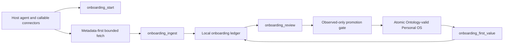

# Portable Connected-world Onboarding Architecture

## Decision

接続済み世界のオンボーディングを、既存CLIへ追加する分岐ではなく独立した`connected-onboarding` runtimeとして実装する。公開MCPは5つの操作を提供し、生成される公開Skillがhost-entry contractを担う。connector discoveryとbounded fetchはホストエージェントの責務、receipt/candidate/review/promotion/first-value auditはBrainbaseの責務とする。

## Responsibility boundaries

- `src/connected-onboarding.ts`: schema validation、state machine、secret/body rejection、receipt/candidate ledger、idempotency、review planning、first-value receiptを所有する。
- `src/import-extract.ts`: candidate kindを既存canonical shapeへ変換する決定的promotion planを所有し、各candidateが作るcanonical IDを返す。
- `src/ssot.ts`: lock、recovery、Ontology aggregate validation、atomic publishを引き続き唯一のcanonical write境界とする。
- `src/server.ts`: MCP schemaとruntime関数への薄いadapterだけを持つ。onboarding business ruleを再実装しない。
- `src/skills.ts`: connector実在確認からfirst-value verdictまでのhost entryを配布する。connectorの存在や成功を推測しない。

## Persistence

onboarding ledgerは`<dataDir>/runs/connected-onboarding.json`にschema version 1として保存する。これはcanonical factではなくreview/audit stateであり、Graph検索対象に含めない。書込みはdata directory固有のlock、temporary file、atomic renameを使う。未知schema version、不完全ledger、foreign/live lockはfail loudする。

ledgerへ保存できるのは次に限定する。

- run ID、value target、状態、timestamp
- source mode/id、evidence pointer、SHA-256 content hash、permission allowlist、collection status
- candidate ID、ingest時payload hash、kind、構造化payload、observation class、evidence ID、review state、promoted canonical IDs
- answer hash、使用したpromoted canonical IDs、不足文脈、verdict、elapsed seconds

source本文、first-value回答本文、credentialまたはsecret様のkey/valueは拒否する。permission allowlistは50件、各文字列と永続JSON sizeには上限を置く。

## State and retry semantics

状態は`initialized`→`source_ready`→`candidates_ready`→`promotion_reviewed`→`first_value_ready`→`first_value_answer_reviewed`の単調遷移とする。後段完了後のretryは状態を戻さない。

source IDはrun内でimmutableであり、同じidentity/hash/permissionの再ingestは同じcandidate IDを返す。異なるpointer/hashへの差替えは拒否する。candidate IDはrun、source、evidence、kind、ingest時payload hashのstable hashから決定し、edit/merge後も元のingest identityを保持する。batch全体のvalidation完了後にだけledgerを更新する。

reviewもbatch全体を先に検証する。`inferred`のapprove/merge、存在しないcandidate、terminal candidateの再編集、空reason、異kindのmerge対象はcanonical mutation前に拒否する。promotionは1回の`mutatePersonalOsWithSidecar`内で全候補を`planApply`し、canonical 4ファイルとreview ledgerを同じrecovery可能なtransaction setとしてpublishする。Ontology-invalid、unsupported candidate、ledger size超過、途中publish失敗があれば両方を旧状態へ復旧する。

ledger読込みではmerge元が`observed`かつtargetと同kindであること、promotion済みtargetとの双方向関係、candidateのingest identity、promotion IDの決定的再計算を検証する。`get`、ingest、review、first-valueの全既存run操作でledgerが主張するpromotion IDを現在のcanonical aggregateとも照合し、ledgerだけを整合的に差し替えた状態をfail loudする。

## Host entry

公開Skillは最初の価値質問から始め、実際にcallableなconnectorだけを棚卸しする。認証失敗・権限待ち・timeout・未確認を別状態で`brainbase_onboarding_start`へ渡す。ready sourceがあれば最小scopeを選び、metadata-firstでbounded evidenceを取得する。ready sourceがなければ、ユーザーが明示した単一ドキュメントだけをfallbackにできる。

## Failure semantics

- connector unavailableは空のsourceや成功に変換しない。
- ledger validation/lock/serialization failureはcanonical write前に停止し、transaction publish失敗はcanonicalとledgerを共に旧状態へ復旧する。
- canonical promotion failureはreview成功としてledgerへ記録しない。
- rejectされた候補は監査のため残すがcanonical IDを付与しない。
- first valueが未昇格IDを参照した場合はreceiptを保存しない。
- response bodyはcallerへ返せるが、Brainbaseへはhashと根拠IDだけを渡す契約とする。

## Compatibility

既存9 MCP tool、canonical 4 files、CLI import/extract/apply契約を変更しない。新しい5 toolとSkillはadditiveであり、旧クライアントは従来どおり動作する。
