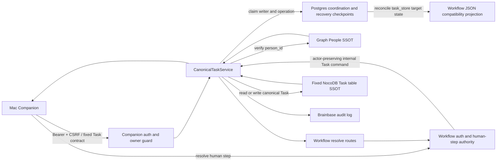

# Companion Canonical Task Provider Architecture

## 決定

Brainbaseプロジェクトの既存NocoDB Task表を個人Taskの正本として維持し、その上に
`CanonicalTaskService` を置く。Mac CompanionとWorkflow承認は必ずこのserviceを経由し、
NocoDBの自由入力列を直接Task権限として扱わない。

## 所有境界

| 層 | 所有するもの | 所有しないもの |
|---|---|---|
| Mac Companion | 一覧・入力・状態操作・エラー回復UI | Task正本、人物名寄せ、監査 |
| Companion Task API | 認証、入力検証、HTTP契約 | Taskの別保存 |
| CanonicalTaskService | 状態遷移、People ID検証、冪等性、版競合、監査 | UI |
| NocoDB Task repository | 既存Task表の永続化と検索 | 人物同定、業務判断 |
| Graph SSOT | `person_id` と表示名 | Task状態 |
| WorkflowService | 承認順序と再試行 | 独自Task作成ロジック |

## SSOT

- 正本テーブルはbase `pva7l2qlu6fdfip`、table `m7iys8m7o1abr3f` の `タスク` に固定する。
  client requestや複数project mappingから選択しない。環境上書き時も起動時に一組へ確定し、mapping不在・不一致はfail-closedにする。
- 正本storeのproject/owner scopeは `brainbase` / configured Personal KG ownerである。
  Task IDはstore schema versionと固定storeを結合した署名付きopaque IDとし、別store IDを拒否する。
- `担当者PersonID` が権威ある担当者識別子で、既存 `担当者` は表示互換用の投影である。
- 既存行で `担当者PersonID` が空の場合は `assignee_person_id: null` と
  `normalization_warnings: ["assignee_unresolved"]` を返す。文字列一致で補完しない。
- 正規化APIが作る行には版、発生元参照、冪等キーとfingerprint、期限日時、待ち情報、完了日時を保存する。

## API構成

- `GET /api/companion/tasks`
- `GET /api/companion/tasks/:taskId`
- `POST /api/companion/tasks`
- `PATCH /api/companion/tasks/:taskId`
- `POST /api/companion/tasks/:taskId/transitions`

既存 `createCompanionRouter` の認証・owner guardを再利用する。owner credentialはserver-sideで
configured ownerへscopeし、別person filter/assignmentを403にする。service/internal credentialは
固定store内でGraph確認済みpersonを扱えるが、store/projectは変更できない。actorとauth sourceを監査する。

ownerの作成で担当者が省略された場合はconfigured ownerを補完する。一覧と単体取得はowner担当Taskだけを
返し、未担当・別person Taskは存在を開示せず404にする。ownerからの担当解除・別person指定は403である。
service/internalだけが固定store内の未担当TaskとGraph確認済みの別person Taskを扱える。

## データフローと脅威境界

| 脅威 | 境界と対策 |
|---|---|
| clientが別storeを指定する | base/table/projectをrequestから受けず、署名付きopaque IDも固定storeへ照合する |
| ownerが他人または未担当Taskを列挙する | server-side owner filter、単体取得の404非開示、担当変更の403 |
| 自由入力名を人物権限に使う | Graphの`person_id`だけを権威値とし、表示名は投影に限定する |
| 同じ作成・承認が再送される | Postgres operation uniqueとNocoDB冪等キーDB一意制約で同じTask IDへ収束する |
| 旧writerの遅延PATCHが新writerを上書きする | 単一writer tokenを自動takeoverせず、旧process停止確認後の明示回復だけを許可する |
| Task作成後にWorkflow JSON更新が失われる | Task IDとhuman step/run目標状態、監査checkpoint、phaseをPostgresから再投影する |
| 下流障害を0件と誤認する | Graph/NocoDB/Postgres障害は構造化503にし、空・partialへ変換しない |

## 一度だけ作成

1. `resolveHumanStep` がapproved要求と `write_back_target=task_store` を検出する。
2. approval inbox投影時に元output候補へ安定`candidate_id`を付与し、Macの`response_ref.review_items`を同じIDで一対一に結合する。
3. `decision_mode`と`resolution`の対応を検証する。承認itemの`edited_fields`にある許可値だけを元候補へ上書きしてGraphで再確認する。拒否itemは除外結果へ残し、修正依頼または最終owner未解決があれば理由付き409でpendingに残す。
4. `workflow-output:<outputId>:<candidateFingerprint>:<ordinal>` を並べ替えに安定した冪等キーとして全候補を作成する。
5. 1件ごとにTask IDをPostgres operation resultへcheckpointし、human step metadataへ互換投影する。全件成功後にphaseを進めてapprovedへ遷移する。
6. 応答はトップレベル `materialized_task_ids` と詳細materializationを返す。
7. 再要求でstepがapprovedなら保存済みまたは冪等keyから復元した同じ結果を返す。

NocoDB作成後にプロセスが停止しても、再試行は冪等キーで既存行を取得する。Task作成に
失敗した場合はhuman stepをpendingのまま残す。Workflow ledgerのtransactionは外部NocoDBを
巻き戻せないため、補償ではなく冪等な前進回復を採用する。

## 単一writerと永続調停

NocoDB REST PATCHはPostgres lease generationを条件にした原子的更新を提供しないため、v1は
ADR-016に従いTask mutationと`task_store`承認を単一writer processへ限定する。Postgres
`canonical_task_writer` singleton rowにactive process tokenを保存し、他processは503にする。
graceful shutdown時だけreleaseし、異常終了後は旧process停止確認を伴う明示回復までtakeoverしない。

`server.js`はHTTP listen前にclaimとreconcileを実行し、`registerGracefulShutdown`はHTTP close後にreleaseする。
明示回復は`recover-canonical-task-writer.js --expected-token`だけから行う。再投影監査はoperation/phase由来の
決定的IDを`upsertAuditLog`し、既存非Task workflowのappend-only `writeAuditLog`は変えない。

Postgres `canonical_task_operations` を実行調停台帳として使い、`(scope, operation_key)` のunique制約、
writer token、fingerprint、result JSON、human step/run目標状態、監査checkpoint、後処理phaseを保存する。
Task本文や状態は保存しないため、Taskの正本はNocoDBのままである。createの最終防衛はNocoDB正本表の
`冪等キー` DB一意制約が担う。

- createはidempotency key、update/transitionは共通scopeの`taskId:expectedVersion`、承認はstep IDをclaimする。
- claim取得後に現行Task版を再読込し、一致時だけNocoDBへ書く。変更patchには次版、最終操作key、fingerprintを含める。
- writer停止時は自動引継ぎを行わない。旧process停止を運用確認した明示回復でtokenを移譲し、保存済みoperationから再開する。
- createはNocoDB uniqueで同じ行へ収束し、mutationはexpected versionと同じ操作markerを同じrowへ書く。異なるfingerprintはoperation claim時に409となる。
- Postgres台帳が利用不能なら503にし、process内Mapだけで正しさを代替しない。

これにより同一processの並行POST、同一版更新、同一step承認を制御し、複数processの同時writeを拒否する。

## 前進回復

| 停止点 | 回復 |
|---|---|
| 一部Task作成後 | deterministic keyで既存Taskを回収し、残りを続行 |
| create成功後・checkpoint前 | operation結果またはNocoDB unique key照会からIDを復元 |
| 全ID保存後・approved前 | 外部createをせずapprovedへ進む |
| approved後・audit/run更新前 | Postgresの目標状態とcheckpointをWorkflow JSONへ再投影し、未完了の後処理だけ再実行 |
| approvedだがIDなし | 全keyから復元できる場合だけmetadata修復。不足時は409で手動確認 |
| 同時approve | 単一writer内のstep claimとdestination uniqueで同一結果へ収束し、他方は同じ完了結果を読む |
| writer異常終了 | 自動takeoverせず503を維持。旧process停止確認後の明示回復でoperationを再開 |

## 選択肢と決定理由

- NocoDBだけのlookup-then-createは並行要求を原子的に止められないため棄却した。
- operation leaseと自動takeoverの案は、leaseを失ったworkerの遅延NocoDB書き込みをfenceできないため棄却した。
- process内mutexは再起動・複数processを跨げないため補助最適化に限定した。
- TaskをPostgresへ複製する案はSSOTを増やすため棄却した。
- Task本文を持たない単一writer tokenとoperation ledgerは既存NocoDB正本を保ちつつ、現行単一process運用で並行実行と回復を閉じられるため採用した。

運用責任はBrainbase serverが持つ。release前にPostgres schema、writer token、NocoDB列と冪等キー一意制約、固定storeをcheckし、
不足時はTask書き込み経路を停止する。障害復旧はoperation状態とNocoDB idempotency keyを照合して前進する。

release順序はPostgres writer/operation schema、NocoDB列/unique、旧writer release、Brainbase API、実契約確認、Macの順とする。
両migrationは`--apply`と`--check`を提供し、NocoDB metadata APIでDB一意制約を保証できない環境は
fail-closedにして、基盤DB側の管理migrationを別途完了させる。

## 障害方針

- NocoDB未設定・通信失敗: `503 task_store_unavailable`
- Graph未確認・通信失敗: `503 assignee_directory_unavailable`
- person不存在: `422 invalid_assignee_person_id`
- 版不一致: `409 version_conflict` とcurrent Task
- 冪等キー再利用の内容不一致: `409 idempotency_conflict`

空配列、自由入力への退避、承認だけ先に進める処理は行わない。
