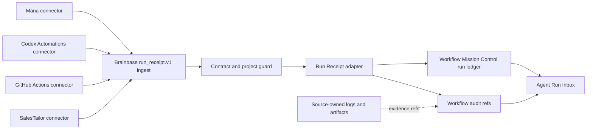

# Run Receipt Inbox v1 Architecture

## Boundary

## Components

| Component | Responsibility |
|---|---|
| `RunReceiptAdapter` | `run_receipt.v1` validation resultをWMC workflow/run/audit shapeへ決定的に変換する。 |
| `RunReceiptIngestService` | receipt lock、idempotency、conflict検知、project整合性、transactional writeを所有する。 |
| `createRunReceiptRouter` | POSTのserver-to-server auth、GETのoperator auth、project access、ingest/list query boundaryを所有する。 |
| `WorkflowService.listRunReceiptInbox` | WMC runからreceiptだけを抽出し、source workflowごとの最新runへ畳み込んだ後にfilter、priority、paginationを適用する。 |
| Workflow Mission Control UI | receipt専用Inbox sectionを表示し、APIと同じfilter・priority・uncertainty semanticsを使う。 |
| Source connector | source API/scheduler、outbox、retry、raw evidenceの保管を所有する。 |

## Status Mapping

| Source `run_status` | WMC `status` | `closure_state` | `action_required` |
|---|---|---|---|
| `success` | `success` | `closed` | `none` |
| `failed` | `failed` | `needs_action` | `check_error` |
| `blocked` | `needs_action` | `needs_action` | `resolve_blocker` |
| `waiting_human` | `waiting_human` | `open` | supplied action or `review_run` |
| `cancelled` | `cancelled` | `closed` | `none` |

元のsource statusは必ず `workflow_runs.metadata.run_receipt.source_status` に保存し、filter、duplicate比較、UI表示はこの値を使う。WMC `status` は既存台帳との互換投影でありsource statusの代替正本ではない。

`evidence_state` is orthogonal to `run_status`:

- `confirmed`: source-owned evidence referenceが1件以上ある。
- `unconfirmed`: resultは報告されたが確認証跡が不足している。
- `no_data`: sourceが観測対象データを返せなかった。0件成功とは異なる。

## Inbox Priority

Priority is deterministic and lower numeric values are more urgent:

1. `blocked`, or a source-supplied non-`none` `action_required`
2. `failed` without a source-supplied action
3. `waiting_human` without a source-supplied action
4. `evidence_state=unconfirmed`
5. `evidence_state=no_data`
6. confirmed terminal runs

Within the same priority, newest `finished_at || started_at || created_at` comes first.

Adapter-derived defaults (`check_error`, `resolve_blocker`, `review_run`) are stored separately from `source_action_required`; they do not by themselves promote an item to priority 1. This keeps every priority bucket reachable. Existing non-receipt WMC priority remains unchanged.

## Latest Run Selection

- Inbox history is collapsed by the canonical workflow identity `(project_id, source.type, source.workflow_id)`. The ledger keeps every receipt run, but `GET /api/run-receipts/inbox` exposes exactly one latest run per identity.
- The selected run is the greatest by effective timestamp `finished_at || started_at || created_at`. Equal effective timestamps are resolved by greatest persisted `created_at`, then lexicographically greatest deterministic `workflow_runs.id`, so selection is stable.
- Collapse happens before every query filter, urgency priority, `count`, and `limit`. Therefore an older blocked/failed run cannot survive a newer success, and filtering for `blocked` does not resurrect stale history.
- After collapse and filters, `count` is the full matching identity count before `limit`; `items` contains the first `limit` rows; `has_more = count > items.length`; `omitted_count = count - items.length`.

## Surface Isolation

- Receipt workflow/runは共有WMC repositoryに保存するが、`WorkflowService.listWorkflows` が返す既存 `GET /api/workflows` のOperational Inbox projectionから `metadata.run_receipt` を持つworkflowを除外する。receiptは `WorkflowService.listRunReceiptInbox` と `GET /api/run-receipts/inbox` だけが一覧化し、同じrunを二つのpriority規則で重複表示しない。
- 除外はreceipt分類だけに適用し、非receipt workflowの集合、既存priority、既存render順を変更しない。receipt＋非receipt混在fixtureでAPIとUIの非重複を固定する。
- Workflow Mission Controlの既存config/projects/workflows取得を必須surface、receipt Inbox取得を独立したoptional surfaceとして扱う。receipt APIのtimeout、network error、または5xxはreceipt sectionの `unavailable` warningへ変換し、既存Operational Inboxのstate/renderを維持する。
- receipt APIの障害は空 `items` や `count=0` に丸めない。routeは明示的な非2xx errorを返し、UIは「receiptなし」と「receipt取得不能」を別stateで表示する。

## Transaction and Idempotency

1. Validate the full contract before repository writes.
2. Canonical tuple encoding is UTF-8 JSON of `[project_id, source.type, external_run_id]` with no whitespace. The canonical delivery key is `rr1_` plus the lowercase SHA-256 hex digest of that byte sequence. The WMC run id is `run_receipt_run_` plus the first 32 digest characters.
3. Internal workflow id is `run_receipt_wf_` plus the first 32 characters of SHA-256 over UTF-8 JSON `[project_id, source.type, source.workflow_id]`. Original source workflow id is retained in metadata. Existing workflow project/source metadata must match or ingest fails without mutation.
4. Acquire a repository receipt lock using `workspace_id=run.project_id`, `workflow_id=<deterministic run id>`, and a unique ingest owner. Acquisition retries for a bounded interval. Duplicate lookup, conflict comparison, and the write transaction run while the lock is held; release occurs in `finally`. Missing lock/transaction capability or lock timeout fails without writes. This serializes concurrent deliveries across the JSON repository's file lock and the in-memory repository lock.
5. If absent, create/project-check the source workflow, then create run and audit in one repository transaction.
6. If present and the normalized immutable projection matches, return `duplicate` without new run or audit. The projection includes normalized contract/source/run fields, recursively sorted object keys, sorted evidence references, and excludes all `delivery` metadata. Store its SHA-256 as `payload_digest`.
7. If present but the normalized surface differs, reject with `run_receipt_conflict` and preserve the original run.

## Connector Observation Fallback

When a connector cannot obtain a source-owned run identity, it emits its own observation attempt rather than inventing a source run failure:

- `run.observation_kind=connector_observation`
- `source.workflow_id=__connector_observation__`
- `run.external_run_id` is the connector-owned immutable observation attempt id
- `run.status=blocked`
- `run.evidence_state=no_data|unconfirmed`
- `run.blocker_reason` identifies the connection/read failure

The source connector is authoritative for that observation attempt identity. Inbox API and UI label it as a connector observation.

## Security and Privacy

- Both routes use existing `requireAuth`.
- `POST /ingest` additionally requires internal, service-token, bearer, or insecure-header server-to-server credential and project access.
- Global production CSRF middleware exempts only `req.method === 'POST' && req.path === '/api/run-receipts/ingest'` because non-browser clients cannot obtain a CSRF token. `PUT`, `PATCH`, and `DELETE` against that same path remain CSRF-protected and return `403` before route dispatch. The POST route still runs `requireAuth` and a server-to-server credential guard, so cookie/session-only POST remains forbidden. GET receives no CSRF exemption because it is a safe method. Existing exemptions remain unchanged.
- `GET /inbox` accepts an authenticated Brainbase operator/session. With no `project_id`, it returns only projects visible to that actor; explicit inaccessible projects are rejected.
- `project_id` must be visible to the authenticated actor.
- Evidence references allow `url`, `artifact_ref`, or `log_ref`; HTTPS/opaque-ref syntax and length are validated, and forbidden raw keys are rejected recursively across the entire envelope.
- Connector-owned labels, summary, and blocker text are single-line and bounded; action is an enum. Metrics accept finite number, boolean, or null only. Source connectors must redact customer prose, secrets, logs, and transcripts before delivery; Brainbase validation is defense in depth.
- API credentials and source payload bodies remain in source connectors.
- Graph SSOT and Candidate Store are not written by this adapter.
