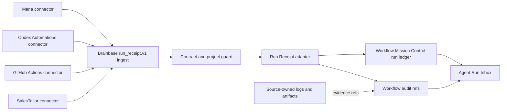

# Run Receipt Inbox v1 Architecture

## Boundary

## Components

| Component | Responsibility |
|---|---|
| `RunReceiptAdapter` | `run_receipt.v1` validation resultをWMC workflow/run/audit shapeへ決定的に変換する。 |
| `RunReceiptIngestService` | idempotency、conflict検知、project整合性、transactional writeを所有する。 |
| `createRunReceiptRouter` | server-to-server auth、project access、ingest/list query boundaryを所有する。 |
| `WorkflowService.listRunReceiptInbox` | WMC runからreceiptだけを抽出し、priorityとfilterを適用する。 |
| Source connector | source API/scheduler、outbox、retry、raw evidenceの保管を所有する。 |

## Status Mapping

| Source `run_status` | WMC `status` | `closure_state` | `action_required` |
|---|---|---|---|
| `success` | `success` | `closed` | `none` |
| `failed` | `failed` | `needs_action` | `check_error` |
| `blocked` | `needs_action` | `needs_action` | `resolve_blocker` |
| `waiting_human` | `waiting_human` | `open` | supplied action or `review_run` |
| `cancelled` | `cancelled` | `closed` | `none` |

`evidence_state` is orthogonal to `run_status`:

- `confirmed`: evidence reference or source-confirmed factがある。
- `unconfirmed`: resultは報告されたが確認証跡が不足している。
- `no_data`: sourceが観測対象データを返せなかった。0件成功とは異なる。

## Inbox Priority

Priority is deterministic and lower numeric values are more urgent:

1. `blocked` or explicit `action_required`
2. `failed`
3. `waiting_human`
4. `evidence_state=unconfirmed`
5. `evidence_state=no_data`
6. confirmed terminal runs

Within the same priority, newest `finished_at || started_at || created_at` comes first.

## Transaction and Idempotency

1. Validate the full contract before repository writes.
2. Compute a stable WMC run id from project, source type, and external run id.
3. If absent, create/project-check the source workflow, then create run and audit in one repository transaction when supported.
4. If present and normalized receipt surfaces match, return `duplicate` without new run.
5. If present but the normalized surface differs, reject with `run_receipt_conflict` and preserve the original run.

## Security and Privacy

- Route uses existing `requireAuth` plus server-to-server credential check.
- `project_id` must be visible to the authenticated actor.
- Evidence references allow `url`, `artifact_ref`, or `log_ref`; inline raw log/content fields are rejected.
- API credentials and source payload bodies remain in source connectors.
- Graph SSOT and Candidate Store are not written by this adapter.

