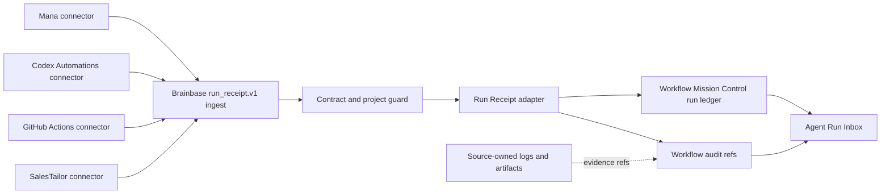

# Run Receipt Inbox v1 Architecture

> Surface lifecycle: contract、ingest、ledger、priority、auditはBrainbase Coreとして維持する。図中のAgent Run Inbox Web UIは移行中の互換面であり、MCPの全件・診断面とMac Companionの要介入projectionへ移管後にretireする。

## Boundary

## Components

| Component | Responsibility |
|---|---|
| `normalizeRunReceipt` | `run_receipt.v1` validation resultをWMC workflow/run/audit shapeへ決定的に変換する。 |
| `RunReceiptIngestService` | receipt lock、idempotency、conflict検知、project整合性、transactional writeを所有する。 |
| `WorkflowRepository` shared-ledger transaction | AsyncLocalStorage owner context、in-process queue、JsonFile file-wide lease、reload、single commit、rollback-only、transaction-required mutation guardを所有する。 |
| `createRunReceiptRouter` | POSTのserver-to-server auth、GETのoperator auth、project access、ingest/list query boundaryを所有する。 |
| `RunReceiptQueryService.listInbox` | ledger runからreceiptだけを抽出し、source workflowごとの最新runへ畳み込んだ後にfilter、priority、paginationを適用する。`WorkflowService.listRunReceiptInbox`は移行中の互換adapterとして残す。 |
| Brainbase MCP Run Receipt tools | Inbox、history、diagnosisをCodex / Claude Codeへ公開し、confirmed emptyとtransport/auth/contract failureを分離する。 |
| Mac Companion Inbox | 要介入状態だけをstable identityで投影し、取得不能時は前回snapshotを保持する。 |
| Source connector | source API/scheduler、outbox、retry、raw evidenceの保管を所有する。 |

## Status Mapping

| Source `run_status` | WMC `status` | `closure_state` | `action_required` |
|---|---|---|---|
| `success` | `success` | `closed` | source non-`none` action or `none` |
| `failed` | `failed` | `needs_action` | source non-`none` action or `check_error` |
| `blocked` | `needs_action` | `needs_action` | source non-`none` action or `resolve_blocker` |
| `waiting_human` | `waiting_human` | `open` | source non-`none` action or `review_run` |
| `cancelled` | `cancelled` | `closed` | source non-`none` action or `none` |

元のsource statusは必ず `workflow_runs.metadata.run_receipt.source_status` に保存し、filter、duplicate比較、UI表示はこの値を使う。WMC `status` は既存台帳との互換投影でありsource statusの代替正本ではない。

表のactionはadapter defaultである。sourceが許可enumの非`none` actionを明示した場合はstatusにかかわらずそのactionを優先し、`metadata.run_receipt.source_action_required=true` として保持する。これにより、例えば完了runの事後レビュー依頼もpriority 1へ上げられる。source actionがない場合だけ表のdefaultを使う。

`evidence_state` is orthogonal to `run_status`:

- `confirmed`: source-owned evidence referenceが1件以上ある。
- `unconfirmed`: resultは報告されたが確認証跡が不足している。
- `no_data`: sourceが観測対象データを返せなかった。0件成功とは異なる。

## Inbox Priority

Priority is deterministic and lower numeric values are more urgent:

1. `blocked`, or a source-supplied non-`none` `action_required`
2. `failed` without a source-supplied action
3. `waiting_human` without a source-supplied action
4. `evidence_state=unconfirmed`
5. `evidence_state=no_data`
6. confirmed terminal runs

Within the same priority, newest `finished_at || started_at || created_at` comes first. Every validated RFC 3339 value is converted to a UTC epoch millisecond before comparison; offset-bearing timestamp strings are never ordered lexicographically. Remaining ties use greatest persisted `created_at` epoch, then lexicographically greatest deterministic `workflow_runs.id`. This is the total order used before `limit`, so pagination is stable.

Adapter-derived defaults (`check_error`, `resolve_blocker`, `review_run`) are stored separately from `source_action_required`; they do not by themselves promote an item to priority 1. This keeps every priority bucket reachable. Existing non-receipt WMC priority remains unchanged.

## Latest Run Selection

- Inbox history is collapsed by the canonical workflow identity `(project_id, source.type, source.workflow_id)`. The ledger keeps every receipt run, but `GET /api/run-receipts/inbox` exposes exactly one latest run per identity.
- The selected run is the greatest by effective timestamp `finished_at || started_at || created_at`. Equal effective timestamps are resolved by greatest persisted `created_at`, then lexicographically greatest deterministic `workflow_runs.id`, so selection is stable.
- Both latest selection and the final cross-identity sort compare validated RFC 3339 timestamps as UTC epoch milliseconds. The final total order is priority ascending, effective epoch descending, persisted-created epoch descending, deterministic run id descending.
- Collapse happens before every query filter, urgency priority, `count`, and `limit`. Therefore an older blocked/failed run cannot survive a newer success, and filtering for `blocked` does not resurrect stale history.
- After collapse and filters, `count` is the full matching identity count before `limit`; `items` contains the first `limit` rows; `has_more = count > items.length`; `omitted_count = count - items.length`.

## Surface Isolation

- Receipt workflow/runは共有ledger repositoryに保存するが、`metadata.run_receipt` を持つworkflow/runは既存の汎用Workflow APIから除外する。`GET /api/workflows` の一覧だけでなく、汎用workflow詳細・更新・実行およびrun詳細・再実行も404にし、receiptの参照面と操作面を `RunReceiptQueryService`、`GET /api/run-receipts/inbox`、receipt専用操作へ限定する。旧`WorkflowService` methodは互換adapterであり、priority規則は専用serviceだけが所有する。
- 除外はreceipt分類だけに適用し、非receipt workflowの集合、既存priority、既存render順を変更しない。receipt＋非receipt混在fixtureでAPIとUIの非重複を固定する。
- MCPとMac Companionはreceipt取得を独立surfaceとして扱う。receipt APIのtimeout、network error、または5xxは`unavailable`へ変換し、Mac Companionは前回成功snapshotを維持する。
- receipt APIの障害は空 `items` や `count=0` に丸めない。routeは明示的な非2xx errorを返し、MCP/Companionは「receiptなし」と「receipt取得不能」を別stateで表示する。

## Browser Architecture Boundary

- `public/modules/domain/run-receipt/run-receipt-inbox-client.js` owns the HTTP request and response-shape validation. It receives the authenticated `apiFetch` function by constructor injection and does not read DOM state.
- `public/modules/domain/run-receipt/run-receipt-inbox-service.js` receives the client, `appStore`, and `eventBus` by constructor injection. It updates `appStore.runReceiptInbox={status,items,count,has_more,omitted_count,error,filters}` and emits `EVENTS.RUN_RECEIPT_INBOX_LOADED` or `EVENTS.RUN_RECEIPT_INBOX_FAILED` after each state change.
- `public/modules/core/store.js` defines the initial receipt slice and `public/modules/core/event-bus.js` defines the two receipt events. `public/workflows.html` composes the service, subscribes to the receipt slice/event, and renders only; it does not join receipt loading into the existing required workflow `Promise.all`.
- This extraction is the migration-safe application of EventBus, Reactive Store, and DI to the new surface. Existing page-local Workflow state remains unchanged in this Story, avoiding an unrelated full-page refactor while preventing new receipt logic from increasing the monolith.

## Transaction and Idempotency

1. Validate the full contract before repository writes.
2. Canonical tuple encoding is UTF-8 JSON of `[project_id, source.type, external_run_id]` with no whitespace. The canonical delivery key is `rr1_` plus the lowercase SHA-256 hex digest of that byte sequence. The WMC run id is `run_receipt_run_` plus the first 32 digest characters.
3. Internal workflow id is `run_receipt_wf_` plus the first 32 characters of SHA-256 over UTF-8 JSON `[project_id, source.type, source.workflow_id]`. Original source workflow id is retained in metadata. Existing workflow project/source metadata must match or ingest fails without mutation.
4. Acquire a repository receipt identity lock using `workspace_id=run_receipt:<run.project_id>`, `workflow_id=<deterministic run id>`, and a unique ingest owner. The `run_receipt:` namespace prevents collision with other workflow-lock users while preserving project scope. Acquisition retries for a bounded interval. JsonFile writes and fsyncs a unique pending file, then publishes it through an atomic no-replace hard link; the canonical path therefore never exposes a partial JSON write. Stale or malformed legacy locks are quarantined only under a mutation guard. That guard records owner PID and expiry, preserves every live local owner, and recovers expired dead-owner or stale ownerless crash artifacts. If another repository wins the now-empty lock path, recovery returns contention and never deletes that fresh lock. Release uses the same mutation boundary and owner check. While that lock is held, enter the repository-wide write transaction before duplicate lookup, conflict comparison, workflow/run/audit persistence, or returning the committed duplicate. Missing lock/transaction capability fails without writes. Identity-lock timeout returns retryable HTTP `503` with `Retry-After`; contract/conflict failures remain `400`. Either timeout path leaves the ledger unchanged.
5. Repository-wide transactions are serialized by an in-process queue for every repository implementation. The transaction owner is carried by `AsyncLocalStorage`. A nested `transaction()` from the same async owner joins the outer unit without reacquiring the queue/file lease or taking a second snapshot; only the outermost call reloads, commits, or restores. Any nested failure marks the owner rollback-only, and the outermost call rejects even if an intermediate caller caught the error. Unrelated owners remain queued.
6. `JsonFileWorkflowRepository` additionally acquires one file-wide transaction lease with bounded retry. It never steals a live lease; stale recovery requires the lease age to exceed the configured threshold and the recorded local PID to be absent. It reloads the ledger only after acquiring the lease, suppresses intermediate `_persist()` calls, and atomically persists exactly once on commit. Failure restores only the transaction's process-local snapshot and leaves the on-disk committed ledger unchanged. Lease release is in `finally`.
7. Every JsonFile shared-ledger collection mutation primitive asserts an active transaction owner before modifying process memory. Receipt/workflow identity lock files and transaction lease metadata are separate control-plane state, are not stored in `workflow-ledger.json`, and are exempt from that collection guard; acquire/release never calls ledger reload or replaces pending memory. The InMemory repository also holds identity locks outside its rollback snapshot. WorkflowService, WorkflowRunner, external_runner duplicate/create paths, reconciler, and every other production writer enter short repository transactions for each atomic persistence group. Remote execution handlers, network I/O, long sleeps, and user waits run outside the file lease. This makes direct nontransaction ledger writes fail before mutation without creating a lock-order cycle.
8. Distinct receipt identities and all production writers therefore cannot overwrite one another. Deterministic ordering is receipt identity lock first, shared-ledger transaction lock second; shared-ledger transaction code never tries to acquire a receipt identity lock.
9. Repository startup inserts missing seed workflows only inside a dedicated pre-publication initialization transaction that uses the same file-wide lease, owner context, reload, single commit, and `finally` release rules. It never overwrites existing ledger content. Later default-workflow checks use the normal reentrant transaction. If a receipt workflow is absent, create/project-check it, then create run and audit in the ingest repository transaction.
10. If present and the normalized immutable projection matches, return `duplicate` without new run or audit. The projection includes normalized contract/source/run fields, recursively sorted object keys, sorted evidence references, and excludes all `delivery` metadata. Store its SHA-256 as `payload_digest`.
11. If present but the normalized surface differs, reject with `run_receipt_conflict` and preserve the original run.

## Existing External Runner Candidate Outbox

- Core `external_runner.v0` run/context/human/output state and deterministic `candidate_pending` audit intents commit in one short shared-ledger transaction.
- Candidate Store calls run after that commit and outside the file lease. Each uses `extcand_${sha256(compactJson(["external_runner.v0", workspace_id, org_id || "", project_id, runner.type, external_run_id, source_candidate_id]))}` as the global idempotency id. Its `source_event_ids` are `[external_runner_scope:${sha256(compactJson(["external_runner.v0", workspace_id, org_id || "", project_id, runner.type, external_run_id]))}, source_candidate_id]`, preserving the original id while making Candidate Store's existing source-event dedupe project/run scoped; audit metadata also preserves the original id.
- Every Candidate Repository implementation rejects an existing primary id with `DuplicateCandidateError` before mutation, regardless of whether the incoming source-event dedupe key matches, and preserves the original record. Each outbox result is finalized in a second short transaction as `stored` or `deferred`. An exact duplicate with pending intents resumes only those intents and writes no duplicate-replay audit. If create reports a duplicate after Candidate Store success but before finalization, `findById(derived_id)` is canonicalized over immutable ingest-controlled fields; an exact record is adopted, while a missing or mismatched record appends `external_runner.candidate_conflict`, leaves the intent pending/actionable, and rejects with `external_runner_candidate_conflict` rather than becoming deferred. Retryable Candidate Store unavailability remains deferred.
- After every intent has converged, a later exact duplicate preserves the legacy `external_runner.duplicate_replay_ignored` audit inside a short shared-ledger transaction. A crash before Candidate Store call, after Candidate Store success, or before final audit is recovered by the same replay path without an orphan or duplicate candidate.

## Connector Observation Fallback

The connector fallback is a three-path state machine, not one generic error fallback:

- When source identity is known but authoritative status is unknown or nonterminal, the connector retains the source run in its own pending/outbox state and emits neither a receipt nor an observation.
- When source identity and a terminal status are known but evidence cannot be retrieved, the connector emits a source receipt with the same source identity and terminal status, sets `evidence_state=unconfirmed|no_data`, and maps action/blocker fields from that status without inventing success or zero metrics.
- Only when source identity itself is unavailable does the connector emit the connector-owned observation below.

When a connector cannot obtain a source-owned run identity, it emits its own observation attempt rather than inventing a source run failure:

- `run.observation_kind=connector_observation`
- `source.workflow_id=__connector_observation__`
- `run.external_run_id` is the connector-owned immutable observation attempt id
- `run.status=blocked`
- `run.evidence_state=no_data|unconfirmed`
- `run.blocker_reason` identifies the connection/read failure

The source connector is authoritative for that observation attempt identity. Inbox API and UI label it as a connector observation.

## Security and Privacy

- Both routes use existing `requireAuth`.
- `POST /ingest` additionally requires `internal` or `service-token` authentication and project access in production. A normal human JWT remains `bearer` even when supplied in the Authorization header and is rejected. `insecure-header` is accepted only where the existing auth middleware explicitly enables that test/development-only mode.
- Global production CSRF middleware exempts only `req.method === 'POST' && req.path === '/api/run-receipts/ingest'` because non-browser clients cannot obtain a CSRF token. `PUT`, `PATCH`, and `DELETE` against that same path remain CSRF-protected and return `403` before route dispatch. The POST route still runs `requireAuth` and a server-to-server credential guard, so cookie/session-only POST remains forbidden. GET receives no CSRF exemption because it is a safe method. Existing exemptions remain unchanged.
- `GET /inbox` accepts an authenticated Brainbase operator/session. With no `project_id`, it returns only projects visible to that actor; explicit inaccessible projects are rejected.
- `project_id` must be visible to the authenticated actor.
- Evidence references allow `url`, `artifact_ref`, or `log_ref`; HTTPS/opaque-ref syntax and length are validated, and forbidden raw keys are rejected recursively across the entire envelope.
- Connector-owned labels, summary, and blocker text are single-line and bounded; action is an enum. Metrics accept finite number, boolean, or null only. Source connectors must redact customer prose, secrets, logs, and transcripts before delivery; Brainbase validation is defense in depth.
- API credentials and source payload bodies remain in source connectors.
- Graph SSOT and Candidate Store are not written by this adapter.

## Release Operations

The production rollout, canary evidence, connector-disable behavior, version-skew handling, and non-destructive rollback are defined in `docs/runbooks/run-receipt-inbox-v1.md`. Rollback disables connector delivery before removing the dedicated surface, preserves receipt ledger rows, and keeps them isolated from legacy workflow/run APIs and Operational Inbox.
