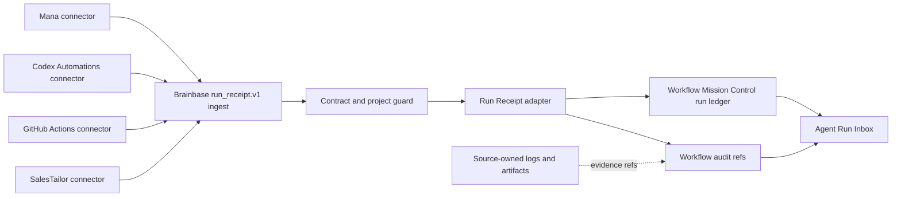

# Run Receipt Inbox v1 Architecture

## Boundary

## Components

| Component | Responsibility |
|---|---|
| `RunReceiptAdapter` | `run_receipt.v1` validation resultをWMC workflow/run/audit shapeへ決定的に変換する。 |
| `RunReceiptIngestService` | idempotency、conflict検知、project整合性、transactional writeを所有する。 |
| `createRunReceiptRouter` | POSTのserver-to-server auth、GETのoperator auth、project access、ingest/list query boundaryを所有する。 |
| `WorkflowService.listRunReceiptInbox` | WMC runからreceiptだけを抽出し、priorityとfilterを適用する。 |
| Workflow Mission Control UI | receipt専用Inbox sectionを表示し、APIと同じfilter・priority・uncertainty semanticsを使う。 |
| Source connector | source API/scheduler、outbox、retry、raw evidenceの保管を所有する。 |

## Status Mapping

| Source `run_status` | WMC `status` | `closure_state` | `action_required` |
|---|---|---|---|
| `success` | `success` | `closed` | `none` |
| `failed` | `failed` | `needs_action` | `check_error` |
| `blocked` | `needs_action` | `needs_action` | `resolve_blocker` |
| `waiting_human` | `waiting_human` | `open` | supplied action or `review_run` |
| `cancelled` | `cancelled` | `closed` | `none` |

元のsource statusは必ず `workflow_runs.metadata.run_receipt.source_status` に保存し、filter、duplicate比較、UI表示はこの値を使う。WMC `status` は既存台帳との互換投影でありsource statusの代替正本ではない。

`evidence_state` is orthogonal to `run_status`:

- `confirmed`: source-owned evidence referenceが1件以上ある。
- `unconfirmed`: resultは報告されたが確認証跡が不足している。
- `no_data`: sourceが観測対象データを返せなかった。0件成功とは異なる。

## Inbox Priority

Priority is deterministic and lower numeric values are more urgent:

1. `blocked`, or a source-supplied non-`none` `action_required`
2. `failed` without a source-supplied action
3. `waiting_human` without a source-supplied action
4. `evidence_state=unconfirmed`
5. `evidence_state=no_data`
6. confirmed terminal runs

Within the same priority, newest `finished_at || started_at || created_at` comes first.

Adapter-derived defaults (`check_error`, `resolve_blocker`, `review_run`) are stored separately from `source_action_required`; they do not by themselves promote an item to priority 1. This keeps every priority bucket reachable. Existing non-receipt WMC priority remains unchanged.

## Transaction and Idempotency

1. Validate the full contract before repository writes.
2. Canonical tuple encoding is UTF-8 JSON of `[project_id, source.type, external_run_id]` with no whitespace. The canonical delivery key is `rr1_` plus the lowercase SHA-256 hex digest of that byte sequence. The WMC run id is `run_receipt_run_` plus the first 32 digest characters.
3. Internal workflow id is `run_receipt_wf_` plus the first 32 characters of SHA-256 over UTF-8 JSON `[project_id, source.type, source.workflow_id]`. Original source workflow id is retained in metadata. Existing workflow project/source metadata must match or ingest fails without mutation.
4. If absent, create/project-check the source workflow, then create run and audit in one repository transaction. A repository without `transaction()` is unsupported and ingest fails before writes.
5. If present and normalized receipt surfaces match, return `duplicate` without new run or audit.
6. If present but the normalized surface differs, reject with `run_receipt_conflict` and preserve the original run.

## Connector Observation Fallback

When a connector cannot obtain a source-owned run identity, it emits its own observation attempt rather than inventing a source run failure:

- `run.observation_kind=connector_observation`
- `source.workflow_id=__connector_observation__`
- `run.external_run_id` is the connector-owned immutable observation attempt id
- `run.status=blocked`
- `run.evidence_state=no_data|unconfirmed`
- `run.blocker_reason` identifies the connection/read failure

The source connector is authoritative for that observation attempt identity. Inbox and summary surfaces label it as a connector observation.

## Security and Privacy

- Both routes use existing `requireAuth`.
- `POST /ingest` additionally requires internal, service-token, bearer, or insecure-header server-to-server credential and project access.
- `GET /inbox` accepts an authenticated Brainbase operator/session. With no `project_id`, it returns only projects visible to that actor; explicit inaccessible projects are rejected.
- `project_id` must be visible to the authenticated actor.
- Evidence references allow `url`, `artifact_ref`, or `log_ref`; forbidden raw keys are rejected recursively across the entire envelope.
- `run.summary`, evidence labels, metric names, and string metric values have bounded lengths. Metrics remain scalar-only and may not use content/log/transcript-like keys.
- API credentials and source payload bodies remain in source connectors.
- Graph SSOT and Candidate Store are not written by this adapter.
