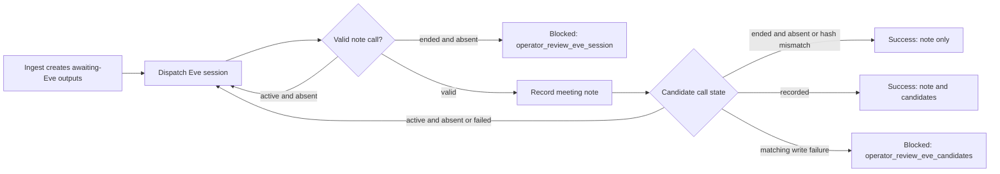
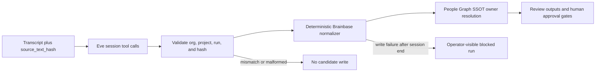

# Eve meeting candidates pull reconciler architecture

## Current reality

Brainbase creates five sibling outputs for one meeting ingest run. The meeting note is produced by Eve and pulled back from the Eve session stream by `EveMeetingNoteReconciler`, while task, decision, and follow-up candidates were previously generated by deterministic transcript splitting during ingest. Structured transcript JSON therefore leaked into candidate titles and the candidate path did not use the People SSOT owner resolver.

## Decision

Extend the existing Eve session pull protocol with `record_meeting_candidates`. The existing reconciler requires the candidate call's `org_id`, `project_id`, `run_id`, and `source_text_hash` to exactly match the dispatch scope, delegates deterministic normalization to `MeetingAutomationService.recordCandidates`, and writes the three sibling candidate outputs. `package_id` remains available to direct MeetingAutomationService APIs but is not an Eve candidate pull fallback. Candidate generation belongs to Eve; identifiers, approval state, evidence references, owner safety, and write authority remain in Brainbase.

No ADR is required. This change does not introduce a new bounded context, store, authority, network boundary, or deployment topology. It extends the existing Meeting Automation and Eve pull reconciler contracts. People Graph remains the sole owner-resolution authority, and the existing human approval steps remain the authority for task creation and external send.

## Scope judgment

The consumer implementation, tests, Story and architecture records, responsibility authority, and runbook form one atomic protocol change: ingest must stop producing deterministic candidates, Eve must emit a candidate tool call, the pull reconciler must consume it, MeetingAutomationService must normalize and resolve owners, and tests must cover the worker, route, state machine, and Story contract. Splitting these changes would create a deploy state with either no producer or no consumer for candidate outputs. The unit is therefore kept bundled and merged after the Eve producer PR.

## State model

## Authority and threat model

Eve cannot select an arbitrary Brainbase person id. It provides only an `owner_hint`; Brainbase queries People SSOT in the run's project scope. A unique safe match becomes `selected_owner` and the first candidate. Ambiguous or unresolved matches remain unselected. Candidate contents cannot create tasks or send follow-ups without the existing human approval steps.

## External input bounds

`record_meeting_candidates` is LLM-produced external input. Brainbase validates the complete payload before People SSOT lookup or any output/audit mutation:

- `task_candidates` and `decision_candidates`: at most 5 entries each
- `title`: 500 characters
- `owner_hint` and `due_hint`: 200 characters
- `source_excerpt`: 2,000 characters
- `decision_type`: 100 characters
- `follow_up_draft.body`: 10,000 characters

Both snake_case and accepted camelCase aliases use the same limits. Any count, type, blank-title, or length violation returns `blocked_invalid_candidates` and atomically preserves all existing candidate outputs and audit records.

## Responsibility Authority

| Responsibility | Authority | Implementation |
| --- | --- | --- |
| Candidate generation | Eve meeting agent | `record_meeting_candidates` tool call provides content and `owner_hint` only |
| Dispatch/run scope and source integrity | Brainbase Meeting Automation | `MeetingAutomationService` and `MeetingReviewLedgerService` validate organization, project, run, and `source_text_hash` before mutation |
| Candidate normalization and storage | Brainbase Meeting Automation | Assigns ids, statuses, evidence, approval flags, and writes sibling outputs transactionally |
| Canonical person identity | Brainbase Graph People SSOT | Resolves `owner_hint`; Eve cannot assign a person id directly |
| Task creation and external send | Existing human approval gates | `approve_task_candidates` and follow-up approval remain mandatory |
| Runtime recovery decision | Brainbase operator | Reviews blocked dispatches and `operator_review_eve_candidates` evidence |

## Failure modes

- Parse failure or malformed tool input: reject before candidate mutation and retain the awaiting-Eve output.
- Oversized candidate payload: reject the complete payload before owner resolution or mutation; do not partially accept candidates or append audit records.
- Source hash or org/project/run scope mismatch: ignore the candidate call, retain `mismatched_candidate_calls` on dispatch metadata, and show the count in Mission Control; a valid note may still close the dispatch because candidates are best-effort.
- Active session with delayed or transiently failed candidates: retain `running` and retry on the next poll.
- Eve session stream read failure: retain `running`, persist retry status/error/count on `eve_note_reconciler`, emit failure/recovery audit actions, and surface the current failure in Mission Control.
- Ended session with a matching candidate write exception: retain the generated note, mark the dispatch `blocked`, set `human_waiting`, and require `operator_review_eve_candidates`.
- Ambiguous People SSOT result: retain all candidates for human selection and leave `selected_owner` unset.

## Done evidence

Completion requires focused reconciler unit tests, the related workflow integration suite, typecheck, and the Story-specific Playwright contract on an isolated port. VibePro verification records must be bound to the final git HEAD. The Eve producer PR is merged before this Brainbase consumer PR, and deployment is verified separately from Git merge state.

## Release Operations

- Release order: merge and deploy the Eve producer PR before the Brainbase consumer PR so `record_meeting_candidates` exists before Brainbase relies on it.
- Operator path: inspect dispatch metadata under `eve_note_reconciler`, candidate sibling outputs, stream failure/recovery audit actions, and `workflow.meeting_pack.candidates.reconcile_blocked`. Stream failures retry automatically; resolve ended-session write failures through `operator_review_eve_candidates`.
- Scoped replay: after deployment, redispatch only `msrc_4f7c995f` for the structured-transcript validation. The remaining historical meetings are not bulk backfilled by this release.
- Rollback: revert or disable the Brainbase consumer first. Existing review outputs remain readable, and Eve candidate tool calls become unused producer output; no schema migration or irreversible state change is introduced.
- Observability: verify merge SHA, deploy/runtime SHA, dispatch status, candidate metadata, and Mac Companion owner display as separate evidence layers.
