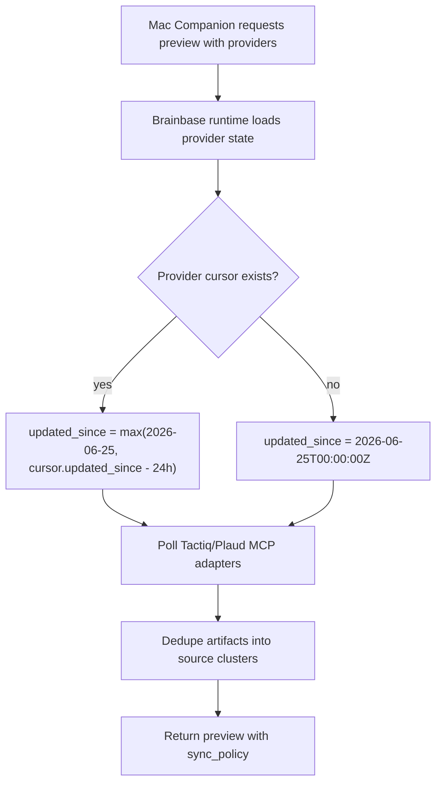

# Architecture: Meeting Source Runtime Sync Policy

## Responsibility Boundary

Brainbase runtime owns Meeting Source synchronization:

- scheduler cadence
- provider cursor
- incremental overlap
- first backfill date
- Tactiq/Plaud source priority
- Meeting Pack submission

Mac Companion is a control surface. It may trigger a dry-run preview and display the policy returned by Brainbase, but it must not manufacture sync ranges.

## Runtime Flow

## Policy

- Trigger: every 5 minutes in Brainbase runtime worker.
- Incremental source: `provider.cursor.updated_since`.
- Overlap: 24 hours.
- Initial backfill: `2026-06-25T00:00:00.000Z`.
- Calendar: supplementary context only.

## Failure Handling

If no provider is connected, preview still returns provider-level skip reasons. The caller does not need to know or choose a range to understand that configuration is missing.

