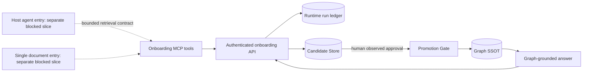

# 10分オンボーディング実動Architecture

## Decision

connector discoveryとbounded retrievalは実際のDrive/Gmail/MCP/local accessを持つhost agentが担う。Brainbase serverはprovider credentialや接続状態を複製せず、認証済みAPIでsource receiptと短いevidence-bound factを受け取る。候補は既存Candidate Store、昇格は既存Promotion Gate、正本は既存Graph SSOTとする。

このArchitectureが今回実装するのは`Onboarding MCP tools`から下流のserver runtimeである。host agentがconnectorを発見し、bounded retrievalを実行してtoolsへ渡すSkill bindingは親Story `story-ten-minute-world-onboarding` AC-001..006の別delivery sliceとする。そのPRがmergeされるまで、下図のhost entryは設計上のdependencyであって今回の稼働確認済みsurfaceではない。

## Authority

| Concern | Authority | Runtime rule |
| --- | --- | --- |
| Connector auth/content | provider / host connector | serverへcredentialやraw本文を渡さない |
| Progress receipt | onboarding run ledger | entity正本ではなく進行証跡だけを保持 |
| Candidate | Candidate Store | evidence付き仮説をGraphから隔離 |
| Approval | authenticated human actor | inferredを直接approveしない |
| Canonical fact | Graph SSOT | Promotion Gate経由のみwrite |
| Answer | host agent + Graph context | promoted IDだけをreceiptへ記録 |

## Runtime components

- `OnboardingRunRepository`: `var/onboarding-runs.json`をatomic renameで永続化する。raw source bodyは保持しない。
- `OnboardingRuntimeService`: run state、scope、source receipt、candidate linkage、first-value budgetを検証する。
- `createOnboardingRouter`: `requireAuth`後のHTTP contractを提供する。
- `OnboardingGraphWriter`: request accessを`InfoSSOTService.createOrUpdateGraphEntity`へ渡し、Promotion Gateのwrite先を実Graphへ固定する。
- `onboardingTools`: Brainbase MCPからhost agentがruntime flowを操作する。

今回のmergeは上記runtime componentsを提供するが、host-agent entry、provider connector、または利用者向けオンボーディング完成を提供しない。Runtime Storyは単独でmerge可能なfoundationであり、製品deliveryは親Storyのhost entry PRをblocking dependencyとして追跡する。

## State machine

内部処理statusは`collecting -> reviewing -> answering -> first_value_answer_reviewed`を維持する。利用者向け進捗は独立した`workflow_state`として`initialized -> source_ready -> candidates_ready -> promotion_reviewed -> first_value_ready -> first_value_answer_reviewed`を返す。candidateを持たないsource receiptは`source_ready`、candidateを持つreceiptは同一mutation内で`candidates_ready`まで進み、rejectも`promotion_reviewed`として記録する。

- source receiptが一件以上正常に取り込まれるまで`reviewing`へ進めない。
- candidate createはGraph writeではない。
- inferred candidateはrejectまたは将来のedit-to-observed対象であり、直接promotionしない。
- Graph write失敗を成功receiptへ変換しない。
- first-value receiptはrunに記録されたpromoted IDの部分集合だけを受理する。

## Security boundaries

- `/api/onboarding/**`のunsafe methodはMCP/native clientがbrowser CSRF sessionを持たないため、`Authorization: Bearer `の存在だけを条件にglobal CSRF token検査から後段へ渡す。この例外は認証成功を意味せず、直後のroute-level `requireAuth`がtoken validity、actor、project scopeを必ず検証する。invalid Bearerは401、Bearerなしのcookie/session fallbackはproduction CSRF境界で403とし、middleware順序を`csrfMiddleware -> requireAuth -> onboarding router`に固定する。
- actorのproject scope外のrun作成、取得、mutationを拒否する。
- owner専用runは同じprojectの別actorにも開示・変更せず、明示的な委任機構が導入されるまではowner本人だけを許可する。
- source receiptは秘密値らしいfield nameと値を再帰検査し、保存前に拒否する。
- permission snapshotはruntime/MCPで同じallowlistに閉じ、token類を受けず、8KiB・配列50件の上限を持つ。
- `evidence_ref`は追跡可能なopaque pointer、`content_hash`はsha256のみを受理する。
- local folder pathはhost側の明示allowlist責務とし、serverにはsource ID/evidence referenceだけを保持する。
- answer本文はrun receiptへ保存せず、hash、used IDs、missing context、reviewだけを保持する。
- Candidate Store IDはGraph entityではないためGraph edge endpointにしない。Graph昇格時はpromoted entity payloadの`derived_from_candidate_id`とCandidate Storeの`promoted_graph_entity_id`を相互参照として保持し、Graph障害後はapproved状態から同じIDで再試行できる。
- source batchは全draftを先に検証し、`run + source + evidence`由来のdeterministic candidate IDで、candidate作成後にledger更新が失敗しても同一payloadを再開できる。
- JSON run ledgerは単一server processをwriter authorityとし、cold startの初回loadは共有promiseで一度だけ実行する。readはそのloadと進行中mutationを待ち、read-modify-writeとatomic file replacementは同じmutation queueで直列化する。複数processから同じledger fileを書かない。水平分割時はCAS/transactionを持つDB repositoryへ置換する。

## Release and rollback

1. rollout前に既存single-writer processを停止し、`var/onboarding-runs.json`のreadable backupを保存する。新processが`onboarding_runs.v1`をloadできた後にだけtrafficを切り替える。
2. server routeとMCP adapterは同一releaseとして扱う。route未配備・非2xx・transport failureをMCPは`unavailable`へ写像し、confirmed-emptyやsuccessへ変換しない。
3. rollback可能なcode境界は`onboarding_runs.v1`を読める直前releaseまでとする。欠落/未知schemaは503でfail-closedにし、旧processから既存ledgerを書き換えない。
4. Promotion前のrun/candidateは削除せず、receipt identityとdeterministic IDを使ってresumeする。Graph昇格済みentityはdeploy rollbackの対象に含めず、Candidate Store auditとprovenanceを残したままGraph authority側の監査可能な訂正・無効化として処理する。
5. rollback後の完了条件は、ledger load、未完了runのread、同一receipt retry、Graph昇格済みcandidateの同一Graph ID再結合が通ること。live provider/deploy E2Eはこのruntime PRの未確認項目として残す。
