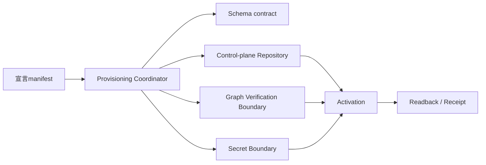

# テナント本番プロビジョニング制御面のArchitecture

## 目的と判断

本番テナントの登録を、個別の管理画面操作やproviderごとの手作業ではなく、再実行可能な宣言を受け取るBrainbase制御面として扱う。制御面は「検証→計画→トランザクション書込み→外部正本の検証→有効化→読戻し」を一つの操作相関へ束ねる。

この変更では、テナントの識別・履歴、workspace接続、契約、操作ledgerをBrainbase PostgreSQLの正本とする。Graphはcanonical projectや既存entityの解決・検証境界であり、プロビジョニングの重複抑止やrevision履歴の正本ではない。秘密管理はSecret Manager／Infisical等の外部境界を正本とし、制御面はopaque referenceのみを受け取る。

## 責務と境界

### Provisioning Coordinator

宣言を正規化してfingerprintを作り、schemaが利用可能か、実行actorが許可されているか、対象tenantとdeploymentが一意かを先に検証する。操作ledgerを最初の永続化境界として確保し、同じ宣言の再実行を既存結果へ収束させる。副作用を行う順序と失敗分類を所有する。ledgerのclaimは短いDB transactionで確定し、Graph／credential resolverはtransactionとadvisory lockの外でbounded timeout付きに実行する。

### Control-plane Repository

テナント識別子、revision履歴、workspace接続のrevision、契約revisionへの参照、service actor／capability、操作ledgerを同一PostgreSQLトランザクションで管理する。workspace接続はcurrent pointerを更新し、`workspace_connection_revisions`をappend-only historyとして先に追加する。credential／usage／receipt等のrevision FKはhistoryへ向け、過去のtenant-owned recordが新しいrevisionの更新で壊れないようにする。契約payloadの宣言的upsertは既存 `tenant_contract_revisions` の状態を確認してから別実装レーンで追加する。

### Graph Verification Boundary

Brainbase Graphからcanonical projectをコードで一意解決し、宣言されたproject境界と一致することだけを確認する。Graph障害、未登録、複数候補、別projectはすべて有効化前に停止する。サービスactorをGraphの `person` として登録しない。サービス権限の組合せはControl-plane Repositoryが所有し、Graphへは必要な既存project参照だけを渡す。

### Secret Boundary

provider credential、OAuth token、署名秘密鍵、service token本文は制御面の入力・DB・Graph・ログ・Receiptへ流さない。プロビジョニング入力はopaque credential reference、credential mode、refresh revision、public key ID／fingerprint等の非秘密metadataに限定する。実値の取得はruntimeが認証済みのSecret Manager境界で行う。

### Activation and Readback

有効化は、schema確認、DBトランザクション、Graph検証、credential reference検証、service capability検証が完了した後だけ可能とする。各段階はoperation IDに紐づけ、失敗時には未完了状態を残して再実行可能にする。完了判定はCLIの終了コードではなく、DBのledger、各revision、registry、Graph検証、秘密境界のreadbackを照合して行う。

## 依存方向

CoordinatorはGraphやSecret Managerの実装詳細を所有せず、検証結果とopaque referenceを受け取る。GraphやSecret Managerが利用不能な場合に別deployment、別tenant、推測したproject、別credentialへfallbackしない。

## 操作シーケンス

1. CLIまたは管理APIがmanifestとidempotency keyを受け取る。
2. Coordinatorがmanifestを正規化し、秘密らしいキー・値を拒否してdesired-state fingerprintを算出する。
3. Schema contractと実行actor/capabilityをread-onlyで確認する。
4. 操作ledgerをkeyとfingerprintへ原子的に紐づける。claim token hashとattemptを保存し、既存成功なら結果を返し、fingerprint不一致ならconflictにする。`failed`は同じkey・同じfingerprintに限り新しいclaim tokenで再claimでき、`claimed`のstale claimはfencingして旧実行の完了を拒否する。
5. Graphのcanonical projectとcredential referenceを、claim transactionをcommitしてlockを解放した後に境界越しで検証する。検証不能なら短い失敗更新でledgerをfailedにし、DB副作用を開始しない。
6. tenant識別子・revision履歴、接続、service registryを同一DBトランザクションで確定する。既存contract revisionの境界は確認するが、契約payloadが未指定なら推測せず次レーンへ渡す。
7. capability境界を再確認し、manifestから消えたcapability grant／JWKをrevokedへ遷移させてreadbackする。DB副作用失敗時はsavepoint後にrollbackし、claim tokenでfencedされたledgerをfailedへ遷移させる。
8. DB、Graph、registry、ledgerをoperation IDでreadbackし、秘密値を含まないreceiptを返す。

## 失敗と復旧

- schema未適用・hash不一致・DB到達不能: 計画またはschema状態で停止し、既存tenantへ書き込まない。
- tenant／project／credentialの不一致: denyとして記録し、候補を横断検索しない。
- Graph／Secret Managerのunavailable: unavailableとして記録し、0件や成功へ丸めない。
- DBトランザクション失敗: その操作のDB副作用をrollbackし、ledgerに安全な失敗状態を残して同じkey・同じfingerprintの再試行を許可する。旧claim tokenは無効化し、別fingerprintの再利用や旧callbackの完了は拒否する。
- provider側副作用が伴う将来拡張: provider callをDBトランザクション内へ隠さず、独立したoutbox／compensation契約をArchitecture変更として先に承認する。

## 運用上の不変条件

- tenantの正本キーは入力境界から全リポジトリ操作へ一意に伝播する。
- revision履歴は不変で、現在値の更新が過去の書込みの参照を壊さない。
- 同一tenant・provider・workspace・appの有効接続は一つだけである。
- service actorは人物ではなく、明示的なactor／capability registryの主体である。
- 秘密値はSecret Boundaryの外へ出ない。
- 未確認、部分適用、障害を成功や0件として確定しない。

## 変更対象外と別承認

実際の本番DBへのmigration apply、provider credential発行、Graph ontologyの新しい人物種別、Cloudflare／mana-runtimeのデプロイ、Slack配送の切替はこのArchitectureの実装PRでは実行しない。それぞれの環境証跡と承認を別途要求する。
