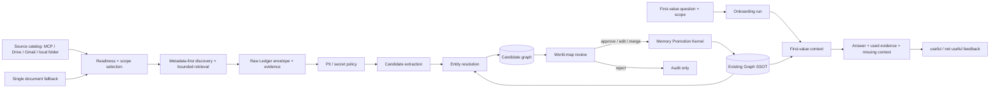

# 10分で自社の世界が立ち上がるオンボーディング設計

## Decision

Brainbase のオンボーディング北極星を「文章から知識グラフを作る」から、**すでに仕事が存在する MCP、Drive、Gmail、ローカル管理フォルダを読み、最初の10分で自社の世界を証拠付き候補として立ち上げ、利用者が確認し、その理解で最初の有用な回答を得る**へ置く。単一の文章ファイルは connector を使わない利用者向けの fallback とする。

この Story は既存の Graph SSOT、Memory Promotion Kernel、Graph entity resolver、admin source-class projection を組み合わせる。既存の authority や store を増やさないため、新規 ADR は作らない。オンボーディングは新しい正本ではなく、既存境界を時間制約のある一つの体験へ編成する orchestration 層である。

## Center Pin

最初の10分で最適化する対象は import 件数でも graph density でもない。

> 利用者が「Brainbase は自社をこのように理解した。根拠を確認でき、間違いを直せ、この理解で仕事上の問いに答えられる」と判断できること。

### Completion signal

`first_value_answer_reviewed`

次は補助指標であり、単独では完了を表さない。

- connector connected
- source imported
- extraction completed
- candidate graph rendered
- candidate promoted

## 10分の体験設計

| 時間 | 利用者の体験 | システムの責務 | 成功条件 |
| --- | --- | --- | --- |
| 0-2分 | 最初に答えてほしい問いと、既存情報をどこから読むかを決める | value target と接続済み MCP / Drive / Gmail / local folder を提示する | 問いと source が明示される |
| 2-4分 | account、folder、project、query、date range を選ぶ | connector readiness と permission を確認し、読み取り scope、retention を run に固定する | source が ready になり permission snapshot が残る |
| 4-6分 | 選んだ範囲から何が見つかったかを見る | metadata-first に棚卸しし、問いに必要な content だけを取得して evidence envelope にする | raw 本文を Graph に書かず候補生成可能になる |
| 6-8分 | 「Brainbase が理解した世界」を見る | entity/edge 候補を解決し、observed と inferred を分離して投影 | 根拠付き候補が一画面に収まる |
| 8-9分 | approve/edit/reject/merge する | review decision と provenance を監査し、承認済みだけ Promotion Gate へ渡す | 未承認・推論候補が正本へ入らない |
| 9-10分 | 最初の問いへの回答を見る | Graph SSOT context だけで回答し、使用 entity と不足を示す | 利用者が useful / not useful を判断できる |

10分 SLA は source が利用可能になった時点から測る。接続済み MCP や認可済み provider は onboarding 開始から10分以内を狙う。外部 OAuth、workspace 管理者承認、ローカルOS権限の待ち時間は `time_to_source_ready_seconds` として分離し、`waiting_for_source_authorization` を成功に見せない。待たずに試したい利用者には単一文章ファイルを提示する。

## Target Architecture



## Source Acquisition Architecture

入力画面は知識の再入力欄ではなく、既存の仕事場を選ぶ source catalog とする。すでに認可済みの接続を先に発見し、新しい credential や token の貼り付けを要求しない。

接続能力のinventoryは、connectorを実際に保持するホストagentの責務である。Brainbase serverは、同じagent hostに公開されている兄弟MCPやapp connectorを一般に列挙できない。したがってSlice 0aは `.claude/skills/brainbase-onboarding/SKILL.md` と決定論的なsource inventory normalizerを入口にし、serverへprovider固有の接続状態を複製しない。

| Adapter | 初期 scope | 取得方針 | 主な境界 |
| --- | --- | --- | --- |
| MCP | server/resource/tool と actor が許可された project scope | capability と health を検証してから resource を列挙 | MCP 接続成功だけでは完了しない。tool の結果と permission を source receipt に残す |
| Google Drive | account、shared drive、folder、file type | metadata を先に読み、選択文書だけ本文取得 | 元 ACL と共有範囲を保持し、権限外 file を候補化しない |
| Gmail | account、label/query、date range | thread metadata / participant / subject / snippet を先に読み、必要な body だけ限定取得 | credential を保存せず、private mail と org scope を自動混同しない |
| Local folder | 明示選択した root、project、file type | allowlist 内を metadata-first に走査し、対象 file だけ読む | secret、build output、VCS metadata、scope 外 path を deny-by-default にする |
| Single document | upload または paste 一件 | 同じ evidence envelope へ正規化 | connector を避ける利用者向け fallback。標準経路ではない |

全 adapter は `discover -> authorize/check -> select scope -> inventory -> bounded fetch -> receipt` を共通契約とする。ready判定に使うhealth checkは実行時刻から15分以内とし、最大5分の未来skewだけを許容する。readinessがready以外でも、不正な認可状態、health、evidence referenceを監査理由なしに保持しない。provider 固有の取得結果を直接 Graph writer へ渡さない。

## Authority Boundaries

| Concern | Authority | Onboarding responsibility |
| --- | --- | --- |
| Raw input | 元 source | body を正本化せず、pointer/hash/retention と permission snapshot を保持する |
| Candidate entity/edge | Memory Promotion Kernel | 仮説、観測、推論、confidence、evidence を保持する。Graph retrieval から隔離する |
| Canonical identity | Graph SSOT | alias と既存 entity を解決し、重複作成を避ける |
| Review decision | 認証済み human actor | approve/edit/reject/merge の理由を監査記録に残す |
| Promotion | Promotion Gate | 承認、redaction、ACL、catalog mapping が通った候補だけ Graph writer へ渡す |
| World map | UI projection | candidate と canonical を source class で分けて見せる。正本を所有しない |
| First-value answer | Graph context resolver | 承認済み Graph entity/edge のみを文脈に含める |

### Inference rule

観測された edge と推論 edge は同じ扱いにしない。

- `observed`: source 内に明示された関係。source excerpt/hash が必須。
- `inferred`: 複数候補から導いた仮説。破線表示、初期非選択、Graph への自動昇格禁止。
- 推論を採用する場合も、人が意味を編集して observed/approved fact として別の promotion decision を残す。

## World-map Projection

世界マップは「全件を描いた hairball」ではなく、最初の問いに必要な小さな説明面である。

- 中心: 利用者が選んだ value target
- 優先 node: person、org、project、decision
- edge: relationship と decision の関係
- 各 item: `source_class`, `observation_class`, `confidence`, `evidence_count`, `review_status`
- 操作: approve、edit、reject、merge、根拠を見る
- 表示: canonical は実線、candidate は点線、inferred は薄い破線
- 初期表示上限を設け、残りは community 単位で畳む

candidate JSON や一般管理画面をそのまま初回レビュー面にはしない。既存 admin visualization は source class の読み分けと運用診断に再利用し、オンボーディング UI は利用者の問いを中心にした別 projection とする。

## Onboarding Run Contract

一回の体験を `onboarding_run_id` で束ねる。

```json
{
  "onboarding_run_id": "onb_...",
  "value_target": "次の経営会議で誰と何を決めるべきか",
  "source_mode": "mcp|drive|gmail|local_folder|single_document",
  "source_readiness": "ready|waiting_for_authorization|unavailable|error|unconfirmed",
  "scope": {
    "owner_person_id": "per_...",
    "org_ids": ["org_..."],
    "project_ids": ["prj_..."]
  },
  "started_at": "ISO-8601",
  "source_ready_at": "ISO-8601|null",
  "source_receipts": [],
  "candidate_ids": [],
  "review_receipts": [],
  "promoted_graph_entity_ids": [],
  "first_value_presentation_contract": {
    "version": "first_value_clarity.v1",
    "sections": ["覚えていたこと", "つながったこと", "次にできること"],
    "initial_format": "short_bullets",
    "initial_table": false,
    "technical_details": "separate_on_request",
    "value_evidence": "human_review"
  },
  "first_value_answer": {
    "used_entity_ids": [],
    "missing_context": [],
    "presentation_contract_version": "first_value_clarity.v1",
    "presented_sections": ["覚えていたこと", "つながったこと", "次にできること"],
    "review": "useful|not_useful|unreviewed"
  },
  "completion_signal": "first_value_answer_reviewed"
}
```

Onboarding run は進行と証跡を束ねる ledger であり、entity/edge の正本ではない。

## 現状とのギャップ

調査基準は `origin/develop` の `d9f310e3b`（2026-07-30）である。設計、現行HEAD、デプロイ済み runtime は別の証拠層として扱う。本調査では production runtime の動作確認はしていない。

| 能力 | 現状の証拠 | 判定 | 10分体験までのギャップ |
| --- | --- | --- | --- |
| Graph SSOT と権限付き context | `graph.ssot.yml`, `AdminVisualizationService.listGraphEntities/previewContext` | 現行HEADにあり | onboarding run と value target に結び付いていない |
| Source catalog / connector readiness | `.claude/skills/brainbase-onboarding/SKILL.md`, `normalize-onboarding-source-inventory.mjs`, `onboarding.connected-world.yml` | host-agent orchestration contractを実装 | provider固有adapter、live connector fixture、scope selector UI、production E2Eは未実装 |
| Candidate Store / Promotion Gate | `candidate-store-mvp-spec.md`, `promotion-gate-service.js`, Pg/InMemory repository | 現行HEADにあり | onboarding 用の person/org/project/relationship/decision candidate contract と一括 review orchestration がない |
| Raw Ledger / PII・secret scan | `raw-ledger-adapter.js`, `pii-scanner.js` | 現行HEADにあり | session activity 向けで、貼り付け文書や connector import を onboarding source として扱う adapter がない |
| Candidate と Graph の分離表示 | `brainbase-admin-visualization-architecture.md`, `/api/admin/*` | 現行HEADにあり | 管理・診断向け read-only UI で、問い中心の world map や review mutation はない |
| Personal KG review | `personal-kg-review-projection-*` | 一部実装済み | owner memory の CLI projection であり、組織の初期世界を review する UI ではない |
| Entity resolution | `graph-entity-resolver-*` | 設計は proposed、現行に tokenized search の一部あり | onboarding 候補を既存 Graph entity と merge/resolve する end-to-end 契約が未完成 |
| Meeting candidate approval | `meeting-note-generation-dag-wiring-architecture.md` | 特定 workflow であり | meeting 外の初期 source、汎用 entity/edge、onboarding receipt へ一般化されていない |
| Value-first onboarding | 過去ブランチ `cd86ab183` | first-value completion は有用だが現行HEAD外 | connector を demo 後へ送る順序は採用せず、接続起点の主経路へ組み直す必要がある |
| Metadata-first import/extract/apply | 過去ブランチ `6cf1adff9` | Gmail / Calendar / Drive / local source の provider model は有用だが現行HEAD外 | source catalog、現行 schema、ACL、Promotion Gate と未統合 |
| 10分の成果計測 | 該当する current Story/API/metric なし | 未実装 | start/end marker、run receipt、useful feedback、失敗理由が必要 |
| Production outcome | 今回未確認 | 未確認 | merge/deploy SHA と実データの10分 E2E を別途証明する必要がある |

## Gap Conclusion

基盤はゼロではない。特に Graph SSOT、候補隔離、昇格 gate、source class、ACL は再利用できる。一方、利用者価値に直結する上半分がない。

不足の中心は次の五つである。

1. value target から始まる product onboarding entry point
2. 接続済み MCP / Drive / Gmail / local folder を発見・認可確認・scope 選択し、evidence-preserving candidate graph にする共通 adapter/orchestrator
3. 既存 Graph と候補を解決し、質問中心に見せる world-map review UI
4. review receipt と Promotion Gate をつなぐ一括承認フロー
5. Graph context による first-value answer と10分成果計測

したがって、既存管理画面へ graph layout を足すだけでは目的を達成しない。最初に作るべきものは、**一つの問い、既存の仕事場への接続、小さな候補世界、人の確認、一つの有用な回答**を完結させる vertical slice である。

## Delivery Slices

### Slice 0a: host-agent connected-world bootstrap（実装済み）

- callable connectorと明示local rootのinventory
- 認可、health、evidence、available scopeの決定論的readiness正規化
- MCP / Drive / Gmail / local folderをsingle-document fallbackより優先
- metadata-first、bounded fetch、Candidate Store、review、Promotion GateへのAgent Skill契約
- capability mapと契約unit test

このsliceの実装済みはagent workflow contractとlocal testを指す。live connector、candidate-to-Graph、productionのE2E提供済みを意味しない。

### Slice 0b: connected-world product vertical slice

- source catalog と connector readiness
- 共通 source adapter contract
- 接続済み MCP / Drive / Gmail / local folder の scope 選択
- metadata-first inventory と問いに必要な bounded fetch
- single-document fallback
- person / org / project / relationship / decision
- evidence-preserving extraction
- candidate world-map review
- explicit promotion
- first-value answer
- fixture E2E で `<= 600 seconds` を測る

### Slice 1: source depth and incremental sync

- Drive/Gmail の provider 固有 filter と Calendar adapter
- metadata/body retention policy の provider 別 hardening
- incremental dedupe と source receipt

### Slice 2: recurring work graph

- recurring people/project/meeting patterns
- resolver merge queue と更新差分

### Slice 3: controlled inference

- inferred edge の提案
- confidence calibration
- correction history による候補品質改善
- inference は引き続き human approval 必須

## Metrics

| Metric | Target | Meaning |
| --- | --- | --- |
| `time_to_source_ready_seconds` | 観測値、外部待ちを含めて別表示 | onboarding 開始から source が読めるまで |
| `time_source_ready_to_first_world_seconds` | `<= 600` | source ready から根拠付き候補世界が review 可能になるまで |
| `time_source_ready_to_first_value_seconds` | `<= 600` | source ready から最初の回答を useful/not useful 判定できるまで |
| `warm_path_time_to_first_value_seconds` | `<= 600` | 既存接続が ready な利用者の開始から first value まで |
| `provenance_coverage` | `100%` | source pointer/hash のある候補割合 |
| `unauthorized_promotion_count` | `0` | 明示承認なしで Graph へ入った件数 |
| `first_value_useful_rate` | 初期計測後に基準設定 | 最初の回答が useful と判定された割合 |
| `correction_rate` | 観測値 | edit/reject/merge が必要だった候補割合 |
| `unresolved_entity_rate` | 観測値 | 既存 Graph と安全に解決できなかった割合 |

## Failure Semantics

- source 未接続は `unavailable`。候補0件ではない。
- OAuth、管理者承認、OS権限待ちは source readiness の `waiting_for_authorization`（run state は `waiting_for_source_authorization`）。時間計測を止めず source-ready 区間と分離する。
- connector health failure は source readiness の `unavailable`（run state は `connector_unavailable`）。file fallback を選べるが自動で別 source を読むことはしない。
- source 取得失敗は source readiness の `error`（run state は `failed_source_collection`）。自社情報がないとは言わない。
- 証拠・scope・妥当性を確認できない source は `unconfirmed`。ready や空データへ丸めない。
- Graph 不通は `graph_unavailable`。新規 entity を無条件作成しない。
- evidence 欠落は `blocked_missing_evidence`。review 可能として見せない。
- scope 不明は `blocked_scope_required`。owner/org/project を推測しない。
- 10分超過は失敗を隠さず `time_budget_exceeded` として、どの段階で止まったか残す。

## Non-Goals

- raw source、candidate graph、Graph SSOT を一つの store に統合する。
- 推論 edge を graph density のために大量生成する。
- candidate の可視化だけを利用価値とする。
- source 全履歴を初回から同期する。
- 利用者に自社知識の手入力を標準経路として要求する。
- この設計文書だけで現行 capability または production 提供済みと表明する。

## References

- `docs/stories/story-ten-minute-world-onboarding.md`
- `docs/specs/ten-minute-world-onboarding-spec.md`
- `docs/architecture/ADR-010-memory-promotion-kernel-boundary.md`
- `docs/specs/candidate-store-mvp-spec.md`
- `docs/architecture/brainbase-admin-visualization-architecture.md`
- `docs/architecture/graph-entity-resolver-architecture.md`
- `docs/architecture/meeting-note-generation-dag-wiring-architecture.md`
