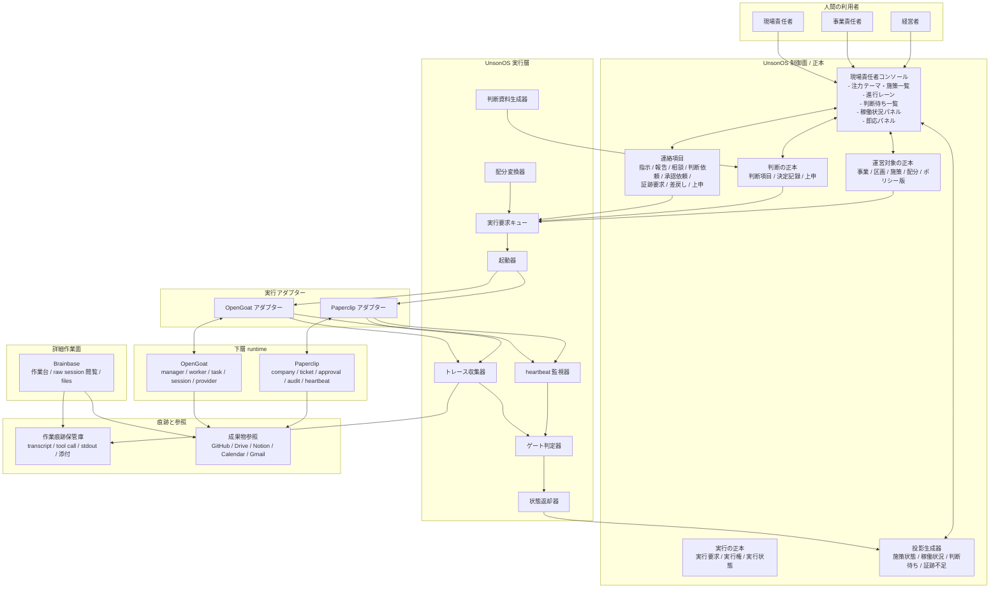
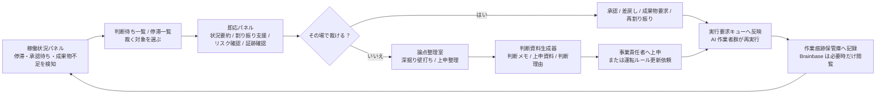

# アーキテクチャ: UnsonOS 現場責任者ランタイム構成

## 文書メタ情報

- 状態: 有効
- 種別: アーキテクチャ
- 主題: 現場責任者ランタイム構成
- 親文書: [UnsonOS 現場責任者コンソール](./unson-os-lead-control-console.md)
- 派生元: [現場責任者 v0導線運用型ストーリー](../stories/unson-os-lead-workflow-validation-story.md)
- 関連文書: [UnsonOS 正準ドメイン](./unson-os-canonical-domain.md), [UI×制御面 整合性マトリクス](./unson-os-ui-architecture-alignment.md), [Paperclip アダプタースパイク](../spikes/unson-os-paperclip-adapter-spike.md)
- 置換: なし

## 位置づけ

この文書は、`現場責任者コンソール` を実際に成立させるためのランタイム構成を定義する。  
主語は UI の見た目ではなく、

- どこに正本を置くか
- 何が状態を持つか
- どこで AI を起こし
- どこで止め
- どの層で判断を保持するか

を切り分けることにある。

この構成は `OpenGoat` と `Paperclip` の既存思想を参考にするが、母艦はあくまで `UnsonOS` 自身の正準ドメインとする。

UI 面との対応は、[UI×制御面 整合性マトリクス](/Volumes/UNSON-DRIVE/brainbase-worktrees/session-1773022945038-brainbase/docs/architecture/unson-os-ui-architecture-alignment.md) を参照する。

## 先に固定する結論

- `UnsonOS` は **運営対象の正本** と **判断の正本** を持つ
- `Paperclip` は **会社単位の実行基盤 / ガバナンス基盤候補**
- `OpenGoat` は **エージェント組織ランタイムの参照実装 / 代替アダプター候補**
- `Brainbase` は **作業台 / 詳細作業面**

したがって、現場責任者アーキテクチャの本体は

- `UnsonOS` が `運営対象 / 実行要求 / 判断項目 / 決定記録 / 連絡項目` を持ち
- 下で `Paperclip` か `OpenGoat` が AI 群を動かし
- `Brainbase` が raw session と実作業の詳細閲覧面を担う

という構成で作る。

## 統合方針

`Paperclip` や `OpenGoat` は、内部モジュールをそのまま `import` して母艦化する前提では扱わない。  
先に固定する方針は次の通り。

- 優先するのは **API / CLI / process 経由の接続**
- `UnsonOS` 側で **実行要求キュー / ゲート判定 / 状態圧縮 / 決定記録** を持つ
- `Paperclip` や `OpenGoat` は **実行基盤** として下に差す
- 両者との接続は **アダプター層** で吸収する
- 既存 runtime の ontology を `UnsonOS` の正本 object に流入させない

### 初手でやらないこと

- `Paperclip` の `company / ticket / board` をそのまま正本にすること
- `OpenGoat` の `agent / task / run` をそのまま UI 主語にすること
- 内部モジュールを直 import して、ライフサイクルごと `UnsonOS` に埋め込むこと

### 例外的に許容すること

- アダプター実装のために最小限の内部コードを参照すること
- API や CLI では吸収できない差分が見つかった後に、限定的な fork を検討すること

つまり、借りるのは **機能** と **実行能力** であって、`Paperclip` や `OpenGoat` の **主語** や **正本モデル** ではない。

## 正本の分離

この構成では「正本」を 1 つの箱として扱わない。少なくとも次の 4 種を分ける。

| 種類 | 何を持つか | 正本の置き場 |
| --- | --- | --- |
| 運営対象の正本 | 事業、区画、施策、判断項目、上申、証跡参照、配分、ポリシー版 | `UnsonOS` |
| 実行の正本 | 実行要求、実行権、実行中、停止理由、再試行状態 | `UnsonOS` |
| 作業痕跡の正本 | transcript、tool call、標準出力、添付、trace | 作業痕跡保管庫 |
| 成果物実体の正本 | コード、PR、ファイル、文書、予定、社外メール | `GitHub` / `Drive` / `Notion` / `Calendar` / `Gmail` |

`Brainbase` は作業痕跡保管庫そのものではなく、**作業痕跡を読む詳細作業面** として扱う。

## システム概要図

### 全体構成

この図で重要なのは、`Paperclip` や `OpenGoat` が直接 UI に繋がっていないこと。  
必ず

- `UnsonOS` が `実行要求キュー` を持ち
- `起動器` がアダプターを選び
- `heartbeat / trace / gate 判定` を回し
- `状態返却器` が UI 向け状態へ圧縮して返す

という経路を通る。

また、`heartbeat` と `trace` は worker 直結ではなく、**アダプター経由で回収する**。  
`Brainbase` は AI が直接書き込む保存先ではなく、`作業痕跡保管庫` と `成果物参照` を読む面である。

### 現場責任者の 1 サイクル

## 正準 object 一覧

| object | ID 単位 | 親 | 状態を持つか | 正本の置き場 | 更新主体 | 外部参照 |
| --- | --- | --- | --- | --- | --- | --- |
| 事業 | business_id | 事業群 | あり | `UnsonOS` | 経営者 / 事業責任者 | あり |
| 区画 | district_id | 事業 | あり | `UnsonOS` | 事業責任者 | あり |
| 施策 | initiative_id | 区画 | あり | `UnsonOS` | 事業責任者 / 現場責任者 | あり |
| 実行要求 | execution_request_id | 施策 | あり | `UnsonOS` | `UnsonOS` | なし |
| 実行権 | execution_claim_id | 実行要求 | あり | `UnsonOS` | 起動器 | なし |
| 判断項目 | decision_item_id | 施策 | あり | `UnsonOS` | ゲート判定器 / 人間 | なし |
| 連絡項目 | communication_id | 対象 object | あり | `UnsonOS` | 人 / AI / 連携器 | あり |
| 配分 | allocation_id | 事業 or 区画 | あり | `UnsonOS` | 経営者 / 事業責任者 / 現場責任者 | なし |
| ポリシー版 | policy_version_id | 事業 or 区画 | あり | `UnsonOS` | 管理者 / 事業責任者 | なし |
| 裁量プロファイル | discretion_profile_id | role or 区画 | あり | `UnsonOS` | 管理者 / 事業責任者 / 現場責任者 | なし |
| 判断前例 | precedent_id | 判断項目 | あり | `UnsonOS` | 判断資料生成器 / 人間 | trace / 成果物参照 |
| 裁量昇格候補 | discretion_candidate_id | 裁量プロファイル | あり | `UnsonOS` | 裁量学習器 | なし |
| 決定記録 | decision_record_id | 判断項目 | あり | `UnsonOS` | 人間 + 判断資料生成器 | trace / 成果物参照 |
| 外部参照リンク | external_ref_id | 任意 object | なし | `UnsonOS` | 連携器 | `GitHub` / `Drive` / `Notion` / `Calendar` / `Gmail` |

## 現場責任者ランタイムの四層

### 1. 制御層（UnsonOS Control Plane）

現場責任者が直接触る層。  
ここが主役。

持つもの:

- 事業
- 区画
- 施策
- 判断項目
- 連絡項目
- 決定記録
- 配分
- 承認状態

責務:

- 何を今裁くかを決める
- どの AI 群にどれだけ張るかを決める
- どこで止めるかを決める
- 何を上申するかを決める

### 2. 運転ルール層（Policy / Gate Plane）

毎回人間が判断しなくて済むようにするための運転ルール層。

持つもの:

- 自動実行条件
- 承認条件
- 証跡必須条件
- 上申条件
- 再割り振り条件
- 役割ごとの裁定権限
- ルール案 / 承認済みルール / 現在有効な版 / ロールバック先

責務:

- 低リスクは自動で流す
- 高リスクは止める
- 証跡不足を自動検知する
- 停滞時に経路変更や上申を自動生成する
- ルール変更自体を版管理する

### 3. 裁量学習層（Discretion Learning Plane）

毎回同じ確認を人に聞き直さなくて済むように、**前例を参照しつつ裁量候補を育てる層**。
ただし、AI が自分の権限を自己承認して広げる層ではない。

持つもの:

- 裁量プロファイル
- 判断前例帳
- 裁量昇格候補
- 昇格却下履歴
- 適用範囲
- 見直し条件

責務:

- 同種判断の繰り返しを検出する
- 「次回から毎回聞かずに進められそうな候補」を抽出する
- 前例の条件、必要証跡、例外条件を構造化する
- 現場責任者 / 事業責任者に昇格候補として上げる
- 承認された候補だけを運転ルールへ昇格する

強い原則:

- AI は前例を学習してよい
- ただし AI は裁量を自己承認してはいけない
- 学習対象は `許可そのもの` ではなく `許可候補` と `境界判定の精度` である

### 4. 実行層（Runtime Substrate）

AI 群が実際に動く層。

候補:

- `Paperclip`
- `OpenGoat`
- 将来の独自 runtime アダプター

責務:

- 実行要求を受けて worker 群を起こす
- 実行健全性を返す
- trace を返す
- 成果物参照を返す

### 5. 作業層（Brainbase 作業台）

raw session / chat / terminal / files を扱う層。  
必要時だけ降りる面。

責務:

- 実作業
- 作業痕跡の閲覧
- file 操作
- terminal 操作
- 成果物の実体確認

## 実行層の具体構成

ここは「何か OSS を借りる」ではなく、最低限次のコンポーネントで成立するものとして定義する。

### UI 非依存の中核サービス

画面上では

- 即応パネル
- 論点整理室
- 判断待ち一覧
- 優先順位・配分表

のような名前を使う。
ただし backend 側では、UI 名をそのまま service 名にしない。

最低限、次の中核サービスを置く。

| service | 役割 |
| --- | --- |
| 対話支援サービス | 即応壁打ち用の要約、原因、選択肢、証跡不足、裁量昇格候補を返す |
| 判断資料生成サービス | 判断メモ、上申資料、判断理由、前例化された判断記録を生成する |
| ミッション投影生成器 | 注力テーマ・施策一覧、優先順位・配分表、判断待ち一覧の読み取り面を作る |
| 進行投影生成器 | 進行レーン、停滞一覧、稼働状況パネルの読み取り面を作る |
| 監査投影生成器 | 証跡一覧、承認履歴、trace 参照を監査面へ圧縮する |
| 役割別投影生成器 | 経営者 / 事業責任者 / 現場責任者で既定の粒度と主操作を切り替える |

この文書で定義する実行層は、上の service 群を支えるための control plane である。

### 実行要求キュー

役割:

- `施策` や `判断結果` を、実際に動かすべき `実行要求` に変換して溜める

最低限の項目:

- 実行要求 ID
- 対象の施策 ID
- 対象の進行段階
- 担当 role / worker 群
- 優先度
- 期限
- 実行前に必要な条件
- 現在状態

### 起動器

役割:

- キューから実行要求を取り出し、適切な worker を起こす
- 同じ施策に対する重複起動を防ぐ

v0 の所有権:

- `claim` は `UnsonOS` 側が持つ
- 下層 runtime は **受けて走らせるだけ**

最低限やること:

- claim
- dedupe
- timeout 管理
- retry 開始

### heartbeat 監視器

役割:

- 起動済み実行がまだ生きているかを監視する
- 無応答、停滞、再試行、完了を判定する

最低限やること:

- 最終活動時刻の更新
- 停滞閾値超過の検知
- 再試行上限の管理
- 上申候補の生成

### ゲート判定器

役割:

- 次の段階へ進めてよいかを、運転ルールに従って判定する
- 必要なら承認依頼、証跡要求、差戻しを作る

ゲートは 1 種類にまとめない。最低限、次を分ける。

- 開始前ゲート
- 段階遷移ゲート
- 例外ゲート
- 公開ゲート

### トレース収集器

役割:

- runtime 経由で transcript、tool call、標準出力、成果物参照を収集する
- 主画面へは出さず、詳細作業面と監査面のために保持する

### 状態返却器

役割:

- runtime 内の細かい状態を、UnsonOS の状態軸へ圧縮して返す

### 配分変換器

役割:

- 現場責任者や事業責任者が決めた配分を、runtime 側の実行条件へ落とす

変換先:

- 実行要求の優先度
- 同時実行枠
- role ごとの worker 上限
- 期限
- 停滞検知の閾値
- 再試行上限

### 判断資料生成器

役割:

- transcript をそのまま成果物にしない
- 会話と判断結果を
  - 判断メモ
  - 上申資料
  - 判断理由
  へ変換する

### 裁量学習器

役割:

- 判断前例と運転ルールを読み、同じ確認が繰り返されている箇所を検出する
- 「この条件付き判断を、次回から事前許可扱いに昇格するか」という候補を作る

生成するもの:

- 裁量昇格候補
- 候補の適用範囲
- 必要証跡
- 例外条件
- 有効期限
- 見直し条件

出してよい条件:

- 同種判断が連続して 3 回以上同じ結論
- 差戻しや事故がない
- 証跡条件が安定している
- 影響範囲が小さい
- 顧客外部公開や契約変更を含まない

出してはいけない領域:

- 顧客影響が大きい
- 外部公開を伴う
- 契約、金額、法務に触る
- 失敗時の損害範囲が広い
- 前例が割れている

## 状態軸の定義

現場責任者が見る状態は単一 enum にしない。  
最低限、次の軸に分ける。

| 状態軸 | 値の例 |
| --- | --- |
| 進行段階 | 受付 / 調査 / 計画 / 実行 / 検証 / 承認 / 出荷 / 学習 |
| 実行健全性 | 正常 / 停滞中 / 実行失敗 / 停止中 |
| 承認状態 | 不要 / 要確認 / 承認待ち / 承認済み / 差戻し |
| 証跡状態 | 充足 / 不足 / 古い / 矛盾あり |
| 上申状態 | なし / 候補 / 上申中 / 解決済み |
| 注意度 | 通常 / 要注意 / 高優先 |

`停滞中`、`承認待ち`、`成果物不足` は排他的な状態ではなく、複数軸の組み合わせとして扱う。

## 命令・事象・記録の対応

### 人が出す主な命令

- 優先順位変更
- 配分変更
- 承認
- 差戻し
- 成果物要求
- 再割り振り
- 上申

### AI が出す主な命令

- 証跡要求候補生成
- 上申候補生成
- 再試行提案
- 経路変更提案
- 裁量昇格候補生成

### 下層 runtime から来る主な事象

- 実行開始
- 実行中心拍更新
- 実行失敗
- 実行完了
- trace 追加
- 成果物参照追加

### 外部ツールから来る主な事象

- `GitHub` 変更
- `Drive` 成果物更新
- `Calendar` 会議追加
- `Gmail` 社外連絡受信
- `Slack` 承認入力

### 記録として残すもの

- 判断項目
- 決定記録
- 連絡項目
- 判断前例
- 裁量昇格候補
- 作業痕跡参照
- 成果物参照

## command から queue までの流れ

UI は queue や runtime を直接触らない。
必ず次の順で流す。

1. UI が object を選ぶ
2. UI が command を発行する
3. 制御面が
   - 権限
   - 運転ルール
   - 状態軸
   - 裁量プロファイル
   を評価する
4. 正準ドメインを更新する
5. 必要な場合だけ `実行要求キュー` を更新する
6. 投影生成器が UI の各面を更新する

つまり、`queue` は UI の操作対象ではなく、**制御面の結果として更新される内部 object** である。

## 裁量学習ループ

現状の運転ルールは、低リスクを自動で流し、高リスクを止めるための **ガードレール** を担う。
そこに次の学習ループを足すことで、同じ確認を毎回繰り返さないようにする。

1. 人間が承認 / 差戻し / 保留を行う
2. 判断資料生成器が判断理由、参照証跡、適用範囲を構造化する
3. 裁量学習器が、同種判断の繰り返しを判断前例帳から検出する
4. 条件を満たす場合のみ、`裁量昇格候補` を生成する
5. 現場責任者または事業責任者が
   - この条件で許可
   - 範囲を狭めて許可
   - 今後も都度確認
   - 上位へ上申
   のいずれかで裁く
6. 承認された候補だけが `ポリシー版` へ反映され、次回から事前許可扱いになる

### 裁量昇格候補の最小項目

- 対象操作
- 適用範囲
- 前提条件
- 必要証跡
- 例外条件
- 有効期限
- 見直し条件
- これまでの前例数
- 差戻し / 事故の有無
- 提案理由

### 何を学習してよいか

- 前例の解釈
- どの条件なら聞かずに済みそうか
- どの証跡が不足しやすいか
- どの再割り振りがよく通るか

### 何を自己決定してはいけないか

- 承認不要への昇格
- 本番反映権限の拡大
- 顧客影響のある変更の自動化
- 契約 / 外部表現に関わる裁量拡大

## 実行層のアダプター能力表

`Paperclip` でも `OpenGoat` でも、UnsonOS は「共通操作一覧」を先に決め打ちしない。  
まず能力表を持ち、足りない能力は `UnsonOS` 側で補う。

| 能力 | 意味 | v0 必須か |
| --- | --- | --- |
| 非同期実行 | 実行要求を受けて worker を起動できる | 必須 |
| 役割単位起動 | role / worker 群を指定して起動できる | 必須 |
| 心拍回収 | 実行継続中の活動時刻や健全性を返せる | 必須 |
| trace 回収 | transcript / tool call / stdout の参照を返せる | 必須 |
| 中断 | 実行を止められる | 必須 |
| 再試行 | 同一実行要求に対して再試行できる | 必須 |
| 一時停止 / 再開 | 中断後に再開できる | 任意 |
| 承認イベント返却 | 承認要否を runtime 側から返せる | 任意 |
| 証跡不足返却 | 証跡不足を runtime 側から返せる | 任意 |

### v0 で要求する操作

- `startWorker`
- `cancelExecution`
- `collectHeartbeat`
- `collectTrace`
- `publishResult`

`claimExecution` は v0 では `UnsonOS` 側が持つ。  
`requestApproval` と `requestEvidence` は runtime の責務にせず、`UnsonOS` のゲート判定器と判断項目生成側で行う。

### アダプターが最低限返すべき情報

- 実行要求 ID
- runtime 側の実行 ID
- 実行者 ID
- 実行健全性
- 最終活動時刻
- 失敗理由
- 出力成果物参照
- trace 参照

## Paperclip / OpenGoat の具体形

### Paperclip を使う場合

Paperclip に任せるもの:

- company 単位の境界
- heartbeat と wake-up
- ticket / approval / audit の基盤
- board governance

UnsonOS 側で吸収するもの:

- `ticket` をそのまま見せず、`施策` または `判断項目` に写像する
- `board` をそのまま主画面にせず、`判断待ち一覧` と `進行管理面` に再投影する
- `heartbeat` をそのまま見せず、`稼働状況パネル` に圧縮する

Paperclip アダプターの具体動き:

1. UnsonOS が `施策` に対して実行要求を作る
2. アダプターが `company` と `ticket` に写像する
3. `Paperclip heartbeat` で worker 群を起こす
4. 進行、承認、監査ログを回収する
5. UnsonOS が状態軸に従って `停滞中 / 承認待ち / 証跡不足 / 上申候補` を生成する

### OpenGoat を使う場合

OpenGoat に任せるもの:

- manager / worker 階層
- task assignment
- session continuity
- provider 混在

UnsonOS 側で吸収するもの:

- `agent` を主語にせず、`施策` を主語に置き換える
- `task / run` をそのまま見せず、`進行` と `判断項目` に写像する
- `goat` へのメッセージ入口を使わず、UnsonOS の command から起動する

OpenGoat アダプターの具体動き:

1. UnsonOS が `施策` に対して実行要求を作る
2. アダプターが必要な manager / worker を選び、task を積む
3. OpenGoat が session を起こして worker 群を回す
4. transcript、artifact、run 状態を回収する
5. UnsonOS が状態軸に従って `進行レーン / 稼働状況パネル / 判断待ち一覧` に再投影する

## 権限モデル

| 役割 | 見られる object | 実行できる操作 | 承認できる範囲 | transcript 閲覧 | 外部送信 |
| --- | --- | --- | --- | --- | --- |
| 経営者 | 事業、区画、施策、判断項目、決定記録 | 配分変更、継続/停止、上位方針 | 全社方針レベル | 必要時のみ | 条件付き可 |
| 事業責任者 | 事業、区画、施策、判断項目、配分、決定記録 | 再優先順位付け、再配分、承認、上申 | 事業配下 | 必要時のみ | 条件付き可 |
| 現場責任者 | 区画、施策、判断項目、連絡項目、決定記録 | 再割り振り、成果物要求、承認、差戻し、上申 | 区画配下 | 必要時のみ | 原則不可 |
| AI 作業者 | 割当施策、実行要求、必要証跡 | 実行、報告、提案 | なし | 自分の trace のみ | 不可 |

権限表の目的はセキュリティだけではない。
どの role が

- どの object を読めるか
- どの command を出せるか
- どの policy を更新できるか

を固定し、経営者 / 事業責任者 / 現場責任者が同じ世界を違う高度で運営するための境界にする。

## 外部連携方針

| 外部ツール | 役割 | 方向 | 正本か参照か |
| --- | --- | --- | --- |
| `Slack` | 通知、軽い承認入力 | 配信 + 軽い入力 | 参照 |
| `Gmail` | 社外連絡の受信と送信 | 取り込み + 送信 | 社外メールの正本 |
| `GitHub` | コード、PR、Issue、CI | 参照 + 状態取り込み | コードの正本 |
| `Drive` | 成果物実体 | 参照 | ファイルの正本 |
| `Calendar` | 会議、承認枠、期限参照 | 参照 | 予定の正本 |
| `Notion` | 文書、プレイブック | 参照 | 文書の正本 |

## 失敗時の挙動

### 下層 runtime が落ちたとき

- 実行要求は `UnsonOS` 側で保持したままにする
- `実行健全性` を `要確認` 相当に落とす
- 判断待ち一覧へ `runtime 障害` の判断項目を生成する

### 実行が重複したとき

- `実行権` を正本にして二重 claim を検知する
- 後発実行は停止候補にする
- 決定記録に重複検知を残す

### trace が欠けたとき

- 証跡状態を `矛盾あり` にする
- 承認を自動で止める
- `作業痕跡不足` の判断項目を作る

### 外部連携が遅れたとき

- 外部参照リンクの更新時刻を保持する
- 古い参照は `古い` として扱う
- 参照更新待ちを判断待ち一覧へ送る

### Brainbase が使えないとき

- 日常運用は継続できるようにする
- 詳細 drill-down だけを制限する
- 決定記録と trace 参照リンクから最低限の監査を継続する

## Brainbase との境界

### Brainbase 側に残すもの

- セッション
- terminal
- files
- raw transcript の閲覧
- 実装や調査の実作業

### UnsonOS 側で持つもの

- 裁くための表
- 稼働状況の圧縮表示
- 判断待ち一覧
- 即応パネル
- 論点整理室
- 連絡項目
- 決定記録

### 接続のしかた

現場責任者は主画面で裁き、必要なときだけ Brainbase の作業台へ降りる。  
つまり Brainbase は主画面ではなく、**詳細 drill-down の受け皿** として接続する。

補足:

- `Brainbase` は作業痕跡の保存先そのものではない
- `Brainbase` は作業痕跡保管庫と成果物参照を読むための詳細閲覧面である
- worker や runtime が直接 `Brainbase` を正本 storage として扱う前提にはしない

## v0 の現実解

v0 では、全部を同時にやらない。  
まず end-to-end で通すのは次の 1 本に絞る。

**停滞中の施策を選ぶ → 状況要約 → 証跡不足を確認 → 成果物要求 or 再割り振り → 上申資料生成 → 判断記録化**

この 1 本の運用型と最小仕様は次を正本とする。

- [現場責任者 v0導線運用型ストーリー](../stories/unson-os-lead-workflow-validation-story.md)
- [現場責任者 v0導線運用型仕様](../specs/unson-os-lead-v0-operating-model-spec.md)

### v0 で必須

- 実行要求キュー
- 起動器
- heartbeat 監視器
- ゲート判定器
- トレース収集器
- 状態返却器
- 配分変換器
- 判断資料生成器
- 判断待ち一覧
- 即応パネル
- 論点整理室

### v0 で許容すること

- 実行基盤は `Paperclip` か `OpenGoat` のどちらか一方でよい
- すべての自動判断を最初からやらなくてよい
- 一時停止 / 再開能力がなくてもよい
- 一部は現場責任者の手動裁定でよい

### v0 で許容しないこと

- 実行層の状態をそのまま UI に出す
- transcript を主画面の情報源にする
- `ticket` や `task` を正本の object にする
- claim の所有権を `UnsonOS` と runtime の両方に持たせる

## 採用判断の基準

良い構成とは、次を満たす構成である。

- 下層 runtime が何であっても、現場責任者の object が変わらない
- 現場責任者が chat-first に戻らない
- transcript を読まなくても日常運用できる
- 停滞、承認待ち、証跡不足をその場で裁ける
- 必要なときだけ Brainbase に降りられる
- 配分変更が runtime の実行条件へ機械的に反映される

## 関連文書

- [`unson-os-lead-control-console-story.md`](/Volumes/UNSON-DRIVE/brainbase-worktrees/session-1773022945038-brainbase/docs/stories/unson-os-lead-control-console-story.md)
- [`unson-os-lead-control-console.md`](/Volumes/UNSON-DRIVE/brainbase-worktrees/session-1773022945038-brainbase/docs/architecture/unson-os-lead-control-console.md)
- [`unson-os-canonical-domain.md`](/Volumes/UNSON-DRIVE/brainbase-worktrees/session-1773022945038-brainbase/docs/architecture/unson-os-canonical-domain.md)
- [`unson-os-paperclip-adapter-spike.md`](/Volumes/UNSON-DRIVE/brainbase-worktrees/session-1773022945038-brainbase/docs/spikes/unson-os-paperclip-adapter-spike.md)
