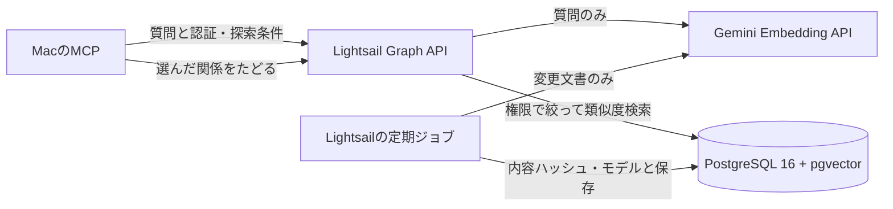

# GraphのAPIベクトル検索

検索時の全件取得とMacでの再計算をなくす。意味検索はGraph探索の入口であり、関係の意味判断と根拠の充足判断は引き続きモデルが担う。

## 保存と更新

- モデルは `gemini-embedding-001`、768次元。APIキーはInfisical正本から `BRAINBASE_EMBEDDING_API_KEY` へ投影する。
- `graph_entity_embeddings` は派生索引。Graphの原文・権限が正本。本文ハッシュとモデルが一致する行だけを検索する。
- 原文の変更で古いベクトルは即座に検索対象から外れる。定期ジョブで再生成するまで `embedding_index_pending` を返す。
- 定期ジョブは1回32件、同時実行はDB advisory lockで抑止。`BRAINBASE_EMBEDDING_PROJECT_CODES` の明示されたプロジェクトだけを処理する。失敗後は次回再開し、検索要求から索引生成を実行しない。
- 名前・本文・判断理由等の決まった項目のみを生成対象とする。Geminiの入力上限を越えないよう、passageとqueryはUTF-8で1,800バイト以下のチャンクに分けて埋め込み、チャンクの平均を正規化する（長文はチャンク数ぶんAPI入力が増える）。6,000文字を超える場合は入口用に先頭を使い、検索結果は `embedding_text_truncated` を含むpartialにする。根拠本文は元のGraph行を返す。埋め込み方針を変えたため、モデル識別子は `gemini-embedding-001:768:v2` として旧ベクトルと混在させない。
- 現在の規模ではpgvectorの正確なコサイン距離計算を使用する。権限を絞った後の再現率を保ち、近似索引は負荷と再現率を測ってから追加する。

## 導入順序

1. 現行SHA、クリーンなcheckout、APIとDBの稼働を確認する。既存のLightsailデプロイ手順に従う。
2. PostgreSQLのバージョンに一致するpgvectorを追加する。PG16なら `postgresql-16-pgvector`。他サービスの再起動やDB移設は不要。
3. 管理者が `CREATE EXTENSION IF NOT EXISTS vector` を実施する。アプリ用roleで `server/sql/graph-vector-search.sql` をtransaction内に適用し、FORCE RLSを確認する。
4. `server/sql/graph-vector-search-smoke.sql` を実行する。異なるプロジェクト、機密区分、古い本文の排除が通るまで切り替えない。
5. Infisicalの承認済みBrainbase targetからキーを `/etc/brainbase/embedding.env`（root所有、0600）へ投影する。ファイルにはキーと明示的な対象プロジェクトだけを置く。キーを表示しない。
6. マージしたSHAを配置し、既存Info SSOTのRLSゲートを実行する。APIのsystemd drop-inへ `EnvironmentFile=/etc/brainbase/embedding.env` を追加する。
7. 同じenvを使って `node scripts/graph-vector-index.mjs` を実行する。初回のみ `BRAINBASE_EMBEDDING_MAX_BATCHES` を1〜100で指定できる。初期投入後にpendingを確認する。
8. `scripts/graph-vector/templates/` のservice/timerを導入する。APIを再起動し、認証付き `POST /api/info/graph/search` と実MCPの検索結果、権限、遅延を確認する。

## 運用・停止

`journalctl -u brainbase-vector-index.service` で選択件数・保存件数・失敗コードを確認する。HTTP成功だけで索引完了とは扱わず、検索応答の `index.ready` / `index.pending` を確認する。

停止時は定期timerを停止し、記録した互換SHAへサービスを戻す。追加テーブルは残せる。Graph原文の削除やDB down migrationは不要。API失敗時にローカルモデルへ黙って切り替えない。

## Terraformの現在地（2026-09-09確認）

Lightsail `brainbase-nocodb` の初期Terraform定義は履歴commit `70773e457b07daef71b023ae1bbda87920edf2e8` の `terraform/lightsail/` にある。現行developにはなく、現在のstateは未確認。AWS実体には `ManagedBy=Terraform` があるが、現行の継続管理を証明しない。今回の作業は既存Lightsail内のソフトウェア追加であり、インスタンスの再作成やTerraform applyを行わない。
